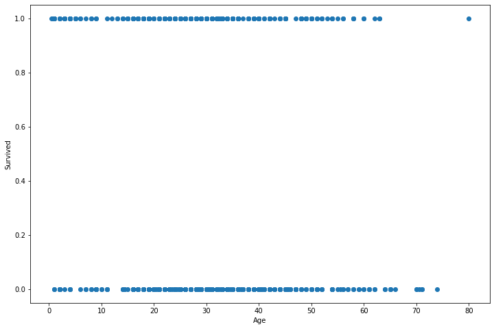
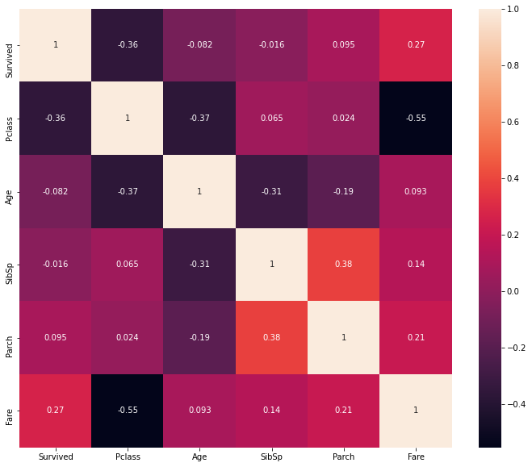
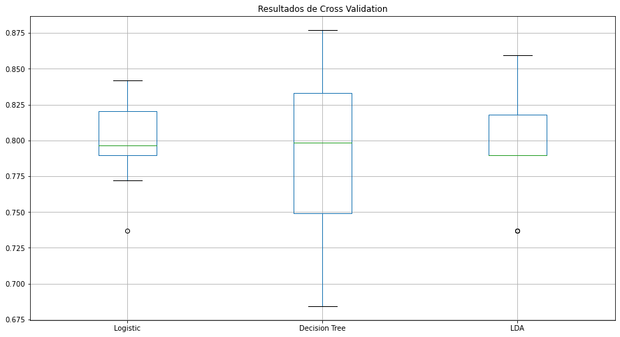
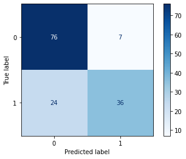
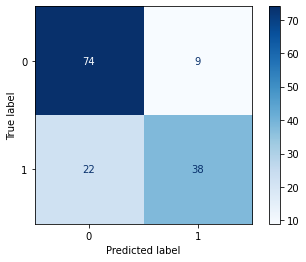

---
# Title, summary, and page position.
linktitle: 7. Clasificacion
summary: Ejemplo Regresion con Python
weight: 70
icon: align-center
icon_pack: fas

# Page metadata.
title: Clasificacion con Scikit Learn
date: "2020-04-18T00:00:00Z"
type: book  # Do not modify
---

Por [Jose R. Zapata](https://joserzapata.github.io/) 

<script type="text/javascript" src="https://cdnjs.buymeacoffee.com/1.0.0/button.prod.min.js" data-name="bmc-button" data-slug="joserzapata" data-color="#328cc1" data-emoji="" data-font="Cookie" data-text="Invítame a un Café" data-outline-color="#000000" data-font-color="#ffffff" data-coffee-color="#FFDD00" ></script><br>

Importar librerias


```python
import pandas as pd
import numpy as np
import matplotlib.pyplot as plt
import seaborn as sns
```

## Informacion de los Datos 

Titanic dataset

Fuente: https://www.kaggle.com/francksylla/titanic-machine-learning-from-disaster


```python
titanic_df = pd.read_csv('datasets/titanic_train.csv')

titanic_df.head(10)
```


<div>
<style scoped>
    .dataframe tbody tr th:only-of-type {
        vertical-align: middle;
    }

    .dataframe tbody tr th {
        vertical-align: top;
    }
    
    .dataframe thead th {
        text-align: right;
    }
</style>
<table border="1" class="dataframe">
  <thead>
    <tr style="text-align: right;">
      <th></th>
      <th>PassengerId</th>
      <th>Survived</th>
      <th>Pclass</th>
      <th>Name</th>
      <th>Sex</th>
      <th>Age</th>
      <th>SibSp</th>
      <th>Parch</th>
      <th>Ticket</th>
      <th>Fare</th>
      <th>Cabin</th>
      <th>Embarked</th>
    </tr>
  </thead>
  <tbody>
    <tr>
      <th>0</th>
      <td>1</td>
      <td>0</td>
      <td>3</td>
      <td>Braund, Mr. Owen Harris</td>
      <td>male</td>
      <td>22.0</td>
      <td>1</td>
      <td>0</td>
      <td>A/5 21171</td>
      <td>7.2500</td>
      <td>NaN</td>
      <td>S</td>
    </tr>
    <tr>
      <th>1</th>
      <td>2</td>
      <td>1</td>
      <td>1</td>
      <td>Cumings, Mrs. John Bradley (Florence Briggs Th...</td>
      <td>female</td>
      <td>38.0</td>
      <td>1</td>
      <td>0</td>
      <td>PC 17599</td>
      <td>71.2833</td>
      <td>C85</td>
      <td>C</td>
    </tr>
    <tr>
      <th>2</th>
      <td>3</td>
      <td>1</td>
      <td>3</td>
      <td>Heikkinen, Miss. Laina</td>
      <td>female</td>
      <td>26.0</td>
      <td>0</td>
      <td>0</td>
      <td>STON/O2. 3101282</td>
      <td>7.9250</td>
      <td>NaN</td>
      <td>S</td>
    </tr>
    <tr>
      <th>3</th>
      <td>4</td>
      <td>1</td>
      <td>1</td>
      <td>Futrelle, Mrs. Jacques Heath (Lily May Peel)</td>
      <td>female</td>
      <td>35.0</td>
      <td>1</td>
      <td>0</td>
      <td>113803</td>
      <td>53.1000</td>
      <td>C123</td>
      <td>S</td>
    </tr>
    <tr>
      <th>4</th>
      <td>5</td>
      <td>0</td>
      <td>3</td>
      <td>Allen, Mr. William Henry</td>
      <td>male</td>
      <td>35.0</td>
      <td>0</td>
      <td>0</td>
      <td>373450</td>
      <td>8.0500</td>
      <td>NaN</td>
      <td>S</td>
    </tr>
    <tr>
      <th>5</th>
      <td>6</td>
      <td>0</td>
      <td>3</td>
      <td>Moran, Mr. James</td>
      <td>male</td>
      <td>NaN</td>
      <td>0</td>
      <td>0</td>
      <td>330877</td>
      <td>8.4583</td>
      <td>NaN</td>
      <td>Q</td>
    </tr>
    <tr>
      <th>6</th>
      <td>7</td>
      <td>0</td>
      <td>1</td>
      <td>McCarthy, Mr. Timothy J</td>
      <td>male</td>
      <td>54.0</td>
      <td>0</td>
      <td>0</td>
      <td>17463</td>
      <td>51.8625</td>
      <td>E46</td>
      <td>S</td>
    </tr>
    <tr>
      <th>7</th>
      <td>8</td>
      <td>0</td>
      <td>3</td>
      <td>Palsson, Master. Gosta Leonard</td>
      <td>male</td>
      <td>2.0</td>
      <td>3</td>
      <td>1</td>
      <td>349909</td>
      <td>21.0750</td>
      <td>NaN</td>
      <td>S</td>
    </tr>
    <tr>
      <th>8</th>
      <td>9</td>
      <td>1</td>
      <td>3</td>
      <td>Johnson, Mrs. Oscar W (Elisabeth Vilhelmina Berg)</td>
      <td>female</td>
      <td>27.0</td>
      <td>0</td>
      <td>2</td>
      <td>347742</td>
      <td>11.1333</td>
      <td>NaN</td>
      <td>S</td>
    </tr>
    <tr>
      <th>9</th>
      <td>10</td>
      <td>1</td>
      <td>2</td>
      <td>Nasser, Mrs. Nicholas (Adele Achem)</td>
      <td>female</td>
      <td>14.0</td>
      <td>1</td>
      <td>0</td>
      <td>237736</td>
      <td>30.0708</td>
      <td>NaN</td>
      <td>C</td>
    </tr>
  </tbody>
</table>
</div>


```python
titanic_df.shape
```


    (891, 12)


```python
titanic_df.info()
```

    <class 'pandas.core.frame.DataFrame'>
    RangeIndex: 891 entries, 0 to 890
    Data columns (total 12 columns):
     #   Column       Non-Null Count  Dtype  
    ---  ------       --------------  -----  
     0   PassengerId  891 non-null    int64  
     1   Survived     891 non-null    int64  
     2   Pclass       891 non-null    int64  
     3   Name         891 non-null    object 
     4   Sex          891 non-null    object 
     5   Age          714 non-null    float64
     6   SibSp        891 non-null    int64  
     7   Parch        891 non-null    int64  
     8   Ticket       891 non-null    object 
     9   Fare         891 non-null    float64
     10  Cabin        204 non-null    object 
     11  Embarked     889 non-null    object 
    dtypes: float64(2), int64(5), object(5)
    memory usage: 83.7+ KB


## Preparacion de datos
### Eliminar columnas no necesarias


```python
titanic_df.drop(['PassengerId', 'Name', 'Ticket', 'Cabin'], 'columns', inplace=True)

titanic_df.head()
```


<div>
<style scoped>
    .dataframe tbody tr th:only-of-type {
        vertical-align: middle;
    }

    .dataframe tbody tr th {
        vertical-align: top;
    }
    
    .dataframe thead th {
        text-align: right;
    }
</style>
<table border="1" class="dataframe">
  <thead>
    <tr style="text-align: right;">
      <th></th>
      <th>Survived</th>
      <th>Pclass</th>
      <th>Sex</th>
      <th>Age</th>
      <th>SibSp</th>
      <th>Parch</th>
      <th>Fare</th>
      <th>Embarked</th>
    </tr>
  </thead>
  <tbody>
    <tr>
      <th>0</th>
      <td>0</td>
      <td>3</td>
      <td>male</td>
      <td>22.0</td>
      <td>1</td>
      <td>0</td>
      <td>7.2500</td>
      <td>S</td>
    </tr>
    <tr>
      <th>1</th>
      <td>1</td>
      <td>1</td>
      <td>female</td>
      <td>38.0</td>
      <td>1</td>
      <td>0</td>
      <td>71.2833</td>
      <td>C</td>
    </tr>
    <tr>
      <th>2</th>
      <td>1</td>
      <td>3</td>
      <td>female</td>
      <td>26.0</td>
      <td>0</td>
      <td>0</td>
      <td>7.9250</td>
      <td>S</td>
    </tr>
    <tr>
      <th>3</th>
      <td>1</td>
      <td>1</td>
      <td>female</td>
      <td>35.0</td>
      <td>1</td>
      <td>0</td>
      <td>53.1000</td>
      <td>S</td>
    </tr>
    <tr>
      <th>4</th>
      <td>0</td>
      <td>3</td>
      <td>male</td>
      <td>35.0</td>
      <td>0</td>
      <td>0</td>
      <td>8.0500</td>
      <td>S</td>
    </tr>
  </tbody>
</table>
</div>


```python
titanic_df.info()
```

    <class 'pandas.core.frame.DataFrame'>
    RangeIndex: 891 entries, 0 to 890
    Data columns (total 8 columns):
     #   Column    Non-Null Count  Dtype  
    ---  ------    --------------  -----  
     0   Survived  891 non-null    int64  
     1   Pclass    891 non-null    int64  
     2   Sex       891 non-null    object 
     3   Age       714 non-null    float64
     4   SibSp     891 non-null    int64  
     5   Parch     891 non-null    int64  
     6   Fare      891 non-null    float64
     7   Embarked  889 non-null    object 
    dtypes: float64(2), int64(4), object(2)
    memory usage: 55.8+ KB


### Tratamiento de datos nulos


```python
# Contar el numero de datos nulos
titanic_df[titanic_df.isnull().any(axis=1)].count()
```


    Survived    179
    Pclass      179
    Sex         179
    Age           2
    SibSp       179
    Parch       179
    Fare        179
    Embarked    177
    dtype: int64


```python
# eliminar las finlas con datos nulos
titanic_df = titanic_df.dropna()
```


```python
titanic_df.shape
```


    (712, 8)


```python
titanic_df[titanic_df.isnull().any(axis=1)].count()
```


    Survived    0
    Pclass      0
    Sex         0
    Age         0
    SibSp       0
    Parch       0
    Fare        0
    Embarked    0
    dtype: int64


### Descripcion estadistica


```python
titanic_df.describe()
```


<div>
<style scoped>
    .dataframe tbody tr th:only-of-type {
        vertical-align: middle;
    }

    .dataframe tbody tr th {
        vertical-align: top;
    }
    
    .dataframe thead th {
        text-align: right;
    }
</style>
<table border="1" class="dataframe">
  <thead>
    <tr style="text-align: right;">
      <th></th>
      <th>Survived</th>
      <th>Pclass</th>
      <th>Age</th>
      <th>SibSp</th>
      <th>Parch</th>
      <th>Fare</th>
    </tr>
  </thead>
  <tbody>
    <tr>
      <th>count</th>
      <td>712.000000</td>
      <td>712.000000</td>
      <td>712.000000</td>
      <td>712.000000</td>
      <td>712.000000</td>
      <td>712.000000</td>
    </tr>
    <tr>
      <th>mean</th>
      <td>0.404494</td>
      <td>2.240169</td>
      <td>29.642093</td>
      <td>0.514045</td>
      <td>0.432584</td>
      <td>34.567251</td>
    </tr>
    <tr>
      <th>std</th>
      <td>0.491139</td>
      <td>0.836854</td>
      <td>14.492933</td>
      <td>0.930692</td>
      <td>0.854181</td>
      <td>52.938648</td>
    </tr>
    <tr>
      <th>min</th>
      <td>0.000000</td>
      <td>1.000000</td>
      <td>0.420000</td>
      <td>0.000000</td>
      <td>0.000000</td>
      <td>0.000000</td>
    </tr>
    <tr>
      <th>25%</th>
      <td>0.000000</td>
      <td>1.000000</td>
      <td>20.000000</td>
      <td>0.000000</td>
      <td>0.000000</td>
      <td>8.050000</td>
    </tr>
    <tr>
      <th>50%</th>
      <td>0.000000</td>
      <td>2.000000</td>
      <td>28.000000</td>
      <td>0.000000</td>
      <td>0.000000</td>
      <td>15.645850</td>
    </tr>
    <tr>
      <th>75%</th>
      <td>1.000000</td>
      <td>3.000000</td>
      <td>38.000000</td>
      <td>1.000000</td>
      <td>1.000000</td>
      <td>33.000000</td>
    </tr>
    <tr>
      <th>max</th>
      <td>1.000000</td>
      <td>3.000000</td>
      <td>80.000000</td>
      <td>5.000000</td>
      <td>6.000000</td>
      <td>512.329200</td>
    </tr>
  </tbody>
</table>
</div>


```python
titanic_df.head()
```


<div>
<style scoped>
    .dataframe tbody tr th:only-of-type {
        vertical-align: middle;
    }

    .dataframe tbody tr th {
        vertical-align: top;
    }
    
    .dataframe thead th {
        text-align: right;
    }
</style>
<table border="1" class="dataframe">
  <thead>
    <tr style="text-align: right;">
      <th></th>
      <th>Survived</th>
      <th>Pclass</th>
      <th>Sex</th>
      <th>Age</th>
      <th>SibSp</th>
      <th>Parch</th>
      <th>Fare</th>
      <th>Embarked</th>
    </tr>
  </thead>
  <tbody>
    <tr>
      <th>0</th>
      <td>0</td>
      <td>3</td>
      <td>male</td>
      <td>22.0</td>
      <td>1</td>
      <td>0</td>
      <td>7.2500</td>
      <td>S</td>
    </tr>
    <tr>
      <th>1</th>
      <td>1</td>
      <td>1</td>
      <td>female</td>
      <td>38.0</td>
      <td>1</td>
      <td>0</td>
      <td>71.2833</td>
      <td>C</td>
    </tr>
    <tr>
      <th>2</th>
      <td>1</td>
      <td>3</td>
      <td>female</td>
      <td>26.0</td>
      <td>0</td>
      <td>0</td>
      <td>7.9250</td>
      <td>S</td>
    </tr>
    <tr>
      <th>3</th>
      <td>1</td>
      <td>1</td>
      <td>female</td>
      <td>35.0</td>
      <td>1</td>
      <td>0</td>
      <td>53.1000</td>
      <td>S</td>
    </tr>
    <tr>
      <th>4</th>
      <td>0</td>
      <td>3</td>
      <td>male</td>
      <td>35.0</td>
      <td>0</td>
      <td>0</td>
      <td>8.0500</td>
      <td>S</td>
    </tr>
  </tbody>
</table>
</div>


## Analisis Univariable
Se debe hacer un analisis de cada una de las variables y describir sus caracteristicas

## Analisis Bivariable

### Scatter Plots


```python
fig, ax = plt.subplots(figsize=(12, 8))

plt.scatter(titanic_df['Age'], titanic_df['Survived'])

plt.xlabel('Age')
plt.ylabel('Survived');
```


​    

​    


```python
fig, ax = plt.subplots(figsize=(12, 8))

plt.scatter(titanic_df['Fare'], titanic_df['Survived'])

plt.xlabel('Fare')
plt.ylabel('Survived');
```


​    

​    


### Correlacion


```python
pd.crosstab(titanic_df['Sex'], titanic_df['Survived'])
```


<div>
<style scoped>
    .dataframe tbody tr th:only-of-type {
        vertical-align: middle;
    }

    .dataframe tbody tr th {
        vertical-align: top;
    }
    
    .dataframe thead th {
        text-align: right;
    }
</style>
<table border="1" class="dataframe">
  <thead>
    <tr style="text-align: right;">
      <th>Survived</th>
      <th>0</th>
      <th>1</th>
    </tr>
    <tr>
      <th>Sex</th>
      <th></th>
      <th></th>
    </tr>
  </thead>
  <tbody>
    <tr>
      <th>female</th>
      <td>64</td>
      <td>195</td>
    </tr>
    <tr>
      <th>male</th>
      <td>360</td>
      <td>93</td>
    </tr>
  </tbody>
</table>
</div>


```python
pd.crosstab(titanic_df['Pclass'], titanic_df['Survived'])
```


<div>
<style scoped>
    .dataframe tbody tr th:only-of-type {
        vertical-align: middle;
    }

    .dataframe tbody tr th {
        vertical-align: top;
    }
    
    .dataframe thead th {
        text-align: right;
    }
</style>
<table border="1" class="dataframe">
  <thead>
    <tr style="text-align: right;">
      <th>Survived</th>
      <th>0</th>
      <th>1</th>
    </tr>
    <tr>
      <th>Pclass</th>
      <th></th>
      <th></th>
    </tr>
  </thead>
  <tbody>
    <tr>
      <th>1</th>
      <td>64</td>
      <td>120</td>
    </tr>
    <tr>
      <th>2</th>
      <td>90</td>
      <td>83</td>
    </tr>
    <tr>
      <th>3</th>
      <td>270</td>
      <td>85</td>
    </tr>
  </tbody>
</table>
</div>


```python
titanic_data_corr = titanic_df.corr()

titanic_data_corr
```


<div>
<style scoped>
    .dataframe tbody tr th:only-of-type {
        vertical-align: middle;
    }

    .dataframe tbody tr th {
        vertical-align: top;
    }
    
    .dataframe thead th {
        text-align: right;
    }
</style>
<table border="1" class="dataframe">
  <thead>
    <tr style="text-align: right;">
      <th></th>
      <th>Survived</th>
      <th>Pclass</th>
      <th>Age</th>
      <th>SibSp</th>
      <th>Parch</th>
      <th>Fare</th>
    </tr>
  </thead>
  <tbody>
    <tr>
      <th>Survived</th>
      <td>1.000000</td>
      <td>-0.356462</td>
      <td>-0.082446</td>
      <td>-0.015523</td>
      <td>0.095265</td>
      <td>0.266100</td>
    </tr>
    <tr>
      <th>Pclass</th>
      <td>-0.356462</td>
      <td>1.000000</td>
      <td>-0.365902</td>
      <td>0.065187</td>
      <td>0.023666</td>
      <td>-0.552893</td>
    </tr>
    <tr>
      <th>Age</th>
      <td>-0.082446</td>
      <td>-0.365902</td>
      <td>1.000000</td>
      <td>-0.307351</td>
      <td>-0.187896</td>
      <td>0.093143</td>
    </tr>
    <tr>
      <th>SibSp</th>
      <td>-0.015523</td>
      <td>0.065187</td>
      <td>-0.307351</td>
      <td>1.000000</td>
      <td>0.383338</td>
      <td>0.139860</td>
    </tr>
    <tr>
      <th>Parch</th>
      <td>0.095265</td>
      <td>0.023666</td>
      <td>-0.187896</td>
      <td>0.383338</td>
      <td>1.000000</td>
      <td>0.206624</td>
    </tr>
    <tr>
      <th>Fare</th>
      <td>0.266100</td>
      <td>-0.552893</td>
      <td>0.093143</td>
      <td>0.139860</td>
      <td>0.206624</td>
      <td>1.000000</td>
    </tr>
  </tbody>
</table>
</div>


```python
fig, ax = plt.subplots(figsize=(12, 10))

sns.heatmap(titanic_data_corr, annot=True);
```


​    

​    


## Transformacion de Variables


```python
from sklearn import preprocessing

label_encoding = preprocessing.LabelEncoder()
titanic_df['Sex'] = label_encoding.fit_transform(titanic_df['Sex'].astype(str))

titanic_df.head()
```


<div>
<style scoped>
    .dataframe tbody tr th:only-of-type {
        vertical-align: middle;
    }

    .dataframe tbody tr th {
        vertical-align: top;
    }
    
    .dataframe thead th {
        text-align: right;
    }
</style>
<table border="1" class="dataframe">
  <thead>
    <tr style="text-align: right;">
      <th></th>
      <th>Survived</th>
      <th>Pclass</th>
      <th>Sex</th>
      <th>Age</th>
      <th>SibSp</th>
      <th>Parch</th>
      <th>Fare</th>
      <th>Embarked</th>
    </tr>
  </thead>
  <tbody>
    <tr>
      <th>0</th>
      <td>0</td>
      <td>3</td>
      <td>1</td>
      <td>22.0</td>
      <td>1</td>
      <td>0</td>
      <td>7.2500</td>
      <td>S</td>
    </tr>
    <tr>
      <th>1</th>
      <td>1</td>
      <td>1</td>
      <td>0</td>
      <td>38.0</td>
      <td>1</td>
      <td>0</td>
      <td>71.2833</td>
      <td>C</td>
    </tr>
    <tr>
      <th>2</th>
      <td>1</td>
      <td>3</td>
      <td>0</td>
      <td>26.0</td>
      <td>0</td>
      <td>0</td>
      <td>7.9250</td>
      <td>S</td>
    </tr>
    <tr>
      <th>3</th>
      <td>1</td>
      <td>1</td>
      <td>0</td>
      <td>35.0</td>
      <td>1</td>
      <td>0</td>
      <td>53.1000</td>
      <td>S</td>
    </tr>
    <tr>
      <th>4</th>
      <td>0</td>
      <td>3</td>
      <td>1</td>
      <td>35.0</td>
      <td>0</td>
      <td>0</td>
      <td>8.0500</td>
      <td>S</td>
    </tr>
  </tbody>
</table>
</div>


```python
label_encoding.classes_
```


    array(['female', 'male'], dtype=object)


 C = Cherbourg,  Q = Queenstown,  S = Southampton


```python
titanic_df = pd.get_dummies(titanic_df, columns=['Embarked'])

titanic_df.head()
```


<div>
<style scoped>
    .dataframe tbody tr th:only-of-type {
        vertical-align: middle;
    }

    .dataframe tbody tr th {
        vertical-align: top;
    }
    
    .dataframe thead th {
        text-align: right;
    }
</style>
<table border="1" class="dataframe">
  <thead>
    <tr style="text-align: right;">
      <th></th>
      <th>Survived</th>
      <th>Pclass</th>
      <th>Sex</th>
      <th>Age</th>
      <th>SibSp</th>
      <th>Parch</th>
      <th>Fare</th>
      <th>Embarked_C</th>
      <th>Embarked_Q</th>
      <th>Embarked_S</th>
    </tr>
  </thead>
  <tbody>
    <tr>
      <th>0</th>
      <td>0</td>
      <td>3</td>
      <td>1</td>
      <td>22.0</td>
      <td>1</td>
      <td>0</td>
      <td>7.2500</td>
      <td>0</td>
      <td>0</td>
      <td>1</td>
    </tr>
    <tr>
      <th>1</th>
      <td>1</td>
      <td>1</td>
      <td>0</td>
      <td>38.0</td>
      <td>1</td>
      <td>0</td>
      <td>71.2833</td>
      <td>1</td>
      <td>0</td>
      <td>0</td>
    </tr>
    <tr>
      <th>2</th>
      <td>1</td>
      <td>3</td>
      <td>0</td>
      <td>26.0</td>
      <td>0</td>
      <td>0</td>
      <td>7.9250</td>
      <td>0</td>
      <td>0</td>
      <td>1</td>
    </tr>
    <tr>
      <th>3</th>
      <td>1</td>
      <td>1</td>
      <td>0</td>
      <td>35.0</td>
      <td>1</td>
      <td>0</td>
      <td>53.1000</td>
      <td>0</td>
      <td>0</td>
      <td>1</td>
    </tr>
    <tr>
      <th>4</th>
      <td>0</td>
      <td>3</td>
      <td>1</td>
      <td>35.0</td>
      <td>0</td>
      <td>0</td>
      <td>8.0500</td>
      <td>0</td>
      <td>0</td>
      <td>1</td>
    </tr>
  </tbody>
</table>
</div>


```python
titanic_df = titanic_df.sample(frac=1).reset_index(drop=True)

titanic_df.head()
```


<div>
<style scoped>
    .dataframe tbody tr th:only-of-type {
        vertical-align: middle;
    }

    .dataframe tbody tr th {
        vertical-align: top;
    }
    
    .dataframe thead th {
        text-align: right;
    }
</style>
<table border="1" class="dataframe">
  <thead>
    <tr style="text-align: right;">
      <th></th>
      <th>Survived</th>
      <th>Pclass</th>
      <th>Sex</th>
      <th>Age</th>
      <th>SibSp</th>
      <th>Parch</th>
      <th>Fare</th>
      <th>Embarked_C</th>
      <th>Embarked_Q</th>
      <th>Embarked_S</th>
    </tr>
  </thead>
  <tbody>
    <tr>
      <th>0</th>
      <td>1</td>
      <td>3</td>
      <td>0</td>
      <td>26.0</td>
      <td>0</td>
      <td>0</td>
      <td>7.9250</td>
      <td>0</td>
      <td>0</td>
      <td>1</td>
    </tr>
    <tr>
      <th>1</th>
      <td>0</td>
      <td>3</td>
      <td>1</td>
      <td>21.0</td>
      <td>0</td>
      <td>0</td>
      <td>8.4333</td>
      <td>0</td>
      <td>0</td>
      <td>1</td>
    </tr>
    <tr>
      <th>2</th>
      <td>0</td>
      <td>2</td>
      <td>1</td>
      <td>57.0</td>
      <td>0</td>
      <td>0</td>
      <td>12.3500</td>
      <td>0</td>
      <td>1</td>
      <td>0</td>
    </tr>
    <tr>
      <th>3</th>
      <td>0</td>
      <td>2</td>
      <td>1</td>
      <td>25.0</td>
      <td>1</td>
      <td>2</td>
      <td>41.5792</td>
      <td>1</td>
      <td>0</td>
      <td>0</td>
    </tr>
    <tr>
      <th>4</th>
      <td>0</td>
      <td>2</td>
      <td>1</td>
      <td>35.0</td>
      <td>0</td>
      <td>0</td>
      <td>10.5000</td>
      <td>0</td>
      <td>0</td>
      <td>1</td>
    </tr>
  </tbody>
</table>
</div>


```python
titanic_df.to_csv('datasets/titanic_processed.csv', index=False)
```

## Clasificacion Binaria


```python
titanic_df = pd.read_csv('datasets/titanic_processed.csv')

titanic_df.head()
```


<div>
<style scoped>
    .dataframe tbody tr th:only-of-type {
        vertical-align: middle;
    }

    .dataframe tbody tr th {
        vertical-align: top;
    }
    
    .dataframe thead th {
        text-align: right;
    }
</style>
<table border="1" class="dataframe">
  <thead>
    <tr style="text-align: right;">
      <th></th>
      <th>Survived</th>
      <th>Pclass</th>
      <th>Sex</th>
      <th>Age</th>
      <th>SibSp</th>
      <th>Parch</th>
      <th>Fare</th>
      <th>Embarked_C</th>
      <th>Embarked_Q</th>
      <th>Embarked_S</th>
    </tr>
  </thead>
  <tbody>
    <tr>
      <th>0</th>
      <td>1</td>
      <td>3</td>
      <td>0</td>
      <td>26.0</td>
      <td>0</td>
      <td>0</td>
      <td>7.9250</td>
      <td>0</td>
      <td>0</td>
      <td>1</td>
    </tr>
    <tr>
      <th>1</th>
      <td>0</td>
      <td>3</td>
      <td>1</td>
      <td>21.0</td>
      <td>0</td>
      <td>0</td>
      <td>8.4333</td>
      <td>0</td>
      <td>0</td>
      <td>1</td>
    </tr>
    <tr>
      <th>2</th>
      <td>0</td>
      <td>2</td>
      <td>1</td>
      <td>57.0</td>
      <td>0</td>
      <td>0</td>
      <td>12.3500</td>
      <td>0</td>
      <td>1</td>
      <td>0</td>
    </tr>
    <tr>
      <th>3</th>
      <td>0</td>
      <td>2</td>
      <td>1</td>
      <td>25.0</td>
      <td>1</td>
      <td>2</td>
      <td>41.5792</td>
      <td>1</td>
      <td>0</td>
      <td>0</td>
    </tr>
    <tr>
      <th>4</th>
      <td>0</td>
      <td>2</td>
      <td>1</td>
      <td>35.0</td>
      <td>0</td>
      <td>0</td>
      <td>10.5000</td>
      <td>0</td>
      <td>0</td>
      <td>1</td>
    </tr>
  </tbody>
</table>
</div>


```python
titanic_df.shape
```


    (712, 10)


```python
from sklearn.model_selection import train_test_split

X = titanic_df.drop('Survived', axis=1)
Y = titanic_df['Survived']

x_train, x_test, y_train, y_test = train_test_split(X, Y, test_size=0.2)
```


```python
x_train.shape, y_train.shape
```


    ((569, 9), (569,))


```python
x_test.shape, y_test.shape
```


    ((143, 9), (143,))


### Regresion Logistica para Clasificacion

https://scikit-learn.org/stable/modules/generated/sklearn.linear_model.LogisticRegression.html


```python
from sklearn.linear_model import LogisticRegression

logistic_model = LogisticRegression(penalty='l2', C=1.0, solver='liblinear').fit(x_train, y_train)
```


```python
y_pred = logistic_model.predict(x_test)
```

#### Matriz de confusion


```python
pred_results = pd.DataFrame({'y_test': y_test,
                             'y_pred': y_pred})
```


```python
pred_results.head()
```


<div>
<style scoped>
    .dataframe tbody tr th:only-of-type {
        vertical-align: middle;
    }

    .dataframe tbody tr th {
        vertical-align: top;
    }
    
    .dataframe thead th {
        text-align: right;
    }
</style>
<table border="1" class="dataframe">
  <thead>
    <tr style="text-align: right;">
      <th></th>
      <th>y_test</th>
      <th>y_pred</th>
    </tr>
  </thead>
  <tbody>
    <tr>
      <th>524</th>
      <td>0</td>
      <td>0</td>
    </tr>
    <tr>
      <th>133</th>
      <td>0</td>
      <td>0</td>
    </tr>
    <tr>
      <th>460</th>
      <td>1</td>
      <td>0</td>
    </tr>
    <tr>
      <th>110</th>
      <td>1</td>
      <td>0</td>
    </tr>
    <tr>
      <th>639</th>
      <td>0</td>
      <td>0</td>
    </tr>
  </tbody>
</table>
</div>


```python
titanic_crosstab = pd.crosstab(pred_results.y_pred, pred_results.y_test)

titanic_crosstab
```


<div>
<style scoped>
    .dataframe tbody tr th:only-of-type {
        vertical-align: middle;
    }

    .dataframe tbody tr th {
        vertical-align: top;
    }
    
    .dataframe thead th {
        text-align: right;
    }
</style>
<table border="1" class="dataframe">
  <thead>
    <tr style="text-align: right;">
      <th>y_test</th>
      <th>0</th>
      <th>1</th>
    </tr>
    <tr>
      <th>y_pred</th>
      <th></th>
      <th></th>
    </tr>
  </thead>
  <tbody>
    <tr>
      <th>0</th>
      <td>71</td>
      <td>24</td>
    </tr>
    <tr>
      <th>1</th>
      <td>8</td>
      <td>40</td>
    </tr>
  </tbody>
</table>
</div>


#### Precision - recall

https://scikit-learn.org/stable/modules/generated/sklearn.metrics.precision_score.html
https://scikit-learn.org/stable/modules/generated/sklearn.metrics.recall_score.html


```python
from sklearn.metrics import accuracy_score
from sklearn.metrics import precision_score
from sklearn.metrics import recall_score
```


```python
acc = accuracy_score(y_test, y_pred)
prec = precision_score(y_test, y_pred)
recall = recall_score(y_test, y_pred)

print("accuracy_score : ", acc)
print("precision_score : ", prec)
print("recall_score : ", recall)
```

    accuracy_score :  0.7762237762237763
    precision_score :  0.8333333333333334
    recall_score :  0.625


```python
titanic_crosstab
```


<div>
<style scoped>
    .dataframe tbody tr th:only-of-type {
        vertical-align: middle;
    }

    .dataframe tbody tr th {
        vertical-align: top;
    }
    
    .dataframe thead th {
        text-align: right;
    }
</style>
<table border="1" class="dataframe">
  <thead>
    <tr style="text-align: right;">
      <th>y_test</th>
      <th>0</th>
      <th>1</th>
    </tr>
    <tr>
      <th>y_pred</th>
      <th></th>
      <th></th>
    </tr>
  </thead>
  <tbody>
    <tr>
      <th>0</th>
      <td>71</td>
      <td>24</td>
    </tr>
    <tr>
      <th>1</th>
      <td>8</td>
      <td>40</td>
    </tr>
  </tbody>
</table>
</div>


```python
TP = titanic_crosstab[1][1]
TN = titanic_crosstab[0][0]
FP = titanic_crosstab[0][1]
FN = titanic_crosstab[1][0]
```


```python
accuracy_score_verified = (TP + TN) / (TP + FP + TN + FN)

accuracy_score_verified
```


    0.7762237762237763


```python
precision_score_survived = TP / (TP + FP)

precision_score_survived
```


    0.8333333333333334


```python
recall_score_survived = TP / (TP + FN)

recall_score_survived
```


    0.625


## Clasificacion con Multiples Modelos


```python
from sklearn.model_selection import train_test_split
from sklearn.metrics import accuracy_score
from sklearn.metrics import precision_score
from sklearn.metrics import recall_score

from sklearn.linear_model import LogisticRegression
from sklearn.discriminant_analysis import LinearDiscriminantAnalysis
from sklearn.discriminant_analysis import QuadraticDiscriminantAnalysis
from sklearn.linear_model import SGDClassifier
from sklearn.svm import LinearSVC
from sklearn.neighbors import RadiusNeighborsClassifier
from sklearn.naive_bayes import GaussianNB
from sklearn.tree import DecisionTreeClassifier
```


```python
titanic_df = pd.read_csv('datasets/titanic_processed.csv')

titanic_df.head()
```


<div>
<style scoped>
    .dataframe tbody tr th:only-of-type {
        vertical-align: middle;
    }

    .dataframe tbody tr th {
        vertical-align: top;
    }
    
    .dataframe thead th {
        text-align: right;
    }
</style>
<table border="1" class="dataframe">
  <thead>
    <tr style="text-align: right;">
      <th></th>
      <th>Survived</th>
      <th>Pclass</th>
      <th>Sex</th>
      <th>Age</th>
      <th>SibSp</th>
      <th>Parch</th>
      <th>Fare</th>
      <th>Embarked_C</th>
      <th>Embarked_Q</th>
      <th>Embarked_S</th>
    </tr>
  </thead>
  <tbody>
    <tr>
      <th>0</th>
      <td>1</td>
      <td>3</td>
      <td>0</td>
      <td>26.0</td>
      <td>0</td>
      <td>0</td>
      <td>7.9250</td>
      <td>0</td>
      <td>0</td>
      <td>1</td>
    </tr>
    <tr>
      <th>1</th>
      <td>0</td>
      <td>3</td>
      <td>1</td>
      <td>21.0</td>
      <td>0</td>
      <td>0</td>
      <td>8.4333</td>
      <td>0</td>
      <td>0</td>
      <td>1</td>
    </tr>
    <tr>
      <th>2</th>
      <td>0</td>
      <td>2</td>
      <td>1</td>
      <td>57.0</td>
      <td>0</td>
      <td>0</td>
      <td>12.3500</td>
      <td>0</td>
      <td>1</td>
      <td>0</td>
    </tr>
    <tr>
      <th>3</th>
      <td>0</td>
      <td>2</td>
      <td>1</td>
      <td>25.0</td>
      <td>1</td>
      <td>2</td>
      <td>41.5792</td>
      <td>1</td>
      <td>0</td>
      <td>0</td>
    </tr>
    <tr>
      <th>4</th>
      <td>0</td>
      <td>2</td>
      <td>1</td>
      <td>35.0</td>
      <td>0</td>
      <td>0</td>
      <td>10.5000</td>
      <td>0</td>
      <td>0</td>
      <td>1</td>
    </tr>
  </tbody>
</table>
</div>


```python
FEATURES = list(titanic_df.columns[1:])

FEATURES
```


    ['Pclass',
     'Sex',
     'Age',
     'SibSp',
     'Parch',
     'Fare',
     'Embarked_C',
     'Embarked_Q',
     'Embarked_S']


```python
result_dict = {}
```

### Funciones de ayuda


```python
def summarize_classification(y_test, y_pred):
    
    acc = accuracy_score(y_test, y_pred, normalize=True)
    num_acc = accuracy_score(y_test, y_pred, normalize=False)

    prec = precision_score(y_test, y_pred)
    recall = recall_score(y_test, y_pred)
    
    return {'accuracy': acc, 
            'precision': prec,
            'recall':recall, 
            'accuracy_count':num_acc}
```


```python
def build_model(classifier_fn,                
                name_of_y_col, 
                names_of_x_cols, 
                dataset, 
                test_frac=0.2):
    
    X = dataset[names_of_x_cols]
    Y = dataset[name_of_y_col]

    x_train, x_test, y_train, y_test = train_test_split(X, Y, test_size=test_frac)
       
    model = classifier_fn(x_train, y_train)
    
    y_pred = model.predict(x_test)

    y_pred_train = model.predict(x_train)
    
    train_summary = summarize_classification(y_train, y_pred_train)
    test_summary = summarize_classification(y_test, y_pred)
    
    pred_results = pd.DataFrame({'y_test': y_test,
                                 'y_pred': y_pred})
    
    model_crosstab = pd.crosstab(pred_results.y_pred, pred_results.y_test)
    
    return {'training': train_summary, 
            'test': test_summary,
            'confusion_matrix': model_crosstab}
```


```python
def compare_results():
    for key in result_dict:
        print('Classification: ', key)

        print()
        print('Training data')
        for score in result_dict[key]['training']:
            print(score, result_dict[key]['training'][score])

        print()
        print('Test data')
        for score in result_dict[key]['test']:
            print(score, result_dict[key]['test'][score])
       
        print()
```

### Regresion logistica


```python
def logistic_fn(x_train, y_train):
    
    model = LogisticRegression(solver='liblinear')
    model.fit(x_train, y_train)
    
    return model
```


```python
result_dict['survived ~ logistic'] = build_model(logistic_fn,
                                              'Survived',
                                               FEATURES,
                                               titanic_df)

compare_results()
```

    Classification:  survived ~ logistic
    
    Training data
    accuracy 0.8137082601054482
    precision 0.7990196078431373
    recall 0.7149122807017544
    accuracy_count 463
    
    Test data
    accuracy 0.7762237762237763
    precision 0.8043478260869565
    recall 0.6166666666666667
    accuracy_count 111


### Lineal Discriminant Analysis


```python
def linear_discriminant_fn(x_train, y_train, solver='svd'):
    
    model = LinearDiscriminantAnalysis(solver=solver)
    model.fit(x_train, y_train)
    
    return model
```


```python
result_dict['survived ~ linear_discriminant_analysis'] = build_model(linear_discriminant_fn,
                                                                 'Survived',
                                                                  FEATURES,
                                                                  titanic_df)
compare_results()
```

    Classification:  survived ~ logistic
    
    Training data
    accuracy 0.8137082601054482
    precision 0.7990196078431373
    recall 0.7149122807017544
    accuracy_count 463
    
    Test data
    accuracy 0.7762237762237763
    precision 0.8043478260869565
    recall 0.6166666666666667
    accuracy_count 111
    
    Classification:  survived ~ linear_discriminant_analysis
    
    Training data
    accuracy 0.8066783831282952
    precision 0.784037558685446
    recall 0.7229437229437229
    accuracy_count 459
    
    Test data
    accuracy 0.7342657342657343
    precision 0.6792452830188679
    recall 0.631578947368421
    accuracy_count 105


```python
result_dict['survived ~ linear_discriminant_analysis'] = build_model(linear_discriminant_fn,
                                                                     'Survived',
                                                                      FEATURES[0:-1],
                                                                      titanic_df)
compare_results()
```

    Classification:  survived ~ logistic
    
    Training data
    accuracy 0.8137082601054482
    precision 0.7990196078431373
    recall 0.7149122807017544
    accuracy_count 463
    
    Test data
    accuracy 0.7762237762237763
    precision 0.8043478260869565
    recall 0.6166666666666667
    accuracy_count 111
    
    Classification:  survived ~ linear_discriminant_analysis
    
    Training data
    accuracy 0.7996485061511424
    precision 0.7772727272727272
    recall 0.7245762711864406
    accuracy_count 455
    
    Test data
    accuracy 0.7412587412587412
    precision 0.6415094339622641
    recall 0.6538461538461539
    accuracy_count 106


### Quadratic Discriminant Analysis


```python
def quadratic_discriminant_fn(x_train, y_train):
    
    model = QuadraticDiscriminantAnalysis()
    model.fit(x_train, y_train)
    
    return model
```


```python
result_dict['survived ~ quadratic_discriminant_analysis'] = build_model(quadratic_discriminant_fn,
                                                                        'Survived',
                                                                        FEATURES[0:-1],
                                                                        titanic_df)

compare_results()
```

    Classification:  survived ~ logistic
    
    Training data
    accuracy 0.8137082601054482
    precision 0.7990196078431373
    recall 0.7149122807017544
    accuracy_count 463
    
    Test data
    accuracy 0.7762237762237763
    precision 0.8043478260869565
    recall 0.6166666666666667
    accuracy_count 111
    
    Classification:  survived ~ linear_discriminant_analysis
    
    Training data
    accuracy 0.7996485061511424
    precision 0.7772727272727272
    recall 0.7245762711864406
    accuracy_count 455
    
    Test data
    accuracy 0.7412587412587412
    precision 0.6415094339622641
    recall 0.6538461538461539
    accuracy_count 106
    
    Classification:  survived ~ quadratic_discriminant_analysis
    
    Training data
    accuracy 0.8066783831282952
    precision 0.7752293577981652
    recall 0.7347826086956522
    accuracy_count 459
    
    Test data
    accuracy 0.7622377622377622
    precision 0.7142857142857143
    recall 0.6896551724137931
    accuracy_count 109


### SGD


```python
def sgd_fn(x_train, y_train, max_iter=1000, tol=1e-3):
    
    model = SGDClassifier(max_iter=max_iter, tol=tol)
    model.fit(x_train, y_train)
     
    return model
```


```python
result_dict['survived ~ sgd'] = build_model(sgd_fn,
                                           'Survived',
                                            FEATURES,
                                            titanic_df)

compare_results()
```

    Classification:  survived ~ logistic
    
    Training data
    accuracy 0.8137082601054482
    precision 0.7990196078431373
    recall 0.7149122807017544
    accuracy_count 463
    
    Test data
    accuracy 0.7762237762237763
    precision 0.8043478260869565
    recall 0.6166666666666667
    accuracy_count 111
    
    Classification:  survived ~ linear_discriminant_analysis
    
    Training data
    accuracy 0.7996485061511424
    precision 0.7772727272727272
    recall 0.7245762711864406
    accuracy_count 455
    
    Test data
    accuracy 0.7412587412587412
    precision 0.6415094339622641
    recall 0.6538461538461539
    accuracy_count 106
    
    Classification:  survived ~ quadratic_discriminant_analysis
    
    Training data
    accuracy 0.8066783831282952
    precision 0.7752293577981652
    recall 0.7347826086956522
    accuracy_count 459
    
    Test data
    accuracy 0.7622377622377622
    precision 0.7142857142857143
    recall 0.6896551724137931
    accuracy_count 109
    
    Classification:  survived ~ sgd
    
    Training data
    accuracy 0.7715289982425307
    precision 0.6814814814814815
    recall 0.8070175438596491
    accuracy_count 439
    
    Test data
    accuracy 0.7342657342657343
    precision 0.6447368421052632
    recall 0.8166666666666667
    accuracy_count 105


### SVC Lineal

https://scikit-learn.org/stable/modules/generated/sklearn.svm.LinearSVC.html

* SVC con kernel lineal
* dual=False cuando el numero de muestras > numero de caracteristicas


```python
def linear_svc_fn(x_train, y_train, C=1.0, max_iter=1000, tol=1e-3):
    
    model = LinearSVC(C=C, max_iter=max_iter, tol=tol, dual=False)
    model.fit(x_train, y_train) 
    
    return model
```


```python
result_dict['survived ~ linear_svc'] = build_model(linear_svc_fn,
                                                  'Survived',
                                                   FEATURES,
                                                   titanic_df)

compare_results()
```

    Classification:  survived ~ logistic
    
    Training data
    accuracy 0.8137082601054482
    precision 0.7990196078431373
    recall 0.7149122807017544
    accuracy_count 463
    
    Test data
    accuracy 0.7762237762237763
    precision 0.8043478260869565
    recall 0.6166666666666667
    accuracy_count 111
    
    Classification:  survived ~ linear_discriminant_analysis
    
    Training data
    accuracy 0.7996485061511424
    precision 0.7772727272727272
    recall 0.7245762711864406
    accuracy_count 455
    
    Test data
    accuracy 0.7412587412587412
    precision 0.6415094339622641
    recall 0.6538461538461539
    accuracy_count 106
    
    Classification:  survived ~ quadratic_discriminant_analysis
    
    Training data
    accuracy 0.8066783831282952
    precision 0.7752293577981652
    recall 0.7347826086956522
    accuracy_count 459
    
    Test data
    accuracy 0.7622377622377622
    precision 0.7142857142857143
    recall 0.6896551724137931
    accuracy_count 109
    
    Classification:  survived ~ sgd
    
    Training data
    accuracy 0.7715289982425307
    precision 0.6814814814814815
    recall 0.8070175438596491
    accuracy_count 439
    
    Test data
    accuracy 0.7342657342657343
    precision 0.6447368421052632
    recall 0.8166666666666667
    accuracy_count 105
    
    Classification:  survived ~ linear_svc
    
    Training data
    accuracy 0.7873462214411248
    precision 0.7568807339449541
    recall 0.7081545064377682
    accuracy_count 448
    
    Test data
    accuracy 0.8041958041958042
    precision 0.7368421052631579
    recall 0.7636363636363637
    accuracy_count 115


### Radius Neighbors Classifier


```python
def radius_neighbor_fn(x_train, y_train, radius=40.0):

    model = RadiusNeighborsClassifier(radius=radius)
    model.fit(x_train, y_train) 
    
    return model
```


```python
result_dict['survived ~ radius_neighbors'] = build_model(radius_neighbor_fn,
                                                         'Survived',
                                                         FEATURES,
                                                         titanic_df)
compare_results()
```

    Classification:  survived ~ logistic
    
    Training data
    accuracy 0.8137082601054482
    precision 0.7990196078431373
    recall 0.7149122807017544
    accuracy_count 463
    
    Test data
    accuracy 0.7762237762237763
    precision 0.8043478260869565
    recall 0.6166666666666667
    accuracy_count 111
    
    Classification:  survived ~ linear_discriminant_analysis
    
    Training data
    accuracy 0.7996485061511424
    precision 0.7772727272727272
    recall 0.7245762711864406
    accuracy_count 455
    
    Test data
    accuracy 0.7412587412587412
    precision 0.6415094339622641
    recall 0.6538461538461539
    accuracy_count 106
    
    Classification:  survived ~ quadratic_discriminant_analysis
    
    Training data
    accuracy 0.8066783831282952
    precision 0.7752293577981652
    recall 0.7347826086956522
    accuracy_count 459
    
    Test data
    accuracy 0.7622377622377622
    precision 0.7142857142857143
    recall 0.6896551724137931
    accuracy_count 109
    
    Classification:  survived ~ sgd
    
    Training data
    accuracy 0.7715289982425307
    precision 0.6814814814814815
    recall 0.8070175438596491
    accuracy_count 439
    
    Test data
    accuracy 0.7342657342657343
    precision 0.6447368421052632
    recall 0.8166666666666667
    accuracy_count 105
    
    Classification:  survived ~ linear_svc
    
    Training data
    accuracy 0.7873462214411248
    precision 0.7568807339449541
    recall 0.7081545064377682
    accuracy_count 448
    
    Test data
    accuracy 0.8041958041958042
    precision 0.7368421052631579
    recall 0.7636363636363637
    accuracy_count 115
    
    Classification:  survived ~ radius_neighbors
    
    Training data
    accuracy 0.6678383128295254
    precision 0.7244897959183674
    recall 0.30472103004291845
    accuracy_count 380
    
    Test data
    accuracy 0.6783216783216783
    precision 0.7368421052631579
    recall 0.2545454545454545
    accuracy_count 97


### Decision Tree classifier

max_depth = None [ If None, then nodes are expanded until all leaves are pure or until all leaves contain less than min_samples_split samples ]

max_features = None [None -- max_features=n_features, 
                     auto -- then max_features=sqrt(n_features), 
                     sqrt -- then max_features=sqrt(n_features), 
                     log2 -- then max_features=log2(n_features)]


```python
def decision_tree_fn(x_train, y_train, max_depth=None, max_features=None): 
    
    model = DecisionTreeClassifier(max_depth=max_depth, max_features=max_features)
    model.fit(x_train, y_train)
    
    return model
```


```python
result_dict['survived ~ decision_tree'] = build_model(decision_tree_fn,
                                                 'Survived',
                                                  FEATURES,
                                                  titanic_df)

compare_results()
```

    Classification:  survived ~ logistic
    
    Training data
    accuracy 0.8137082601054482
    precision 0.7990196078431373
    recall 0.7149122807017544
    accuracy_count 463
    
    Test data
    accuracy 0.7762237762237763
    precision 0.8043478260869565
    recall 0.6166666666666667
    accuracy_count 111
    
    Classification:  survived ~ linear_discriminant_analysis
    
    Training data
    accuracy 0.7996485061511424
    precision 0.7772727272727272
    recall 0.7245762711864406
    accuracy_count 455
    
    Test data
    accuracy 0.7412587412587412
    precision 0.6415094339622641
    recall 0.6538461538461539
    accuracy_count 106
    
    Classification:  survived ~ quadratic_discriminant_analysis
    
    Training data
    accuracy 0.8066783831282952
    precision 0.7752293577981652
    recall 0.7347826086956522
    accuracy_count 459
    
    Test data
    accuracy 0.7622377622377622
    precision 0.7142857142857143
    recall 0.6896551724137931
    accuracy_count 109
    
    Classification:  survived ~ sgd
    
    Training data
    accuracy 0.7715289982425307
    precision 0.6814814814814815
    recall 0.8070175438596491
    accuracy_count 439
    
    Test data
    accuracy 0.7342657342657343
    precision 0.6447368421052632
    recall 0.8166666666666667
    accuracy_count 105
    
    Classification:  survived ~ linear_svc
    
    Training data
    accuracy 0.7873462214411248
    precision 0.7568807339449541
    recall 0.7081545064377682
    accuracy_count 448
    
    Test data
    accuracy 0.8041958041958042
    precision 0.7368421052631579
    recall 0.7636363636363637
    accuracy_count 115
    
    Classification:  survived ~ radius_neighbors
    
    Training data
    accuracy 0.6678383128295254
    precision 0.7244897959183674
    recall 0.30472103004291845
    accuracy_count 380
    
    Test data
    accuracy 0.6783216783216783
    precision 0.7368421052631579
    recall 0.2545454545454545
    accuracy_count 97
    
    Classification:  survived ~ decision_tree
    
    Training data
    accuracy 0.9876977152899824
    precision 1.0
    recall 0.9694323144104804
    accuracy_count 562
    
    Test data
    accuracy 0.7482517482517482
    precision 0.6825396825396826
    recall 0.7288135593220338
    accuracy_count 107


### Naive Bayes


```python
def naive_bayes_fn(x_train,y_train, priors=None):
    
    model = GaussianNB(priors=priors)
    model.fit(x_train, y_train)
    
    return model
```


```python
result_dict['survived ~ naive_bayes'] = build_model(naive_bayes_fn,
                                                    'Survived',
                                                    FEATURES,
                                                    titanic_df)

compare_results()
```

    Classification:  survived ~ logistic
    
    Training data
    accuracy 0.8137082601054482
    precision 0.7990196078431373
    recall 0.7149122807017544
    accuracy_count 463
    
    Test data
    accuracy 0.7762237762237763
    precision 0.8043478260869565
    recall 0.6166666666666667
    accuracy_count 111
    
    Classification:  survived ~ linear_discriminant_analysis
    
    Training data
    accuracy 0.7996485061511424
    precision 0.7772727272727272
    recall 0.7245762711864406
    accuracy_count 455
    
    Test data
    accuracy 0.7412587412587412
    precision 0.6415094339622641
    recall 0.6538461538461539
    accuracy_count 106
    
    Classification:  survived ~ quadratic_discriminant_analysis
    
    Training data
    accuracy 0.8066783831282952
    precision 0.7752293577981652
    recall 0.7347826086956522
    accuracy_count 459
    
    Test data
    accuracy 0.7622377622377622
    precision 0.7142857142857143
    recall 0.6896551724137931
    accuracy_count 109
    
    Classification:  survived ~ sgd
    
    Training data
    accuracy 0.7715289982425307
    precision 0.6814814814814815
    recall 0.8070175438596491
    accuracy_count 439
    
    Test data
    accuracy 0.7342657342657343
    precision 0.6447368421052632
    recall 0.8166666666666667
    accuracy_count 105
    
    Classification:  survived ~ linear_svc
    
    Training data
    accuracy 0.7873462214411248
    precision 0.7568807339449541
    recall 0.7081545064377682
    accuracy_count 448
    
    Test data
    accuracy 0.8041958041958042
    precision 0.7368421052631579
    recall 0.7636363636363637
    accuracy_count 115
    
    Classification:  survived ~ radius_neighbors
    
    Training data
    accuracy 0.6678383128295254
    precision 0.7244897959183674
    recall 0.30472103004291845
    accuracy_count 380
    
    Test data
    accuracy 0.6783216783216783
    precision 0.7368421052631579
    recall 0.2545454545454545
    accuracy_count 97
    
    Classification:  survived ~ decision_tree
    
    Training data
    accuracy 0.9876977152899824
    precision 1.0
    recall 0.9694323144104804
    accuracy_count 562
    
    Test data
    accuracy 0.7482517482517482
    precision 0.6825396825396826
    recall 0.7288135593220338
    accuracy_count 107
    
    Classification:  survived ~ naive_bayes
    
    Training data
    accuracy 0.7644991212653779
    precision 0.6877637130801688
    recall 0.7309417040358744
    accuracy_count 435
    
    Test data
    accuracy 0.7622377622377622
    precision 0.746031746031746
    recall 0.7230769230769231
    accuracy_count 109


## Cross Validation - Seleccion de Modelos
Analizar la varianza de los resultados para obtener los que tengan mejor resultado.


```python
# Grabar los resultados de cada modelo
from sklearn import model_selection

models = []

#logistic Regression
models.append(('Logistic', LogisticRegression(solver='liblinear')))

# Decision Tree classifier
models.append(('Decision Tree', DecisionTreeClassifier()))

#
models.append(('LDA', LinearDiscriminantAnalysis(solver= 'svd')))

# evaluate each model in turn
results = []
names = []
scoring = 'accuracy'
for name, model in models:
    # Kfol cross validation for model selection
    kfold = model_selection.KFold(n_splits=10)
    #X train , y train
    cv_results = model_selection.cross_val_score(model, x_train, y_train, cv=kfold, scoring=scoring)
    results.append(cv_results)
    names.append(name)
    msg = f"({name}, {cv_results.mean()}, {cv_results.std()}"
    print(msg)
```

    (Logistic, 0.7996553884711779, 0.03052711377670607
    (Decision Tree, 0.7908521303258145, 0.05897038598057798
    (LDA, 0.7944235588972431, 0.0357488400750467


```python
plt.figure(figsize = (15,8)) 
result_df = pd.DataFrame(results, index=names).T
result_df.boxplot()
plt.title("Resultados de Cross Validation");
```


​    

​    


## Hyperparameter tunning (Optimizacion de hiperparametros)


```python
titanic_df = pd.read_csv('datasets/titanic_processed.csv')

titanic_df.head()
```


<div>
<style scoped>
    .dataframe tbody tr th:only-of-type {
        vertical-align: middle;
    }

    .dataframe tbody tr th {
        vertical-align: top;
    }
    
    .dataframe thead th {
        text-align: right;
    }
</style>
<table border="1" class="dataframe">
  <thead>
    <tr style="text-align: right;">
      <th></th>
      <th>Survived</th>
      <th>Pclass</th>
      <th>Sex</th>
      <th>Age</th>
      <th>SibSp</th>
      <th>Parch</th>
      <th>Fare</th>
      <th>Embarked_C</th>
      <th>Embarked_Q</th>
      <th>Embarked_S</th>
    </tr>
  </thead>
  <tbody>
    <tr>
      <th>0</th>
      <td>1</td>
      <td>3</td>
      <td>0</td>
      <td>26.0</td>
      <td>0</td>
      <td>0</td>
      <td>7.9250</td>
      <td>0</td>
      <td>0</td>
      <td>1</td>
    </tr>
    <tr>
      <th>1</th>
      <td>0</td>
      <td>3</td>
      <td>1</td>
      <td>21.0</td>
      <td>0</td>
      <td>0</td>
      <td>8.4333</td>
      <td>0</td>
      <td>0</td>
      <td>1</td>
    </tr>
    <tr>
      <th>2</th>
      <td>0</td>
      <td>2</td>
      <td>1</td>
      <td>57.0</td>
      <td>0</td>
      <td>0</td>
      <td>12.3500</td>
      <td>0</td>
      <td>1</td>
      <td>0</td>
    </tr>
    <tr>
      <th>3</th>
      <td>0</td>
      <td>2</td>
      <td>1</td>
      <td>25.0</td>
      <td>1</td>
      <td>2</td>
      <td>41.5792</td>
      <td>1</td>
      <td>0</td>
      <td>0</td>
    </tr>
    <tr>
      <th>4</th>
      <td>0</td>
      <td>2</td>
      <td>1</td>
      <td>35.0</td>
      <td>0</td>
      <td>0</td>
      <td>10.5000</td>
      <td>0</td>
      <td>0</td>
      <td>1</td>
    </tr>
  </tbody>
</table>
</div>


```python
X = titanic_df.drop('Survived', axis=1)

Y = titanic_df['Survived']

x_train, x_test, y_train, y_test = train_test_split(X, Y, test_size=0.2)
```


```python
def summarize_classification(y_test, y_pred):
    
    acc = accuracy_score(y_test, y_pred, normalize=True)
    num_acc = accuracy_score(y_test, y_pred, normalize=False)

    prec = precision_score(y_test, y_pred)
    recall = recall_score(y_test, y_pred)
    
    print("Test data count: ",len(y_test))
    print("accuracy_count : " , num_acc)
    print("accuracy_score : " , acc)
    print("precision_score : " , prec)
    print("recall_score : ", recall)
    print()
```

### Decision Tree


```python
from sklearn.model_selection import GridSearchCV

parameters = {'max_depth': [2, 4, 5, 7, 9, 10]}

grid_search = GridSearchCV(DecisionTreeClassifier(), parameters, cv=3, return_train_score=True)
grid_search.fit(x_train, y_train)

grid_search.best_params_
```


    {'max_depth': 2}


```python
# Para ver todos los resultados del cross validation
# No es necesario, solo es informativo para ver como varia el modelo
for i in range(6):
    print('Parameters: ', grid_search.cv_results_['params'][i])

    print('Mean Test Score: ', grid_search.cv_results_['mean_test_score'][i])
    
    print('Rank: ', grid_search.cv_results_['rank_test_score'][i])
```

    Parameters:  {'max_depth': 2}
    Mean Test Score:  0.8065998329156224
    Rank:  1
    Parameters:  {'max_depth': 4}
    Mean Test Score:  0.8065998329156224
    Rank:  1
    Parameters:  {'max_depth': 5}
    Mean Test Score:  0.8031003434512206
    Rank:  3
    Parameters:  {'max_depth': 7}
    Mean Test Score:  0.7890466908010768
    Rank:  4
    Parameters:  {'max_depth': 9}
    Mean Test Score:  0.773266499582289
    Rank:  6
    Parameters:  {'max_depth': 10}
    Mean Test Score:  0.7750208855472014
    Rank:  5


```python
decision_tree_model = DecisionTreeClassifier( \
    max_depth = grid_search.best_params_['max_depth']).fit(x_train, y_train)
```


```python
y_pred = decision_tree_model.predict(x_test)
```


```python
summarize_classification(y_test, y_pred)
```

    Test data count:  143
    accuracy_count :  109
    accuracy_score :  0.7622377622377622
    precision_score :  0.9333333333333333
    recall_score :  0.4666666666666667


### Regresion logistica


```python
parameters = {'penalty': ['l1', 'l2'], 
              'C': [0.1, 0.4, 0.8, 1, 2, 5]}

grid_search = GridSearchCV(LogisticRegression(solver='liblinear'), parameters, cv=3, return_train_score=True)
grid_search.fit(x_train, y_train)

grid_search.best_params_
```


    {'C': 0.8, 'penalty': 'l1'}


```python
# Para ver todos los resultados del cross validation
# No es necesario, solo es informativo para ver como varia el modelo
for i in range(12):
    print('Parameters: ', grid_search.cv_results_['params'][i])
    print('Mean Test Score: ', grid_search.cv_results_['mean_test_score'][i])
    print('Rank: ', grid_search.cv_results_['rank_test_score'][i])
```

    Parameters:  {'C': 0.1, 'penalty': 'l1'}
    Mean Test Score:  0.7733036294439802
    Rank:  12
    Parameters:  {'C': 0.1, 'penalty': 'l2'}
    Mean Test Score:  0.7961384943841084
    Rank:  10
    Parameters:  {'C': 0.4, 'penalty': 'l1'}
    Mean Test Score:  0.803183885640026
    Rank:  7
    Parameters:  {'C': 0.4, 'penalty': 'l2'}
    Mean Test Score:  0.7961384943841084
    Rank:  10
    Parameters:  {'C': 0.8, 'penalty': 'l1'}
    Mean Test Score:  0.8119558154645875
    Rank:  1
    Parameters:  {'C': 0.8, 'penalty': 'l2'}
    Mean Test Score:  0.801410934744268
    Rank:  8
    Parameters:  {'C': 1, 'penalty': 'l1'}
    Mean Test Score:  0.8102014294996751
    Rank:  2
    Parameters:  {'C': 1, 'penalty': 'l2'}
    Mean Test Score:  0.8049197066740926
    Rank:  5
    Parameters:  {'C': 2, 'penalty': 'l1'}
    Mean Test Score:  0.8049197066740926
    Rank:  5
    Parameters:  {'C': 2, 'penalty': 'l2'}
    Mean Test Score:  0.8101828645688295
    Rank:  3
    Parameters:  {'C': 5, 'penalty': 'l1'}
    Mean Test Score:  0.8066740926390049
    Rank:  4
    Parameters:  {'C': 5, 'penalty': 'l2'}
    Mean Test Score:  0.79963798384851
    Rank:  9


```python
logistic_model = LogisticRegression(solver='liblinear', \
    penalty=grid_search.best_params_['penalty'], C=grid_search.best_params_['C']). \
    fit(x_train, y_train)
```


```python
y_pred = logistic_model.predict(x_test)
```


```python
summarize_classification(y_test, y_pred)
```

    Test data count:  143
    accuracy_count :  113
    accuracy_score :  0.7902097902097902
    precision_score :  0.8125
    recall_score :  0.65


## Final Evaluation Test


```python

from sklearn.metrics import plot_confusion_matrix
from sklearn.metrics import classification_report
from sklearn.metrics import confusion_matrix
from sklearn.metrics import plot_precision_recall_curve
```

### Decision Tree


```python
decision_tree_model = DecisionTreeClassifier( \
    max_depth = 4).fit(x_train, y_train)
```


```python
y_pred = decision_tree_model.predict(x_test)
```


```python
print(classification_report(y_test, y_pred))
```

                  precision    recall  f1-score   support
    
               0       0.76      0.92      0.83        83
               1       0.84      0.60      0.70        60
    
        accuracy                           0.78       143
       macro avg       0.80      0.76      0.76       143
    weighted avg       0.79      0.78      0.78       143


```python
plot_confusion_matrix(decision_tree_model, x_test, y_test,cmap=plt.cm.Blues);
```


​    

​    


### Regresion Logistica


```python
logistic_model = LogisticRegression(solver='liblinear', \
    penalty='l1', C=5). \
    fit(x_train, y_train)
```


```python
y_pred = logistic_model.predict(x_test)
```


```python
print(classification_report(y_test, y_pred))
```

                  precision    recall  f1-score   support
    
               0       0.77      0.89      0.83        83
               1       0.81      0.63      0.71        60
    
        accuracy                           0.78       143
       macro avg       0.79      0.76      0.77       143
    weighted avg       0.79      0.78      0.78       143


```python
plot_confusion_matrix(logistic_model, x_test, y_test,cmap=plt.cm.Blues);
```


​    

​    


## Grabar el Modelo


```python
from joblib import dump, load # libreria de serializacion

# grabar el modelo en un archivo
dump(logistic_model, 'logistic_model-titanic.joblib')
```


    ['logistic_model-titanic.joblib']


```python
from joblib import load

mi_modelo = load('logistic_model-titanic.joblib')
```


```python
mi_modelo.predict(x_test)
```


    array([1, 0, 0, 1, 0, 0, 0, 1, 0, 1, 0, 1, 0, 0, 1, 1, 0, 1, 1, 0, 0, 1,
           0, 0, 0, 0, 1, 1, 0, 1, 0, 1, 1, 1, 0, 0, 0, 0, 0, 1, 0, 1, 0, 0,
           0, 1, 0, 1, 1, 0, 0, 0, 0, 0, 0, 0, 1, 1, 0, 1, 0, 0, 0, 0, 1, 0,
           0, 0, 0, 0, 0, 0, 0, 0, 1, 0, 0, 0, 0, 1, 0, 0, 0, 0, 0, 0, 1, 0,
           0, 0, 0, 0, 0, 0, 0, 1, 0, 0, 0, 1, 1, 0, 0, 0, 0, 1, 0, 1, 1, 0,
           0, 1, 0, 0, 1, 0, 0, 0, 1, 0, 1, 1, 0, 0, 0, 0, 1, 0, 0, 1, 1, 1,
           0, 1, 0, 0, 0, 0, 1, 1, 0, 1, 0])


## Referencias
Cheatsheet scikitlearn 
https://datacamp-community-prod.s3.amazonaws.com/5433fa18-9f43-44cc-b228-74672efcd116

**Phd. Jose R. Zapata**
- [https://joserzapata.github.io/](https://joserzapata.github.io/)
