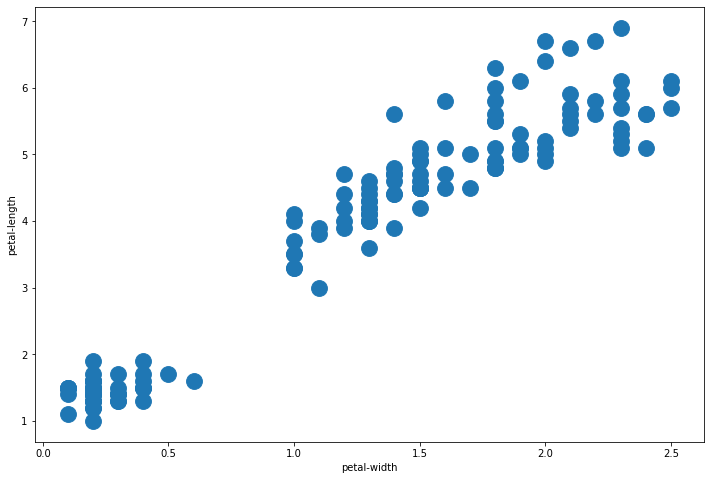
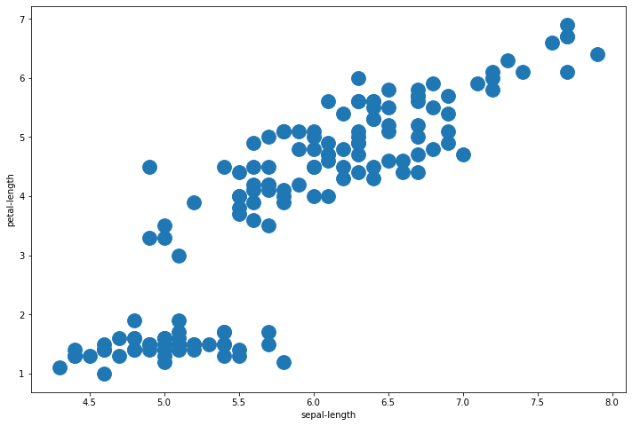
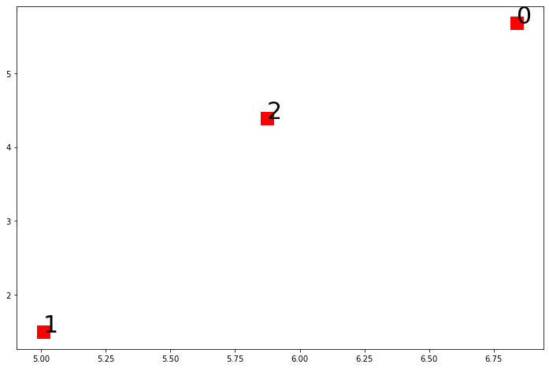
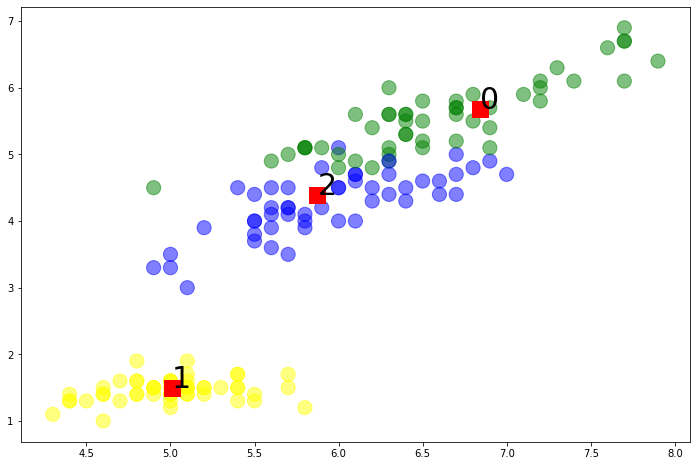
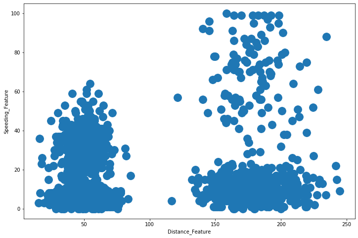

---
# Title, summary, and page position.
linktitle: 9 - Clustering
summary: Ejemplo Clustering con Python
weight: 54
icon: book
icon_pack: fas

# Page metadata.
title: Clustering con Scikit Learn
date: "2020-09-09T00:00:00Z"
type: book  # Do not modify
---

Curso Programacion Analitica

Maestria TIC Linea Ciencia de Datos 

Por [Jose R. Zapata](https://joserzapata.github.io/) 

Importar librerias


```python
import pandas as pd
import matplotlib
import matplotlib.pyplot as plt
import numpy as np
```


```python
from sklearn import metrics
from sklearn.cluster import KMeans

import warnings
warnings.filterwarnings("ignore")
```

# Informacion de los datos


```python
iris_df = pd.read_csv('datasets/iris.csv', 
                      skiprows=1, 
                      names = ['sepal-length',
                               'sepal-width',
                               'petal-length',
                               'petal-width',
                               'class'])

iris_df.head()
```


<div>
<style scoped>
    .dataframe tbody tr th:only-of-type {
        vertical-align: middle;
    }

    .dataframe tbody tr th {
        vertical-align: top;
    }

    .dataframe thead th {
        text-align: right;
    }
</style>
<table border="1" class="dataframe">
  <thead>
    <tr style="text-align: right;">
      <th></th>
      <th>sepal-length</th>
      <th>sepal-width</th>
      <th>petal-length</th>
      <th>petal-width</th>
      <th>class</th>
    </tr>
  </thead>
  <tbody>
    <tr>
      <th>0</th>
      <td>5.1</td>
      <td>3.5</td>
      <td>1.4</td>
      <td>0.2</td>
      <td>Iris-setosa</td>
    </tr>
    <tr>
      <th>1</th>
      <td>4.9</td>
      <td>3.0</td>
      <td>1.4</td>
      <td>0.2</td>
      <td>Iris-setosa</td>
    </tr>
    <tr>
      <th>2</th>
      <td>4.7</td>
      <td>3.2</td>
      <td>1.3</td>
      <td>0.2</td>
      <td>Iris-setosa</td>
    </tr>
    <tr>
      <th>3</th>
      <td>4.6</td>
      <td>3.1</td>
      <td>1.5</td>
      <td>0.2</td>
      <td>Iris-setosa</td>
    </tr>
    <tr>
      <th>4</th>
      <td>5.0</td>
      <td>3.6</td>
      <td>1.4</td>
      <td>0.2</td>
      <td>Iris-setosa</td>
    </tr>
  </tbody>
</table>
</div>


Mezclar la base de datos


```python
iris_df = iris_df.sample(frac=1).reset_index(drop=True)

iris_df.head()
```


<div>
<style scoped>
    .dataframe tbody tr th:only-of-type {
        vertical-align: middle;
    }

    .dataframe tbody tr th {
        vertical-align: top;
    }

    .dataframe thead th {
        text-align: right;
    }
</style>
<table border="1" class="dataframe">
  <thead>
    <tr style="text-align: right;">
      <th></th>
      <th>sepal-length</th>
      <th>sepal-width</th>
      <th>petal-length</th>
      <th>petal-width</th>
      <th>class</th>
    </tr>
  </thead>
  <tbody>
    <tr>
      <th>0</th>
      <td>6.5</td>
      <td>2.8</td>
      <td>4.6</td>
      <td>1.5</td>
      <td>Iris-versicolor</td>
    </tr>
    <tr>
      <th>1</th>
      <td>6.8</td>
      <td>3.2</td>
      <td>5.9</td>
      <td>2.3</td>
      <td>Iris-virginica</td>
    </tr>
    <tr>
      <th>2</th>
      <td>5.4</td>
      <td>3.9</td>
      <td>1.3</td>
      <td>0.4</td>
      <td>Iris-setosa</td>
    </tr>
    <tr>
      <th>3</th>
      <td>6.7</td>
      <td>3.0</td>
      <td>5.0</td>
      <td>1.7</td>
      <td>Iris-versicolor</td>
    </tr>
    <tr>
      <th>4</th>
      <td>7.2</td>
      <td>3.2</td>
      <td>6.0</td>
      <td>1.8</td>
      <td>Iris-virginica</td>
    </tr>
  </tbody>
</table>
</div>


```python
iris_df.shape
```


    (150, 5)


```python
iris_df[iris_df.isnull().any(axis=1)]
```


<div>
<style scoped>
    .dataframe tbody tr th:only-of-type {
        vertical-align: middle;
    }

    .dataframe tbody tr th {
        vertical-align: top;
    }

    .dataframe thead th {
        text-align: right;
    }
</style>
<table border="1" class="dataframe">
  <thead>
    <tr style="text-align: right;">
      <th></th>
      <th>sepal-length</th>
      <th>sepal-width</th>
      <th>petal-length</th>
      <th>petal-width</th>
      <th>class</th>
    </tr>
  </thead>
  <tbody>
  </tbody>
</table>
</div>


```python
iris_df.describe()
```


<div>
<style scoped>
    .dataframe tbody tr th:only-of-type {
        vertical-align: middle;
    }

    .dataframe tbody tr th {
        vertical-align: top;
    }

    .dataframe thead th {
        text-align: right;
    }
</style>
<table border="1" class="dataframe">
  <thead>
    <tr style="text-align: right;">
      <th></th>
      <th>sepal-length</th>
      <th>sepal-width</th>
      <th>petal-length</th>
      <th>petal-width</th>
    </tr>
  </thead>
  <tbody>
    <tr>
      <th>count</th>
      <td>150.000000</td>
      <td>150.000000</td>
      <td>150.000000</td>
      <td>150.000000</td>
    </tr>
    <tr>
      <th>mean</th>
      <td>5.843333</td>
      <td>3.054000</td>
      <td>3.758667</td>
      <td>1.198667</td>
    </tr>
    <tr>
      <th>std</th>
      <td>0.828066</td>
      <td>0.433594</td>
      <td>1.764420</td>
      <td>0.763161</td>
    </tr>
    <tr>
      <th>min</th>
      <td>4.300000</td>
      <td>2.000000</td>
      <td>1.000000</td>
      <td>0.100000</td>
    </tr>
    <tr>
      <th>25%</th>
      <td>5.100000</td>
      <td>2.800000</td>
      <td>1.600000</td>
      <td>0.300000</td>
    </tr>
    <tr>
      <th>50%</th>
      <td>5.800000</td>
      <td>3.000000</td>
      <td>4.350000</td>
      <td>1.300000</td>
    </tr>
    <tr>
      <th>75%</th>
      <td>6.400000</td>
      <td>3.300000</td>
      <td>5.100000</td>
      <td>1.800000</td>
    </tr>
    <tr>
      <th>max</th>
      <td>7.900000</td>
      <td>4.400000</td>
      <td>6.900000</td>
      <td>2.500000</td>
    </tr>
  </tbody>
</table>
</div>


```python
iris_df['class'].unique()
```


    array(['Iris-versicolor', 'Iris-virginica', 'Iris-setosa'], dtype=object)


## Preprocesamiento de datos


```python
from sklearn import preprocessing

label_encoding = preprocessing.LabelEncoder()

iris_df['class'] = label_encoding.fit_transform(iris_df['class'].astype(str))

iris_df.head()
```


<div>
<style scoped>
    .dataframe tbody tr th:only-of-type {
        vertical-align: middle;
    }

    .dataframe tbody tr th {
        vertical-align: top;
    }

    .dataframe thead th {
        text-align: right;
    }
</style>
<table border="1" class="dataframe">
  <thead>
    <tr style="text-align: right;">
      <th></th>
      <th>sepal-length</th>
      <th>sepal-width</th>
      <th>petal-length</th>
      <th>petal-width</th>
      <th>class</th>
    </tr>
  </thead>
  <tbody>
    <tr>
      <th>0</th>
      <td>6.5</td>
      <td>2.8</td>
      <td>4.6</td>
      <td>1.5</td>
      <td>1</td>
    </tr>
    <tr>
      <th>1</th>
      <td>6.8</td>
      <td>3.2</td>
      <td>5.9</td>
      <td>2.3</td>
      <td>2</td>
    </tr>
    <tr>
      <th>2</th>
      <td>5.4</td>
      <td>3.9</td>
      <td>1.3</td>
      <td>0.4</td>
      <td>0</td>
    </tr>
    <tr>
      <th>3</th>
      <td>6.7</td>
      <td>3.0</td>
      <td>5.0</td>
      <td>1.7</td>
      <td>1</td>
    </tr>
    <tr>
      <th>4</th>
      <td>7.2</td>
      <td>3.2</td>
      <td>6.0</td>
      <td>1.8</td>
      <td>2</td>
    </tr>
  </tbody>
</table>
</div>


```python
iris_df.describe()
```


<div>
<style scoped>
    .dataframe tbody tr th:only-of-type {
        vertical-align: middle;
    }

    .dataframe tbody tr th {
        vertical-align: top;
    }

    .dataframe thead th {
        text-align: right;
    }
</style>
<table border="1" class="dataframe">
  <thead>
    <tr style="text-align: right;">
      <th></th>
      <th>sepal-length</th>
      <th>sepal-width</th>
      <th>petal-length</th>
      <th>petal-width</th>
      <th>class</th>
    </tr>
  </thead>
  <tbody>
    <tr>
      <th>count</th>
      <td>150.000000</td>
      <td>150.000000</td>
      <td>150.000000</td>
      <td>150.000000</td>
      <td>150.000000</td>
    </tr>
    <tr>
      <th>mean</th>
      <td>5.843333</td>
      <td>3.054000</td>
      <td>3.758667</td>
      <td>1.198667</td>
      <td>1.000000</td>
    </tr>
    <tr>
      <th>std</th>
      <td>0.828066</td>
      <td>0.433594</td>
      <td>1.764420</td>
      <td>0.763161</td>
      <td>0.819232</td>
    </tr>
    <tr>
      <th>min</th>
      <td>4.300000</td>
      <td>2.000000</td>
      <td>1.000000</td>
      <td>0.100000</td>
      <td>0.000000</td>
    </tr>
    <tr>
      <th>25%</th>
      <td>5.100000</td>
      <td>2.800000</td>
      <td>1.600000</td>
      <td>0.300000</td>
      <td>0.000000</td>
    </tr>
    <tr>
      <th>50%</th>
      <td>5.800000</td>
      <td>3.000000</td>
      <td>4.350000</td>
      <td>1.300000</td>
      <td>1.000000</td>
    </tr>
    <tr>
      <th>75%</th>
      <td>6.400000</td>
      <td>3.300000</td>
      <td>5.100000</td>
      <td>1.800000</td>
      <td>2.000000</td>
    </tr>
    <tr>
      <th>max</th>
      <td>7.900000</td>
      <td>4.400000</td>
      <td>6.900000</td>
      <td>2.500000</td>
      <td>2.000000</td>
    </tr>
  </tbody>
</table>
</div>


# Analisis Univariable
Se debe hacer un analisis de cada una de las variables y describir sus caracteristicas

# Analisis Bivariable

## Scatter plot


```python
fig, ax = plt.subplots(figsize=(12, 8))

plt.scatter(iris_df['sepal-length'], iris_df['sepal-width'], s=250)

plt.xlabel('sepal-length')
plt.ylabel('sepal-width')

plt.show()
```


    

    


```python
fig, ax = plt.subplots(figsize=(12, 8))

plt.scatter(iris_df['petal-width'], iris_df['petal-length'], s=250)

plt.xlabel('petal-width')
plt.ylabel('petal-length')

plt.show()
```


    

    


```python
fig, ax = plt.subplots(figsize=(12, 8))

plt.scatter(iris_df['sepal-length'], iris_df['petal-length'], s=250)

plt.xlabel('sepal-length')
plt.ylabel('petal-length')

plt.show()
```


    

    


# KMeans SIMPLE


```python
iris_2D = iris_df[['sepal-length', 'petal-length']]

iris_2D.sample(5)
```


<div>
<style scoped>
    .dataframe tbody tr th:only-of-type {
        vertical-align: middle;
    }

    .dataframe tbody tr th {
        vertical-align: top;
    }

    .dataframe thead th {
        text-align: right;
    }
</style>
<table border="1" class="dataframe">
  <thead>
    <tr style="text-align: right;">
      <th></th>
      <th>sepal-length</th>
      <th>petal-length</th>
    </tr>
  </thead>
  <tbody>
    <tr>
      <th>133</th>
      <td>6.4</td>
      <td>5.3</td>
    </tr>
    <tr>
      <th>124</th>
      <td>5.6</td>
      <td>3.6</td>
    </tr>
    <tr>
      <th>111</th>
      <td>5.8</td>
      <td>5.1</td>
    </tr>
    <tr>
      <th>75</th>
      <td>4.7</td>
      <td>1.3</td>
    </tr>
    <tr>
      <th>31</th>
      <td>6.7</td>
      <td>5.2</td>
    </tr>
  </tbody>
</table>
</div>


```python
iris_2D.shape
```


    (150, 2)


```python
iris_2D = np.array(iris_2D)
```


```python
kmeans_model_2D = KMeans(n_clusters=3, max_iter=1000).fit(iris_2D)
```


```python
kmeans_model_2D.labels_
```


    array([2, 0, 1, 0, 0, 2, 0, 1, 2, 0, 2, 1, 1, 2, 1, 1, 0, 2, 1, 2, 2, 0,
           2, 2, 2, 1, 0, 2, 1, 0, 1, 0, 1, 2, 2, 1, 0, 2, 1, 0, 2, 1, 0, 2,
           0, 2, 1, 1, 2, 1, 1, 0, 0, 0, 2, 1, 2, 0, 1, 1, 1, 2, 2, 1, 2, 0,
           2, 0, 1, 0, 2, 2, 1, 2, 2, 1, 0, 0, 1, 0, 1, 0, 2, 2, 0, 1, 2, 2,
           1, 2, 0, 2, 1, 0, 1, 1, 1, 2, 2, 1, 0, 2, 2, 0, 2, 1, 0, 1, 2, 2,
           1, 2, 1, 1, 1, 2, 0, 1, 2, 0, 1, 1, 1, 2, 2, 2, 2, 1, 0, 1, 2, 2,
           2, 0, 0, 2, 2, 0, 2, 0, 1, 2, 1, 0, 1, 2, 0, 0, 1, 2], dtype=int32)


```python
centroids_2D = kmeans_model_2D.cluster_centers_

centroids_2D
```


    array([[6.83902439, 5.67804878],
           [5.00784314, 1.49411765],
           [5.87413793, 4.39310345]])


```python
fig, ax = plt.subplots(figsize=(12, 8))

plt.scatter(centroids_2D[:,0], centroids_2D[:,1], c='r', s=250, marker='s')

for i in range(len(centroids_2D)):
    plt.annotate(i, (centroids_2D[i][0], centroids_2D[i][1]), fontsize=30)
```


    

    


```python
iris_labels = iris_df['class']
```


```python
print("Homogeneity_score: ", metrics.homogeneity_score(iris_labels, kmeans_model_2D.labels_))

print("Completeness_score: ", metrics.completeness_score(iris_labels, kmeans_model_2D.labels_))

print("v_measure_score: ", metrics.v_measure_score(iris_labels, kmeans_model_2D.labels_))

print("Adjusted_rand_score: ", metrics.adjusted_rand_score(iris_labels, kmeans_model_2D.labels_))

print("Adjusted_mutual_info_score: ", metrics.adjusted_mutual_info_score(iris_labels,  kmeans_model_2D.labels_))

print("Silhouette_score: ", metrics.silhouette_score(iris_2D, kmeans_model_2D.labels_))
```

    Homogeneity_score:  0.7033177646052958
    Completeness_score:  0.7096993707802843
    v_measure_score:  0.706494157075837
    Adjusted_rand_score:  0.6988627672348092
    Adjusted_mutual_info_score:  0.7028024531409133
    Silhouette_score:  0.5890612473759281


```python
colors = ['yellow','blue','green']

plt.figure(figsize=(12, 8))

plt.scatter(iris_df['sepal-length'], iris_df['petal-length'], c=iris_df['class'], s=200,
            cmap=matplotlib.colors.ListedColormap(colors), alpha=0.5)

plt.scatter(centroids_2D[:,0], centroids_2D[:,1], c='r', s=250, marker='s')

for i in range(len(centroids_2D)):
    plt.annotate( i, (centroids_2D[i][0], centroids_2D[i][1]), fontsize=30)
```


    

    


```python
iris_features = iris_df.drop('class', axis=1)

iris_features.head()
```


<div>
<style scoped>
    .dataframe tbody tr th:only-of-type {
        vertical-align: middle;
    }

    .dataframe tbody tr th {
        vertical-align: top;
    }

    .dataframe thead th {
        text-align: right;
    }
</style>
<table border="1" class="dataframe">
  <thead>
    <tr style="text-align: right;">
      <th></th>
      <th>sepal-length</th>
      <th>sepal-width</th>
      <th>petal-length</th>
      <th>petal-width</th>
    </tr>
  </thead>
  <tbody>
    <tr>
      <th>0</th>
      <td>6.5</td>
      <td>2.8</td>
      <td>4.6</td>
      <td>1.5</td>
    </tr>
    <tr>
      <th>1</th>
      <td>6.8</td>
      <td>3.2</td>
      <td>5.9</td>
      <td>2.3</td>
    </tr>
    <tr>
      <th>2</th>
      <td>5.4</td>
      <td>3.9</td>
      <td>1.3</td>
      <td>0.4</td>
    </tr>
    <tr>
      <th>3</th>
      <td>6.7</td>
      <td>3.0</td>
      <td>5.0</td>
      <td>1.7</td>
    </tr>
    <tr>
      <th>4</th>
      <td>7.2</td>
      <td>3.2</td>
      <td>6.0</td>
      <td>1.8</td>
    </tr>
  </tbody>
</table>
</div>


```python
iris_labels = iris_df['class']

iris_labels.sample(5)
```


    81     2
    136    1
    86     1
    19     1
    61     1
    Name: class, dtype: int64


```python
kmeans_model = KMeans(n_clusters=3).fit(iris_features)
```


```python
kmeans_model.labels_
```


    array([2, 0, 1, 0, 0, 2, 0, 1, 2, 0, 2, 1, 1, 2, 1, 1, 0, 2, 1, 2, 2, 2,
           2, 2, 2, 1, 0, 2, 1, 0, 1, 0, 1, 2, 2, 1, 0, 2, 1, 0, 2, 1, 0, 2,
           0, 2, 1, 1, 2, 1, 1, 2, 2, 0, 2, 1, 2, 0, 1, 1, 1, 2, 2, 1, 2, 0,
           2, 0, 1, 0, 2, 2, 1, 2, 2, 1, 0, 0, 1, 0, 1, 0, 2, 2, 0, 1, 2, 2,
           1, 2, 0, 2, 1, 0, 1, 1, 1, 2, 2, 1, 0, 2, 2, 0, 2, 1, 0, 1, 2, 2,
           1, 2, 1, 1, 1, 2, 0, 1, 2, 0, 2, 1, 1, 2, 2, 2, 2, 1, 0, 1, 2, 2,
           2, 0, 0, 2, 2, 0, 2, 0, 1, 2, 1, 0, 1, 2, 0, 0, 1, 2], dtype=int32)


```python
kmeans_model.cluster_centers_
```


    array([[6.85      , 3.07368421, 5.74210526, 2.07105263],
           [5.006     , 3.418     , 1.464     , 0.244     ],
           [5.9016129 , 2.7483871 , 4.39354839, 1.43387097]])


```python
print("Homogeneity_score: ", metrics.homogeneity_score(iris_labels, kmeans_model.labels_))
print("Completeness_score: ", metrics.completeness_score(iris_labels, kmeans_model.labels_))
print("v_measure_score: ", metrics.v_measure_score(iris_labels, kmeans_model.labels_))
print("Adjusted_rand_score: ", metrics.adjusted_rand_score(iris_labels, kmeans_model.labels_))
print("Adjusted_mutual_info_score: ", metrics.adjusted_mutual_info_score(iris_labels,  kmeans_model.labels_))
print("Silhouette_score: ", metrics.silhouette_score(iris_features, kmeans_model.labels_))
```

    Homogeneity_score:  0.7514854021988338
    Completeness_score:  0.7649861514489815
    v_measure_score:  0.7581756800057784
    Adjusted_rand_score:  0.7302382722834697
    Adjusted_mutual_info_score:  0.7551191675800484
    Silhouette_score:  0.5525919445499757


# Clustering con varios modelos


```python
from sklearn import metrics

from sklearn.cluster import KMeans
from sklearn.cluster import AgglomerativeClustering
from sklearn.cluster import DBSCAN
from sklearn.cluster import MeanShift
from sklearn.cluster import Birch
from sklearn.cluster import AffinityPropagation
from sklearn.cluster import MiniBatchKMeans

import warnings
warnings.filterwarnings("ignore")
```


```python
def build_model(clustering_model, data, labels):
    
    model = clustering_model(data)

    print('homo\tcompl\tv-meas\tARI\tAMI\tsilhouette')
    print(50 * '-')
    
    print('%.3f\t%.3f\t%.3f\t%.3f\t%.3f\t%.3f'
          %(metrics.homogeneity_score(labels, model.labels_),
            metrics.completeness_score(labels, model.labels_),
            metrics.v_measure_score(labels, model.labels_),
            metrics.adjusted_rand_score(labels, model.labels_),
            metrics.adjusted_mutual_info_score(labels,  model.labels_),
            metrics.silhouette_score(data, model.labels_)))
```

## Kmeans


```python
def k_means(data, n_clusters=3, max_iter=1000):
    model = KMeans(n_clusters=n_clusters, max_iter=max_iter).fit(data)
    
    return model
```


```python
build_model(k_means, iris_features, iris_labels)
```

    homo	compl	v-meas	ARI	AMI	silhouette
    --------------------------------------------------
    0.751	0.765	0.758	0.730	0.755	0.553


## Agglomerative


```python
def agglomerative_fn(data, n_clusters=3):
    model = AgglomerativeClustering(n_clusters = n_clusters).fit(data)
    
    return model
```


```python
build_model(agglomerative_fn, iris_features, iris_labels)
```

    homo	compl	v-meas	ARI	AMI	silhouette
    --------------------------------------------------
    0.761	0.780	0.770	0.731	0.767	0.554


## Dbscan


```python
def dbscan_fn(data, eps=0.45, min_samples=4):
    model = DBSCAN(eps=eps, min_samples=min_samples).fit(data)
    return model
```


```python
build_model(dbscan_fn, iris_features, iris_labels)
```

    homo	compl	v-meas	ARI	AMI	silhouette
    --------------------------------------------------
    0.577	0.609	0.593	0.508	0.584	0.372


## Mean Shift


```python
def mean_shift_fn(data, bandwidth=0.85):
    model = MeanShift(bandwidth=bandwidth).fit(data)
    return model
```


```python
build_model(mean_shift_fn, iris_features, iris_labels)
```

    homo	compl	v-meas	ARI	AMI	silhouette
    --------------------------------------------------
    0.760	0.772	0.766	0.744	0.763	0.551


## Birch


```python
def birch_fn(data, n_clusters=3):
    model = Birch(n_clusters=n_clusters).fit(data)
    return model
```


```python
build_model(birch_fn, iris_features, iris_labels)
```

    homo	compl	v-meas	ARI	AMI	silhouette
    --------------------------------------------------
    0.635	0.792	0.705	0.566	0.700	0.534


## Affinity Propagation


```python
def affinity_propagation_fn(data, damping=0.6, max_iter=1000):
    model = AffinityPropagation(damping=damping, max_iter=max_iter).fit(data)
    return model
```


```python
build_model(affinity_propagation_fn, iris_features, iris_labels)
```

    homo	compl	v-meas	ARI	AMI	silhouette
    --------------------------------------------------
    0.851	0.492	0.623	0.437	0.612	0.349


## Mini Batch Kmeans


```python
def mini_batch_kmeans_fn(data, n_clusters=3, max_iter=1000):
    model = MiniBatchKMeans(n_clusters=n_clusters, max_iter=max_iter, batch_size=20).fit(data)
    return model
```


```python
build_model(mini_batch_kmeans_fn, iris_features, iris_labels)
```

    homo	compl	v-meas	ARI	AMI	silhouette
    --------------------------------------------------
    0.745	0.754	0.750	0.729	0.746	0.549


# Hyperparameter Tuning (optimizacion de Hiperparametros)
El ejemplo se desarrollara con un dataset diferente con menos variables


```python
from sklearn import metrics
from sklearn.metrics import silhouette_score

from sklearn.model_selection import ParameterGrid

from sklearn.cluster import KMeans
from sklearn.cluster import DBSCAN
from sklearn.cluster import MeanShift
```


```python
drivers_df = pd.read_csv('datasets/driver_details.csv')

drivers_df.head()
```


<div>
<style scoped>
    .dataframe tbody tr th:only-of-type {
        vertical-align: middle;
    }

    .dataframe tbody tr th {
        vertical-align: top;
    }

    .dataframe thead th {
        text-align: right;
    }
</style>
<table border="1" class="dataframe">
  <thead>
    <tr style="text-align: right;">
      <th></th>
      <th>Driver_ID</th>
      <th>Distance_Feature</th>
      <th>Speeding_Feature</th>
    </tr>
  </thead>
  <tbody>
    <tr>
      <th>0</th>
      <td>3423311935</td>
      <td>71.24</td>
      <td>28</td>
    </tr>
    <tr>
      <th>1</th>
      <td>3423313212</td>
      <td>52.53</td>
      <td>25</td>
    </tr>
    <tr>
      <th>2</th>
      <td>3423313724</td>
      <td>64.54</td>
      <td>27</td>
    </tr>
    <tr>
      <th>3</th>
      <td>3423311373</td>
      <td>55.69</td>
      <td>22</td>
    </tr>
    <tr>
      <th>4</th>
      <td>3423310999</td>
      <td>54.58</td>
      <td>25</td>
    </tr>
  </tbody>
</table>
</div>


```python
drivers_df.shape
```


    (4000, 3)


```python
drivers_df[drivers_df.isnull().any(axis=1)]
```


<div>
<style scoped>
    .dataframe tbody tr th:only-of-type {
        vertical-align: middle;
    }

    .dataframe tbody tr th {
        vertical-align: top;
    }

    .dataframe thead th {
        text-align: right;
    }
</style>
<table border="1" class="dataframe">
  <thead>
    <tr style="text-align: right;">
      <th></th>
      <th>Driver_ID</th>
      <th>Distance_Feature</th>
      <th>Speeding_Feature</th>
    </tr>
  </thead>
  <tbody>
  </tbody>
</table>
</div>


```python
drivers_df.describe()
```


<div>
<style scoped>
    .dataframe tbody tr th:only-of-type {
        vertical-align: middle;
    }

    .dataframe tbody tr th {
        vertical-align: top;
    }

    .dataframe thead th {
        text-align: right;
    }
</style>
<table border="1" class="dataframe">
  <thead>
    <tr style="text-align: right;">
      <th></th>
      <th>Driver_ID</th>
      <th>Distance_Feature</th>
      <th>Speeding_Feature</th>
    </tr>
  </thead>
  <tbody>
    <tr>
      <th>count</th>
      <td>4.000000e+03</td>
      <td>4000.000000</td>
      <td>4000.000000</td>
    </tr>
    <tr>
      <th>mean</th>
      <td>3.423312e+09</td>
      <td>76.041523</td>
      <td>10.721000</td>
    </tr>
    <tr>
      <th>std</th>
      <td>1.154845e+03</td>
      <td>53.469563</td>
      <td>13.708543</td>
    </tr>
    <tr>
      <th>min</th>
      <td>3.423310e+09</td>
      <td>15.520000</td>
      <td>0.000000</td>
    </tr>
    <tr>
      <th>25%</th>
      <td>3.423311e+09</td>
      <td>45.247500</td>
      <td>4.000000</td>
    </tr>
    <tr>
      <th>50%</th>
      <td>3.423312e+09</td>
      <td>53.330000</td>
      <td>6.000000</td>
    </tr>
    <tr>
      <th>75%</th>
      <td>3.423313e+09</td>
      <td>65.632500</td>
      <td>9.000000</td>
    </tr>
    <tr>
      <th>max</th>
      <td>3.423314e+09</td>
      <td>244.790000</td>
      <td>100.000000</td>
    </tr>
  </tbody>
</table>
</div>


```python
drivers_features = drivers_df.drop('Driver_ID', axis=1)
```

## KMeans clustering


```python
parameters = {'n_clusters': [2, 3, 4, 5, 10, 20, 30]}

parameter_grid = ParameterGrid(parameters)
```


```python
list(parameter_grid)
```


    [{'n_clusters': 2},
     {'n_clusters': 3},
     {'n_clusters': 4},
     {'n_clusters': 5},
     {'n_clusters': 10},
     {'n_clusters': 20},
     {'n_clusters': 30}]


```python
best_score = -1
model = KMeans()
```


```python
for g in parameter_grid:
    model.set_params(**g)
    model.fit(drivers_features)

    ss = metrics.silhouette_score(drivers_features, model.labels_)
    print('Parametro: ', g, 'Score: ', ss)
    if ss > best_score:
        best_score = ss
        best_grid = g
```

    Parametro:  {'n_clusters': 2} Score:  0.8490223286225532
    Parametro:  {'n_clusters': 3} Score:  0.8231396834167266
    Parametro:  {'n_clusters': 4} Score:  0.5911323766293183
    Parametro:  {'n_clusters': 5} Score:  0.5128161654454148
    Parametro:  {'n_clusters': 10} Score:  0.41891069100637685
    Parametro:  {'n_clusters': 20} Score:  0.3639487789194615
    Parametro:  {'n_clusters': 30} Score:  0.3540375785241541


```python
best_grid
```


    {'n_clusters': 2}


```python
fig, ax = plt.subplots(figsize=(12, 8))

plt.scatter(drivers_features['Distance_Feature'], 
            drivers_features['Speeding_Feature'], s=250)

plt.xlabel('Distance_Feature')
plt.ylabel('Speeding_Feature')

plt.show()
```


    

    


## DBSCAN clustering


```python
parameters = {'eps': [0.9, 1.0, 5.0, 10.0, 12.0, 14.0, 20.0],
              'min_samples': [5, 7, 10, 12]}

parameter_grid = ParameterGrid(parameters)

list(parameter_grid)
```


    [{'eps': 0.9, 'min_samples': 5},
     {'eps': 0.9, 'min_samples': 7},
     {'eps': 0.9, 'min_samples': 10},
     {'eps': 0.9, 'min_samples': 12},
     {'eps': 1.0, 'min_samples': 5},
     {'eps': 1.0, 'min_samples': 7},
     {'eps': 1.0, 'min_samples': 10},
     {'eps': 1.0, 'min_samples': 12},
     {'eps': 5.0, 'min_samples': 5},
     {'eps': 5.0, 'min_samples': 7},
     {'eps': 5.0, 'min_samples': 10},
     {'eps': 5.0, 'min_samples': 12},
     {'eps': 10.0, 'min_samples': 5},
     {'eps': 10.0, 'min_samples': 7},
     {'eps': 10.0, 'min_samples': 10},
     {'eps': 10.0, 'min_samples': 12},
     {'eps': 12.0, 'min_samples': 5},
     {'eps': 12.0, 'min_samples': 7},
     {'eps': 12.0, 'min_samples': 10},
     {'eps': 12.0, 'min_samples': 12},
     {'eps': 14.0, 'min_samples': 5},
     {'eps': 14.0, 'min_samples': 7},
     {'eps': 14.0, 'min_samples': 10},
     {'eps': 14.0, 'min_samples': 12},
     {'eps': 20.0, 'min_samples': 5},
     {'eps': 20.0, 'min_samples': 7},
     {'eps': 20.0, 'min_samples': 10},
     {'eps': 20.0, 'min_samples': 12}]


```python
model = DBSCAN()
best_score = -1
```


```python
for g in parameter_grid:
    model.set_params(**g)
    model.fit(drivers_features)

    ss = metrics.silhouette_score(drivers_features, model.labels_)
    print('Parametro: ', g, 'Score: ', ss)
    if ss > best_score:
        best_score = ss
        best_grid = g
```

    Parametro:  {'eps': 0.9, 'min_samples': 5} Score:  -0.6057173612292268
    Parametro:  {'eps': 0.9, 'min_samples': 7} Score:  -0.4265046999507063
    Parametro:  {'eps': 0.9, 'min_samples': 10} Score:  -0.39254168253371013
    Parametro:  {'eps': 0.9, 'min_samples': 12} Score:  -0.4286838741223884
    Parametro:  {'eps': 1.0, 'min_samples': 5} Score:  -0.6155746493060738
    Parametro:  {'eps': 1.0, 'min_samples': 7} Score:  -0.41637001640330673
    Parametro:  {'eps': 1.0, 'min_samples': 10} Score:  -0.3837814631696031
    Parametro:  {'eps': 1.0, 'min_samples': 12} Score:  -0.38648235283744914
    Parametro:  {'eps': 5.0, 'min_samples': 5} Score:  0.31011275260225
    Parametro:  {'eps': 5.0, 'min_samples': 7} Score:  0.7820011223700856
    Parametro:  {'eps': 5.0, 'min_samples': 10} Score:  0.7974222681120255
    Parametro:  {'eps': 5.0, 'min_samples': 12} Score:  0.7914367881923341
    Parametro:  {'eps': 10.0, 'min_samples': 5} Score:  0.7598056658175874
    Parametro:  {'eps': 10.0, 'min_samples': 7} Score:  0.8157570071704705
    Parametro:  {'eps': 10.0, 'min_samples': 10} Score:  0.8107405850782263
    Parametro:  {'eps': 10.0, 'min_samples': 12} Score:  0.7826641175724478
    Parametro:  {'eps': 12.0, 'min_samples': 5} Score:  0.8082887021398691
    Parametro:  {'eps': 12.0, 'min_samples': 7} Score:  0.8006933163754029
    Parametro:  {'eps': 12.0, 'min_samples': 10} Score:  0.8177778536465214
    Parametro:  {'eps': 12.0, 'min_samples': 12} Score:  0.8155661587264617
    Parametro:  {'eps': 14.0, 'min_samples': 5} Score:  0.8111072866552332
    Parametro:  {'eps': 14.0, 'min_samples': 7} Score:  0.8121719747215577
    Parametro:  {'eps': 14.0, 'min_samples': 10} Score:  0.8029471072047811
    Parametro:  {'eps': 14.0, 'min_samples': 12} Score:  0.8178938395610874
    Parametro:  {'eps': 20.0, 'min_samples': 5} Score:  0.8490223286225532
    Parametro:  {'eps': 20.0, 'min_samples': 7} Score:  0.8490223286225532
    Parametro:  {'eps': 20.0, 'min_samples': 10} Score:  0.8192119040131286
    Parametro:  {'eps': 20.0, 'min_samples': 12} Score:  0.8156567891999053


```python
best_grid
```


    {'eps': 20.0, 'min_samples': 5}


```python
model.set_params(**best_grid)
model.fit(drivers_features)
```


    DBSCAN(algorithm='auto', eps=20.0, leaf_size=30, metric='euclidean',
           metric_params=None, min_samples=5, n_jobs=None, p=None)


```python
len(model.labels_)
```


    4000


```python
n_clusters = len(set(model.labels_)) - (1 if -1 in model.labels_ else 0)

n_clusters
```


    2


```python
n_noise = list(model.labels_).count(-1)

n_noise
```


    0


```python
another_grid = {'eps': 5.0, 'min_samples': 5}

model.set_params(**another_grid)
model.fit(drivers_features)

n_clusters = len(set(model.labels_)) - (1 if -1 in model.labels_ else 0)
print('Numero de clusters: ', n_clusters)

n_noise = list(model.labels_).count(-1)
print('Puntos ruido: ', n_noise)
```

    Numero de clusters:  7
    Puntos ruido:  117


```python
another_grid = {'eps': 5.0, 'min_samples': 7}

model.set_params(**another_grid)
model.fit(drivers_features)

n_clusters = len(set(model.labels_)) - (1 if -1 in model.labels_ else 0)
print('Numero de Clusters: ', n_clusters)

n_noise = list(model.labels_).count(-1)
print('Puntos Ruido: ', n_noise)
```

    Numero de Clusters:  3
    Puntos Ruido:  157


## MeanShift clustering

https://github.com/scikit-learn/scikit-learn/blob/master/sklearn/cluster/mean_shift_.py#L4

https://stats.stackexchange.com/questions/86324/name-of-algorithm-or-paper-that-scikit-learn-cluster-estimate-bandwidth-func


```python
from sklearn.cluster import estimate_bandwidth
estimate_bandwidth(drivers_features)
```


    33.960524729584314


```python
model = MeanShift(bandwidth=estimate_bandwidth(drivers_features)).fit(drivers_features)

metrics.silhouette_score(drivers_features, model.labels_)
```


    0.8231396834167266


# Referencias
https://scikit-learn.org/stable/modules/clustering.html#clustering

Cheatsheet scikitlearn 
https://datacamp-community-prod.s3.amazonaws.com/5433fa18-9f43-44cc-b228-74672efcd116

**Phd. Jose R. Zapata**
- [https://joserzapata.github.io/](https://joserzapata.github.io/)
- joser.zapata@upb.edu.co
