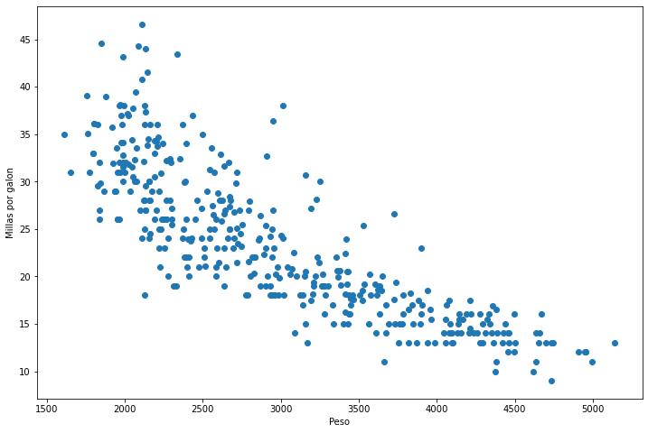

---
# Title, summary, and page position.
linktitle: 6 - Regresion
summary: Ejemplo Regresion con Python
weight: 60
icon: book
icon_pack: fas

# Page metadata.
title: Regresion con Scikit Learn
date: "2020-09-09T00:00:00Z"
type: book  # Do not modify
---

Curso Programacion Analitica

Maestria TIC Linea Ciencia de Datos 

Por [Jose R. Zapata](https://joserzapata.github.io/) 


```python
import pandas as pd
import numpy as np
import matplotlib.pyplot as plt
import seaborn as sns

import datetime
```

# Informacion de los datos


```python
automobile_df = pd.read_csv('auto-mpg.csv')

# Ver 5 registros aleatorios
automobile_df.sample(5)
```


<div>
<style scoped>
    .dataframe tbody tr th:only-of-type {
        vertical-align: middle;
    }

    .dataframe tbody tr th {
        vertical-align: top;
    }

    .dataframe thead th {
        text-align: right;
    }
</style>
<table border="1" class="dataframe">
  <thead>
    <tr style="text-align: right;">
      <th></th>
      <th>mpg</th>
      <th>cylinders</th>
      <th>displacement</th>
      <th>horsepower</th>
      <th>weight</th>
      <th>acceleration</th>
      <th>model year</th>
      <th>origin</th>
      <th>car name</th>
    </tr>
  </thead>
  <tbody>
    <tr>
      <th>284</th>
      <td>20.6</td>
      <td>6</td>
      <td>225.0</td>
      <td>110</td>
      <td>3360</td>
      <td>16.6</td>
      <td>79</td>
      <td>1</td>
      <td>dodge aspen 6</td>
    </tr>
    <tr>
      <th>136</th>
      <td>16.0</td>
      <td>8</td>
      <td>302.0</td>
      <td>140</td>
      <td>4141</td>
      <td>14.0</td>
      <td>74</td>
      <td>1</td>
      <td>ford gran torino</td>
    </tr>
    <tr>
      <th>300</th>
      <td>23.9</td>
      <td>8</td>
      <td>260.0</td>
      <td>90</td>
      <td>3420</td>
      <td>22.2</td>
      <td>79</td>
      <td>1</td>
      <td>oldsmobile cutlass salon brougham</td>
    </tr>
    <tr>
      <th>182</th>
      <td>28.0</td>
      <td>4</td>
      <td>107.0</td>
      <td>86</td>
      <td>2464</td>
      <td>15.5</td>
      <td>76</td>
      <td>2</td>
      <td>fiat 131</td>
    </tr>
    <tr>
      <th>90</th>
      <td>12.0</td>
      <td>8</td>
      <td>429.0</td>
      <td>198</td>
      <td>4952</td>
      <td>11.5</td>
      <td>73</td>
      <td>1</td>
      <td>mercury marquis brougham</td>
    </tr>
  </tbody>
</table>
</div>


```python
#Tamaño del dataset
automobile_df.shape 
```


    (398, 9)


```python
automobile_df.info()
```

    <class 'pandas.core.frame.DataFrame'>
    RangeIndex: 398 entries, 0 to 397
    Data columns (total 9 columns):
     #   Column        Non-Null Count  Dtype  
    ---  ------        --------------  -----  
     0   mpg           398 non-null    float64
     1   cylinders     398 non-null    int64  
     2   displacement  398 non-null    float64
     3   horsepower    398 non-null    object 
     4   weight        398 non-null    int64  
     5   acceleration  398 non-null    float64
     6   model year    398 non-null    int64  
     7   origin        398 non-null    int64  
     8   car name      398 non-null    object 
    dtypes: float64(3), int64(4), object(2)
    memory usage: 28.1+ KB


# Preparacion de Datos


```python
automobile_df = automobile_df.replace('?', np.nan)
```


```python
automobile_df = automobile_df.dropna()
```


```python
automobile_df.shape
```


    (392, 9)


## Eliminar Columnas no necesarias


```python
automobile_df.drop(['origin', 'car name'], axis=1, inplace=True)
```


```python
automobile_df.sample(5)
```


<div>
<style scoped>
    .dataframe tbody tr th:only-of-type {
        vertical-align: middle;
    }

    .dataframe tbody tr th {
        vertical-align: top;
    }

    .dataframe thead th {
        text-align: right;
    }
</style>
<table border="1" class="dataframe">
  <thead>
    <tr style="text-align: right;">
      <th></th>
      <th>mpg</th>
      <th>cylinders</th>
      <th>displacement</th>
      <th>horsepower</th>
      <th>weight</th>
      <th>acceleration</th>
      <th>model year</th>
    </tr>
  </thead>
  <tbody>
    <tr>
      <th>164</th>
      <td>21.0</td>
      <td>6</td>
      <td>231.0</td>
      <td>110</td>
      <td>3039</td>
      <td>15.0</td>
      <td>75</td>
    </tr>
    <tr>
      <th>309</th>
      <td>41.5</td>
      <td>4</td>
      <td>98.0</td>
      <td>76</td>
      <td>2144</td>
      <td>14.7</td>
      <td>80</td>
    </tr>
    <tr>
      <th>224</th>
      <td>15.0</td>
      <td>8</td>
      <td>302.0</td>
      <td>130</td>
      <td>4295</td>
      <td>14.9</td>
      <td>77</td>
    </tr>
    <tr>
      <th>322</th>
      <td>46.6</td>
      <td>4</td>
      <td>86.0</td>
      <td>65</td>
      <td>2110</td>
      <td>17.9</td>
      <td>80</td>
    </tr>
    <tr>
      <th>371</th>
      <td>29.0</td>
      <td>4</td>
      <td>135.0</td>
      <td>84</td>
      <td>2525</td>
      <td>16.0</td>
      <td>82</td>
    </tr>
  </tbody>
</table>
</div>


```python
automobile_df.info()
```

    <class 'pandas.core.frame.DataFrame'>
    Int64Index: 392 entries, 0 to 397
    Data columns (total 7 columns):
     #   Column        Non-Null Count  Dtype  
    ---  ------        --------------  -----  
     0   mpg           392 non-null    float64
     1   cylinders     392 non-null    int64  
     2   displacement  392 non-null    float64
     3   horsepower    392 non-null    object 
     4   weight        392 non-null    int64  
     5   acceleration  392 non-null    float64
     6   model year    392 non-null    int64  
    dtypes: float64(3), int64(3), object(1)
    memory usage: 24.5+ KB


## Convertir el formato de 'model year' a año completo


```python
automobile_df['model year'] = '19' + automobile_df['model year'].astype(str)
```


```python
automobile_df.sample(5)
```


<div>
<style scoped>
    .dataframe tbody tr th:only-of-type {
        vertical-align: middle;
    }

    .dataframe tbody tr th {
        vertical-align: top;
    }

    .dataframe thead th {
        text-align: right;
    }
</style>
<table border="1" class="dataframe">
  <thead>
    <tr style="text-align: right;">
      <th></th>
      <th>mpg</th>
      <th>cylinders</th>
      <th>displacement</th>
      <th>horsepower</th>
      <th>weight</th>
      <th>acceleration</th>
      <th>model year</th>
    </tr>
  </thead>
  <tbody>
    <tr>
      <th>132</th>
      <td>25.0</td>
      <td>4</td>
      <td>140.0</td>
      <td>75</td>
      <td>2542</td>
      <td>17.0</td>
      <td>1974</td>
    </tr>
    <tr>
      <th>213</th>
      <td>13.0</td>
      <td>8</td>
      <td>350.0</td>
      <td>145</td>
      <td>4055</td>
      <td>12.0</td>
      <td>1976</td>
    </tr>
    <tr>
      <th>25</th>
      <td>10.0</td>
      <td>8</td>
      <td>360.0</td>
      <td>215</td>
      <td>4615</td>
      <td>14.0</td>
      <td>1970</td>
    </tr>
    <tr>
      <th>306</th>
      <td>28.8</td>
      <td>6</td>
      <td>173.0</td>
      <td>115</td>
      <td>2595</td>
      <td>11.3</td>
      <td>1979</td>
    </tr>
    <tr>
      <th>259</th>
      <td>20.8</td>
      <td>6</td>
      <td>200.0</td>
      <td>85</td>
      <td>3070</td>
      <td>16.7</td>
      <td>1978</td>
    </tr>
  </tbody>
</table>
</div>


## Agregar columna de los años del automobil


```python
automobile_df['age'] = datetime.datetime.now().year - pd.to_numeric(automobile_df['model year'])
```


```python
automobile_df.drop(['model year'], axis=1, inplace=True)
```


```python
automobile_df.sample(5)
```


<div>
<style scoped>
    .dataframe tbody tr th:only-of-type {
        vertical-align: middle;
    }

    .dataframe tbody tr th {
        vertical-align: top;
    }

    .dataframe thead th {
        text-align: right;
    }
</style>
<table border="1" class="dataframe">
  <thead>
    <tr style="text-align: right;">
      <th></th>
      <th>mpg</th>
      <th>cylinders</th>
      <th>displacement</th>
      <th>horsepower</th>
      <th>weight</th>
      <th>acceleration</th>
      <th>age</th>
    </tr>
  </thead>
  <tbody>
    <tr>
      <th>298</th>
      <td>23.0</td>
      <td>8</td>
      <td>350.0</td>
      <td>125</td>
      <td>3900</td>
      <td>17.4</td>
      <td>41</td>
    </tr>
    <tr>
      <th>154</th>
      <td>15.0</td>
      <td>6</td>
      <td>250.0</td>
      <td>72</td>
      <td>3432</td>
      <td>21.0</td>
      <td>45</td>
    </tr>
    <tr>
      <th>1</th>
      <td>15.0</td>
      <td>8</td>
      <td>350.0</td>
      <td>165</td>
      <td>3693</td>
      <td>11.5</td>
      <td>50</td>
    </tr>
    <tr>
      <th>82</th>
      <td>23.0</td>
      <td>4</td>
      <td>120.0</td>
      <td>97</td>
      <td>2506</td>
      <td>14.5</td>
      <td>48</td>
    </tr>
    <tr>
      <th>199</th>
      <td>20.0</td>
      <td>6</td>
      <td>225.0</td>
      <td>100</td>
      <td>3651</td>
      <td>17.7</td>
      <td>44</td>
    </tr>
  </tbody>
</table>
</div>


```python
automobile_df.dtypes
```


    mpg             float64
    cylinders         int64
    displacement    float64
    horsepower       object
    weight            int64
    acceleration    float64
    age               int64
    dtype: object


```python
automobile_df['horsepower'] = pd.to_numeric(automobile_df['horsepower'], errors='coerce')
```


```python
automobile_df.describe()
```


<div>
<style scoped>
    .dataframe tbody tr th:only-of-type {
        vertical-align: middle;
    }

    .dataframe tbody tr th {
        vertical-align: top;
    }

    .dataframe thead th {
        text-align: right;
    }
</style>
<table border="1" class="dataframe">
  <thead>
    <tr style="text-align: right;">
      <th></th>
      <th>mpg</th>
      <th>cylinders</th>
      <th>displacement</th>
      <th>horsepower</th>
      <th>weight</th>
      <th>acceleration</th>
      <th>age</th>
    </tr>
  </thead>
  <tbody>
    <tr>
      <th>count</th>
      <td>392.000000</td>
      <td>392.000000</td>
      <td>392.000000</td>
      <td>392.000000</td>
      <td>392.000000</td>
      <td>392.000000</td>
      <td>392.000000</td>
    </tr>
    <tr>
      <th>mean</th>
      <td>23.445918</td>
      <td>5.471939</td>
      <td>194.411990</td>
      <td>104.469388</td>
      <td>2977.584184</td>
      <td>15.541327</td>
      <td>44.020408</td>
    </tr>
    <tr>
      <th>std</th>
      <td>7.805007</td>
      <td>1.705783</td>
      <td>104.644004</td>
      <td>38.491160</td>
      <td>849.402560</td>
      <td>2.758864</td>
      <td>3.683737</td>
    </tr>
    <tr>
      <th>min</th>
      <td>9.000000</td>
      <td>3.000000</td>
      <td>68.000000</td>
      <td>46.000000</td>
      <td>1613.000000</td>
      <td>8.000000</td>
      <td>38.000000</td>
    </tr>
    <tr>
      <th>25%</th>
      <td>17.000000</td>
      <td>4.000000</td>
      <td>105.000000</td>
      <td>75.000000</td>
      <td>2225.250000</td>
      <td>13.775000</td>
      <td>41.000000</td>
    </tr>
    <tr>
      <th>50%</th>
      <td>22.750000</td>
      <td>4.000000</td>
      <td>151.000000</td>
      <td>93.500000</td>
      <td>2803.500000</td>
      <td>15.500000</td>
      <td>44.000000</td>
    </tr>
    <tr>
      <th>75%</th>
      <td>29.000000</td>
      <td>8.000000</td>
      <td>275.750000</td>
      <td>126.000000</td>
      <td>3614.750000</td>
      <td>17.025000</td>
      <td>47.000000</td>
    </tr>
    <tr>
      <th>max</th>
      <td>46.600000</td>
      <td>8.000000</td>
      <td>455.000000</td>
      <td>230.000000</td>
      <td>5140.000000</td>
      <td>24.800000</td>
      <td>50.000000</td>
    </tr>
  </tbody>
</table>
</div>


# Analisis Univariable
Se debe hacer un analisis de cada una de las variables y describir sus caracteristicas

# Analisis Bivariable

## Scatter Plots


```python
fig, ax = plt.subplots(figsize=(12, 8))

plt.scatter(automobile_df['age'], automobile_df['mpg'])

plt.xlabel('Años')
plt.ylabel('Millas por galon');
```


    

    
    


```python
fig, ax = plt.subplots(figsize=(12, 8))

plt.scatter(automobile_df['acceleration'], automobile_df['mpg'])

plt.xlabel('Aceleracion')
plt.ylabel('Millas por galon');
```


    

    


```python
fig, ax = plt.subplots(figsize=(12, 8))

plt.scatter(automobile_df['weight'], automobile_df['mpg'])

plt.xlabel('Peso')
plt.ylabel('Millas por galon');
```


    

    


```python
fig, ax = plt.subplots(figsize=(12, 8))

plt.scatter(automobile_df['displacement'], automobile_df['mpg'])

plt.xlabel('Desplazamiento')
plt.ylabel('Millas por galon');
```


    

    


```python
fig, ax = plt.subplots(figsize=(12, 8))

plt.scatter(automobile_df['horsepower'], automobile_df['mpg'])

plt.xlabel('Caballos de fuerza')
plt.ylabel('Millas por galon');
```


    

    


```python
fig, ax = plt.subplots(figsize=(12, 8))

plt.scatter(automobile_df['cylinders'], automobile_df['mpg'])

plt.xlabel('Cilindros')
plt.ylabel('Millas por galon');
```


    

    


## Correlacion


```python
automobile_corr = automobile_df.corr()

automobile_corr
```


<div>
<style scoped>
    .dataframe tbody tr th:only-of-type {
        vertical-align: middle;
    }

    .dataframe tbody tr th {
        vertical-align: top;
    }

    .dataframe thead th {
        text-align: right;
    }
</style>
<table border="1" class="dataframe">
  <thead>
    <tr style="text-align: right;">
      <th></th>
      <th>mpg</th>
      <th>cylinders</th>
      <th>displacement</th>
      <th>horsepower</th>
      <th>weight</th>
      <th>acceleration</th>
      <th>age</th>
    </tr>
  </thead>
  <tbody>
    <tr>
      <th>mpg</th>
      <td>1.000000</td>
      <td>-0.777618</td>
      <td>-0.805127</td>
      <td>-0.778427</td>
      <td>-0.832244</td>
      <td>0.423329</td>
      <td>-0.580541</td>
    </tr>
    <tr>
      <th>cylinders</th>
      <td>-0.777618</td>
      <td>1.000000</td>
      <td>0.950823</td>
      <td>0.842983</td>
      <td>0.897527</td>
      <td>-0.504683</td>
      <td>0.345647</td>
    </tr>
    <tr>
      <th>displacement</th>
      <td>-0.805127</td>
      <td>0.950823</td>
      <td>1.000000</td>
      <td>0.897257</td>
      <td>0.932994</td>
      <td>-0.543800</td>
      <td>0.369855</td>
    </tr>
    <tr>
      <th>horsepower</th>
      <td>-0.778427</td>
      <td>0.842983</td>
      <td>0.897257</td>
      <td>1.000000</td>
      <td>0.864538</td>
      <td>-0.689196</td>
      <td>0.416361</td>
    </tr>
    <tr>
      <th>weight</th>
      <td>-0.832244</td>
      <td>0.897527</td>
      <td>0.932994</td>
      <td>0.864538</td>
      <td>1.000000</td>
      <td>-0.416839</td>
      <td>0.309120</td>
    </tr>
    <tr>
      <th>acceleration</th>
      <td>0.423329</td>
      <td>-0.504683</td>
      <td>-0.543800</td>
      <td>-0.689196</td>
      <td>-0.416839</td>
      <td>1.000000</td>
      <td>-0.290316</td>
    </tr>
    <tr>
      <th>age</th>
      <td>-0.580541</td>
      <td>0.345647</td>
      <td>0.369855</td>
      <td>0.416361</td>
      <td>0.309120</td>
      <td>-0.290316</td>
      <td>1.000000</td>
    </tr>
  </tbody>
</table>
</div>


```python
fig, ax = plt.subplots(figsize=(12, 10))

sns.heatmap(automobile_corr, annot=True);
```


    

    


```python
automobile_df = automobile_df.sample(frac=1).reset_index(drop=True)

automobile_df.head()
```


<div>
<style scoped>
    .dataframe tbody tr th:only-of-type {
        vertical-align: middle;
    }

    .dataframe tbody tr th {
        vertical-align: top;
    }

    .dataframe thead th {
        text-align: right;
    }
</style>
<table border="1" class="dataframe">
  <thead>
    <tr style="text-align: right;">
      <th></th>
      <th>mpg</th>
      <th>cylinders</th>
      <th>displacement</th>
      <th>horsepower</th>
      <th>weight</th>
      <th>acceleration</th>
      <th>age</th>
    </tr>
  </thead>
  <tbody>
    <tr>
      <th>0</th>
      <td>17.0</td>
      <td>8</td>
      <td>305.0</td>
      <td>130</td>
      <td>3840</td>
      <td>15.4</td>
      <td>41</td>
    </tr>
    <tr>
      <th>1</th>
      <td>30.0</td>
      <td>4</td>
      <td>98.0</td>
      <td>68</td>
      <td>2155</td>
      <td>16.5</td>
      <td>42</td>
    </tr>
    <tr>
      <th>2</th>
      <td>19.4</td>
      <td>6</td>
      <td>232.0</td>
      <td>90</td>
      <td>3210</td>
      <td>17.2</td>
      <td>42</td>
    </tr>
    <tr>
      <th>3</th>
      <td>31.8</td>
      <td>4</td>
      <td>85.0</td>
      <td>65</td>
      <td>2020</td>
      <td>19.2</td>
      <td>41</td>
    </tr>
    <tr>
      <th>4</th>
      <td>26.0</td>
      <td>4</td>
      <td>108.0</td>
      <td>93</td>
      <td>2391</td>
      <td>15.5</td>
      <td>46</td>
    </tr>
  </tbody>
</table>
</div>


```python
automobile_df.to_csv('auto-mpg-processed.csv', index=False)
```

# Regresion Lineal

## Regresion lineal con una caracteristica (horsepower)


```python
from sklearn.model_selection import train_test_split

X = automobile_df[['horsepower']]
Y = automobile_df['mpg']

x_train, x_test, y_train, y_test = train_test_split(X, Y, test_size=0.2)
```


```python
x_train.sample(5)
```


<div>
<style scoped>
    .dataframe tbody tr th:only-of-type {
        vertical-align: middle;
    }

    .dataframe tbody tr th {
        vertical-align: top;
    }

    .dataframe thead th {
        text-align: right;
    }
</style>
<table border="1" class="dataframe">
  <thead>
    <tr style="text-align: right;">
      <th></th>
      <th>horsepower</th>
    </tr>
  </thead>
  <tbody>
    <tr>
      <th>375</th>
      <td>89</td>
    </tr>
    <tr>
      <th>265</th>
      <td>68</td>
    </tr>
    <tr>
      <th>29</th>
      <td>97</td>
    </tr>
    <tr>
      <th>231</th>
      <td>120</td>
    </tr>
    <tr>
      <th>349</th>
      <td>108</td>
    </tr>
  </tbody>
</table>
</div>


```python
from sklearn.linear_model import LinearRegression

linear_model = LinearRegression(normalize=True).fit(x_train, y_train)
```


```python
print('Puntaje Entrenamiento: ', linear_model.score(x_train, y_train))
```

    Puntaje Entrenamiento:  0.6323165116170613


```python
y_pred = linear_model.predict(x_test)
```


```python
from sklearn.metrics import r2_score

print('Puntaje Testing: ', r2_score(y_test, y_pred))
```

    Puntaje Testing:  0.31221638583688094


```python
fig, ax = plt.subplots(figsize=(12, 8))

plt.scatter(x_test, y_test)
plt.plot(x_test, y_pred, color='r')

plt.xlabel('Caballos de Fuerza')
plt.ylabel('Mpg')
plt.show()
```


    

    


## Regresion lineal con una caracteristica - age


```python
X = automobile_df[['age']]
Y = automobile_df['mpg']

x_train, x_test, y_train, y_test = train_test_split(X, Y, test_size=0.2)

linear_model = LinearRegression(normalize=True).fit(x_train, y_train)

print('Puntaje de entrenamiento: ', linear_model.score(x_train, y_train))

y_pred = linear_model.predict(x_test)

print('Puntaje de Testing: ', r2_score(y_test, y_pred))
```

    Puntaje de entrenamiento:  0.36723602073481343
    Puntaje de Testing:  0.20002514279066197


```python
fig, ax = plt.subplots(figsize=(12, 8))

plt.scatter(x_test, y_test)
plt.plot(x_test, y_pred, color='r')

plt.xlabel('Age')
plt.ylabel('Mpg')
plt.show()
```


    

    


## Regresion lineal con varias caracteristicas


```python
# X = automobile_df[['displacement', 'horsepower', 'weight', 'acceleration', 'cylinders']]

X = automobile_df[['displacement', 'horsepower', 'weight']]
Y = automobile_df['mpg']

x_train, x_test, y_train, y_test = train_test_split(X, Y, test_size=0.2)
```


```python
linear_model = LinearRegression(normalize=True).fit(x_train, y_train)
```


```python
print('Training score: ', linear_model.score(x_train, y_train))
```

    Training score:  0.7017904639110666


```python
predictors = x_train.columns
coef = pd.Series(linear_model.coef_, predictors).sort_values()

print(coef)
```

    horsepower     -0.047675
    weight         -0.005258
    displacement   -0.004028
    dtype: float64


```python
y_pred = linear_model.predict(x_test)
```


```python
print('Puntaje Testing', r2_score(y_test, y_pred))
```

    Puntaje Testing 0.7243525511175973


```python
plt.figure(figsize = (20,10))

plt.plot(y_pred, label='Prediccion')
plt.plot(y_test.values, label='Real')

plt.ylabel('Mpg')

plt.legend()
plt.show()
```


    

    


# Regresión con Múltiples Modelos


```python
import statsmodels.api as sm

from sklearn.model_selection import train_test_split
from sklearn.metrics import r2_score
from sklearn.preprocessing import StandardScaler

from sklearn.linear_model import LinearRegression
from sklearn.linear_model import Lasso
from sklearn.linear_model import Ridge
from sklearn.linear_model import ElasticNet
from sklearn.linear_model import Lars
from sklearn.linear_model import SGDRegressor
from sklearn.svm import SVR
from sklearn.neighbors import KNeighborsRegressor
from sklearn.tree import DecisionTreeRegressor

import warnings
warnings.filterwarnings("ignore")
```


```python
automobile_df = pd.read_csv('auto-mpg-processed.csv')

automobile_df.head()
```


<div>
<style scoped>
    .dataframe tbody tr th:only-of-type {
        vertical-align: middle;
    }

    .dataframe tbody tr th {
        vertical-align: top;
    }

    .dataframe thead th {
        text-align: right;
    }
</style>
<table border="1" class="dataframe">
  <thead>
    <tr style="text-align: right;">
      <th></th>
      <th>mpg</th>
      <th>cylinders</th>
      <th>displacement</th>
      <th>horsepower</th>
      <th>weight</th>
      <th>acceleration</th>
      <th>age</th>
    </tr>
  </thead>
  <tbody>
    <tr>
      <th>0</th>
      <td>17.0</td>
      <td>8</td>
      <td>305.0</td>
      <td>130</td>
      <td>3840</td>
      <td>15.4</td>
      <td>41</td>
    </tr>
    <tr>
      <th>1</th>
      <td>30.0</td>
      <td>4</td>
      <td>98.0</td>
      <td>68</td>
      <td>2155</td>
      <td>16.5</td>
      <td>42</td>
    </tr>
    <tr>
      <th>2</th>
      <td>19.4</td>
      <td>6</td>
      <td>232.0</td>
      <td>90</td>
      <td>3210</td>
      <td>17.2</td>
      <td>42</td>
    </tr>
    <tr>
      <th>3</th>
      <td>31.8</td>
      <td>4</td>
      <td>85.0</td>
      <td>65</td>
      <td>2020</td>
      <td>19.2</td>
      <td>41</td>
    </tr>
    <tr>
      <th>4</th>
      <td>26.0</td>
      <td>4</td>
      <td>108.0</td>
      <td>93</td>
      <td>2391</td>
      <td>15.5</td>
      <td>46</td>
    </tr>
  </tbody>
</table>
</div>


```python
result_dict = {}
```

## Funciones de ayuda


```python
def build_model(regression_fn,                
                name_of_y_col, 
                names_of_x_cols, 
                dataset, 
                test_frac=0.2,
                preprocess_fn=None,
                show_plot_Y=False,
                show_plot_scatter=False):
    
    """build_model
    
    Funcion para entrenar y evaluar un modelo
        
    """
    
    X = dataset[names_of_x_cols]
    Y = dataset[name_of_y_col]

    if preprocess_fn is not None:
        X = preprocess_fn(X)

    x_train, x_test, y_train, y_test = train_test_split(X, Y, test_size=test_frac)
    
    model = regression_fn(x_train, y_train)
    
    y_pred = model.predict(x_test)
    
    print("Entrenamiento_score : " , model.score(x_train, y_train))
    print("Prueba_score : ", r2_score(y_test, y_pred))

    if show_plot_Y == True:
        fig, ax = plt.subplots(figsize=(12, 8))
        
        plt.plot(y_pred, label='Prediccion')
        plt.plot(y_test.values, label='Actual')
        
        plt.ylabel(name_of_y_col)

        plt.legend()
        plt.show()

    if show_plot_scatter == True:
        fig, ax = plt.subplots(figsize=(12, 8))
        
        plt.scatter(x_test, y_test)
        plt.plot(x_test, y_pred, 'r')
        
        plt.legend(['Linea de Prediccion','Datos observados'])
        plt.show()
    
    return {
            'Entrenamiento_score': model.score(x_train, y_train),
            'Prueba_score': r2_score(y_test, y_pred)
           }     
```


```python
def compare_results():
    for key in result_dict:
        print('Regresion: ', key)
        print('Entrenamiento score', result_dict[key]['Entrenamiento_score'])
        print('Prueba score', result_dict[key]['Prueba_score'])
        print()
```

## Regresion lineal


```python
def linear_reg(x_train, y_train):
    model = LinearRegression(normalize=True)
    model.fit(x_train, y_train)
    
    return model
```


```python
result_dict['mpg ~ single_linear'] = build_model(linear_reg,
                                                 'mpg',
                                                ['weight'],
                                                  automobile_df,
                                                  show_plot_Y=True)
```

    Entrenamiento_score :  0.6940251922026459
    Prueba_score :  0.6780272557552722


    

    


```python
result_dict['mpg ~ kitchen_sink_linear'] = build_model(linear_reg,
                                                      'mpg',
                                                     ['cylinders',
                                                      'displacement',
                                                      'horsepower',
                                                      'weight',
                                                      'acceleration'],
                                                      automobile_df,
                                                      show_plot_Y=True)
```

    Entrenamiento_score :  0.7143524190779553
    Prueba_score :  0.6496852460273488


    

    


```python
result_dict['mpg ~ parsimonius_linear'] = build_model(linear_reg,
                                                      'mpg',
                                                    ['horsepower',
                                                     'weight'],
                                                      automobile_df,
                                                      show_plot_Y=True)
```

    Entrenamiento_score :  0.7069851597873933
    Prueba_score :  0.7035037058069924


    

    


```python
compare_results()
```

    Regresion:  mpg ~ single_linear
    Entrenamiento score 0.6940251922026459
    Prueba score 0.6780272557552722
    
    Regresion:  mpg ~ kitchen_sink_linear
    Entrenamiento score 0.7143524190779553
    Prueba score 0.6496852460273488
    
    Regresion:  mpg ~ parsimonius_linear
    Entrenamiento score 0.7069851597873933
    Prueba score 0.7035037058069924
    


## Lasso


```python
def lasso_reg(x_train, y_train, alpha=0.5):
    model = Lasso(alpha=alpha)
    model.fit(x_train, y_train)
    
    return model
```


```python
result_dict['mpg ~ kitchen_sink_lasso'] = build_model(lasso_reg,
                                                     'mpg',
                                                    ['cylinders',
                                                     'displacement',
                                                     'horsepower',
                                                     'weight',
                                                     'acceleration'],
                                                      automobile_df,
                                                      show_plot_Y=True)
```

    Entrenamiento_score :  0.7151538580963827
    Prueba_score :  0.6762521302280093


    

    


```python
compare_results()
```

    Regresion:  mpg ~ single_linear
    Entrenamiento score 0.6940251922026459
    Prueba score 0.6780272557552722
    
    Regresion:  mpg ~ kitchen_sink_linear
    Entrenamiento score 0.7143524190779553
    Prueba score 0.6496852460273488
    
    Regresion:  mpg ~ parsimonius_linear
    Entrenamiento score 0.7069851597873933
    Prueba score 0.7035037058069924
    
    Regresion:  mpg ~ kitchen_sink_lasso
    Entrenamiento score 0.7151538580963827
    Prueba score 0.6762521302280093
    


## Ridge


```python
def ridge_reg(x_train, y_train, alpha=0.5, normalize=True):
    model = Ridge(alpha=alpha, normalize=normalize)
    model.fit(x_train, y_train)
    
    return model
```


```python
result_dict['mpg ~ kitchen_sink_ridge'] = build_model(ridge_reg,
                                                      'mpg',
                                                     ['cylinders',
                                                      'displacement',
                                                      'horsepower',
                                                      'weight',
                                                      'acceleration'],
                                                       automobile_df,
                                                       show_plot_Y=True)
```

    Entrenamiento_score :  0.6896708807553231
    Prueba_score :  0.6556435118377518


    

    


```python
compare_results()
```

    Regresion:  mpg ~ single_linear
    Entrenamiento score 0.6940251922026459
    Prueba score 0.6780272557552722
    
    Regresion:  mpg ~ kitchen_sink_linear
    Entrenamiento score 0.7143524190779553
    Prueba score 0.6496852460273488
    
    Regresion:  mpg ~ parsimonius_linear
    Entrenamiento score 0.7069851597873933
    Prueba score 0.7035037058069924
    
    Regresion:  mpg ~ kitchen_sink_lasso
    Entrenamiento score 0.7151538580963827
    Prueba score 0.6762521302280093
    
    Regresion:  mpg ~ kitchen_sink_ridge
    Entrenamiento score 0.6896708807553231
    Prueba score 0.6556435118377518
    


## Elasticnet


```python
def elastic_net_reg(x_train, y_train, alpha=1, l1_ratio=0.5, 
                    normalize=False, max_iter=100000, warm_start=True, equivalent_to="Elastic Net"):

    print("Equivalent to:", equivalent_to)
    
    model = ElasticNet(alpha=alpha, l1_ratio=l1_ratio, 
                       normalize=normalize, max_iter=max_iter, warm_start=warm_start)
    model.fit(x_train, y_train)

    return model
```


```python
from functools import partial

## This generates a warning which says will not converge
result_dict['mpg ~ kitchen_sink_elastic_net_ols'] = build_model(partial(elastic_net_reg, 
                                                                        alpha=0, equivalent_to="OLS"),
                                                               'mpg',
                                                              ['cylinders',
                                                               'displacement',
                                                               'horsepower',
                                                               'weight',
                                                               'acceleration'],
                                                                automobile_df,
                                                                show_plot_Y=True)
```

    Equivalent to: OLS
    Entrenamiento_score :  0.7164509306550633
    Prueba_score :  0.6549631422669479


    

    


```python
result_dict['mpg ~ kitchen_sink_elastic_net_lasso'] = build_model(partial(elastic_net_reg, alpha=1, 
                                                                    l1_ratio=0, equivalent_to="Lasso"),
                                                                  'mpg',
                                                                 ['cylinders',
                                                                  'displacement',
                                                                  'horsepower',
                                                                  'weight',
                                                                  'acceleration'],
                                                                   automobile_df,
                                                                   show_plot_Y=True)
```

    Equivalent to: Lasso
    Entrenamiento_score :  0.7095244697290346
    Prueba_score :  0.693312102583202


    

    


```python
result_dict['mpg ~ kitchen_sink_elastic_net_ridge'] = build_model(partial(elastic_net_reg, alpha=1, 
                                                                    l1_ratio=1, equivalent_to="Ridge"),
                                                                  'mpg',
                                                                 ['cylinders',
                                                                  'displacement',
                                                                  'horsepower',
                                                                  'weight',
                                                                  'acceleration'],
                                                                   automobile_df,
                                                                   show_plot_Y=True)
```

    Equivalent to: Ridge
    Entrenamiento_score :  0.7062365688088987
    Prueba_score :  0.7064404958207979


    

    


```python
result_dict['mpg ~ kitchen_sink_elastic_net'] = build_model(partial(elastic_net_reg, alpha=1, l1_ratio=0.5),
                                                            'mpg',
                                                          [ 'cylinders',
                                                            'displacement',
                                                            'horsepower',
                                                            'weight',
                                                            'acceleration'],
                                                            automobile_df,
                                                            show_plot_Y=True)
```

    Equivalent to: Elastic Net
    Entrenamiento_score :  0.7143840512964182
    Prueba_score :  0.6719883512351271


    

    


```python
compare_results()
```

    Regresion:  mpg ~ single_linear
    Entrenamiento score 0.6940251922026459
    Prueba score 0.6780272557552722
    
    Regresion:  mpg ~ kitchen_sink_linear
    Entrenamiento score 0.7143524190779553
    Prueba score 0.6496852460273488
    
    Regresion:  mpg ~ parsimonius_linear
    Entrenamiento score 0.7069851597873933
    Prueba score 0.7035037058069924
    
    Regresion:  mpg ~ kitchen_sink_lasso
    Entrenamiento score 0.7151538580963827
    Prueba score 0.6762521302280093
    
    Regresion:  mpg ~ kitchen_sink_ridge
    Entrenamiento score 0.6896708807553231
    Prueba score 0.6556435118377518
    
    Regresion:  mpg ~ kitchen_sink_elastic_net_ols
    Entrenamiento score 0.7164509306550633
    Prueba score 0.6549631422669479
    
    Regresion:  mpg ~ kitchen_sink_elastic_net_lasso
    Entrenamiento score 0.7095244697290346
    Prueba score 0.693312102583202
    
    Regresion:  mpg ~ kitchen_sink_elastic_net_ridge
    Entrenamiento score 0.7062365688088987
    Prueba score 0.7064404958207979
    
    Regresion:  mpg ~ kitchen_sink_elastic_net
    Entrenamiento score 0.7143840512964182
    Prueba score 0.6719883512351271
    


## SVR

For SVR regression with larger datasets this alternate implementations is preferred

https://scikit-learn.org/stable/modules/generated/sklearn.svm.LinearSVR.html#sklearn.svm.LinearSVR

* Uses a different library for implementation
* More flexibility with choice of penalties
* Scales to larger datasets


```python
def svr_reg(x_train, y_train, kernel='linear', epsilon=0.05, C=0.3):
    model = SVR(kernel=kernel, epsilon=epsilon, C=C)
    model.fit(x_train,y_train)
    
    return model
```


```python
result_dict['mpg ~ kitchen_sink_svr'] = build_model(svr_reg,
                                                    'mpg',
                                                   ['cylinders',
                                                    'displacement',
                                                    'horsepower',
                                                    'weight',
                                                    'acceleration'],
                                                     automobile_df,
                                                     show_plot_Y=True)
```

    Entrenamiento_score :  0.6933523813332493
    Prueba_score :  0.6864550093179962


    

    


```python
compare_results()
```

    Regresion:  mpg ~ single_linear
    Entrenamiento score 0.6940251922026459
    Prueba score 0.6780272557552722
    
    Regresion:  mpg ~ kitchen_sink_linear
    Entrenamiento score 0.7143524190779553
    Prueba score 0.6496852460273488
    
    Regresion:  mpg ~ parsimonius_linear
    Entrenamiento score 0.7069851597873933
    Prueba score 0.7035037058069924
    
    Regresion:  mpg ~ kitchen_sink_lasso
    Entrenamiento score 0.7151538580963827
    Prueba score 0.6762521302280093
    
    Regresion:  mpg ~ kitchen_sink_ridge
    Entrenamiento score 0.6896708807553231
    Prueba score 0.6556435118377518
    
    Regresion:  mpg ~ kitchen_sink_elastic_net_ols
    Entrenamiento score 0.7164509306550633
    Prueba score 0.6549631422669479
    
    Regresion:  mpg ~ kitchen_sink_elastic_net_lasso
    Entrenamiento score 0.7095244697290346
    Prueba score 0.693312102583202
    
    Regresion:  mpg ~ kitchen_sink_elastic_net_ridge
    Entrenamiento score 0.7062365688088987
    Prueba score 0.7064404958207979
    
    Regresion:  mpg ~ kitchen_sink_elastic_net
    Entrenamiento score 0.7143840512964182
    Prueba score 0.6719883512351271
    
    Regresion:  mpg ~ kitchen_sink_svr
    Entrenamiento score 0.6933523813332493
    Prueba score 0.6864550093179962
    


## KNR


```python
def kneighbors_reg(x_train, y_train, n_neighbors=10):
    model = KNeighborsRegressor(n_neighbors=n_neighbors)
    model.fit(x_train, y_train)
    
    return model
```


```python
result_dict['mpg ~ kitchen_sink_kneighbors'] = build_model(kneighbors_reg,
                                                           'mpg',
                                                          ['cylinders',
                                                           'displacement',
                                                           'horsepower',
                                                           'weight',
                                                           'acceleration'],
                                                           automobile_df,
                                                           show_plot_Y=True)
```

    Entrenamiento_score :  0.7486049876709735
    Prueba_score :  0.7499122640106735


    

    


```python
compare_results()
```

    Regresion:  mpg ~ single_linear
    Entrenamiento score 0.6940251922026459
    Prueba score 0.6780272557552722
    
    Regresion:  mpg ~ kitchen_sink_linear
    Entrenamiento score 0.7143524190779553
    Prueba score 0.6496852460273488
    
    Regresion:  mpg ~ parsimonius_linear
    Entrenamiento score 0.7069851597873933
    Prueba score 0.7035037058069924
    
    Regresion:  mpg ~ kitchen_sink_lasso
    Entrenamiento score 0.7151538580963827
    Prueba score 0.6762521302280093
    
    Regresion:  mpg ~ kitchen_sink_ridge
    Entrenamiento score 0.6896708807553231
    Prueba score 0.6556435118377518
    
    Regresion:  mpg ~ kitchen_sink_elastic_net_ols
    Entrenamiento score 0.7164509306550633
    Prueba score 0.6549631422669479
    
    Regresion:  mpg ~ kitchen_sink_elastic_net_lasso
    Entrenamiento score 0.7095244697290346
    Prueba score 0.693312102583202
    
    Regresion:  mpg ~ kitchen_sink_elastic_net_ridge
    Entrenamiento score 0.7062365688088987
    Prueba score 0.7064404958207979
    
    Regresion:  mpg ~ kitchen_sink_elastic_net
    Entrenamiento score 0.7143840512964182
    Prueba score 0.6719883512351271
    
    Regresion:  mpg ~ kitchen_sink_svr
    Entrenamiento score 0.6933523813332493
    Prueba score 0.6864550093179962
    
    Regresion:  mpg ~ kitchen_sink_kneighbors
    Entrenamiento score 0.7486049876709735
    Prueba score 0.7499122640106735
    


## SGD


```python
def apply_standard_scaler(x):
    scaler = StandardScaler()
    scaler.fit(x)  

    return scaler.transform(x)
```


```python
def sgd_reg(x_train, y_train, max_iter=10000, tol=1e-3):
    model = SGDRegressor(max_iter=max_iter, tol=tol)
    model.fit(x_train, y_train)
    
    return model
```


```python
result_dict['mpg ~ kitchen_sink_sgd'] = build_model(sgd_reg,
                                                   'mpg',
                                                  ['cylinders',
                                                   'displacement',
                                                   'horsepower',
                                                   'weight',
                                                   'acceleration'],
                                                    automobile_df,
                                                    show_plot_Y=True,
                                                    preprocess_fn=apply_standard_scaler)
```

    Entrenamiento_score :  0.7161070391196642
    Prueba_score :  0.6613614209196004


    

    


```python
compare_results()
```

    Regresion:  mpg ~ single_linear
    Entrenamiento score 0.6940251922026459
    Prueba score 0.6780272557552722
    
    Regresion:  mpg ~ kitchen_sink_linear
    Entrenamiento score 0.7143524190779553
    Prueba score 0.6496852460273488
    
    Regresion:  mpg ~ parsimonius_linear
    Entrenamiento score 0.7069851597873933
    Prueba score 0.7035037058069924
    
    Regresion:  mpg ~ kitchen_sink_lasso
    Entrenamiento score 0.7151538580963827
    Prueba score 0.6762521302280093
    
    Regresion:  mpg ~ kitchen_sink_ridge
    Entrenamiento score 0.6896708807553231
    Prueba score 0.6556435118377518
    
    Regresion:  mpg ~ kitchen_sink_elastic_net_ols
    Entrenamiento score 0.7164509306550633
    Prueba score 0.6549631422669479
    
    Regresion:  mpg ~ kitchen_sink_elastic_net_lasso
    Entrenamiento score 0.7095244697290346
    Prueba score 0.693312102583202
    
    Regresion:  mpg ~ kitchen_sink_elastic_net_ridge
    Entrenamiento score 0.7062365688088987
    Prueba score 0.7064404958207979
    
    Regresion:  mpg ~ kitchen_sink_elastic_net
    Entrenamiento score 0.7143840512964182
    Prueba score 0.6719883512351271
    
    Regresion:  mpg ~ kitchen_sink_svr
    Entrenamiento score 0.6933523813332493
    Prueba score 0.6864550093179962
    
    Regresion:  mpg ~ kitchen_sink_kneighbors
    Entrenamiento score 0.7486049876709735
    Prueba score 0.7499122640106735
    
    Regresion:  mpg ~ kitchen_sink_sgd
    Entrenamiento score 0.7161070391196642
    Prueba score 0.6613614209196004
    


## Decision Tree


```python
def decision_tree_reg(x_train, y_train, max_depth=2):
    model = DecisionTreeRegressor(max_depth=max_depth)
    model.fit(x_train, y_train)
    
    return model
```


```python
result_dict['mpg ~ kitchen_sink_decision_tree'] = build_model(decision_tree_reg,
                                                             'mpg',
                                                            ['cylinders',
                                                             'displacement',
                                                             'horsepower',
                                                             'weight',
                                                             'acceleration'],
                                                              automobile_df,
                                                              show_plot_Y=True)
```

    Entrenamiento_score :  0.7309719034142717
    Prueba_score :  0.7059004654965224


    

    


```python
compare_results()
```

    Regresion:  mpg ~ single_linear
    Entrenamiento score 0.6940251922026459
    Prueba score 0.6780272557552722
    
    Regresion:  mpg ~ kitchen_sink_linear
    Entrenamiento score 0.7143524190779553
    Prueba score 0.6496852460273488
    
    Regresion:  mpg ~ parsimonius_linear
    Entrenamiento score 0.7069851597873933
    Prueba score 0.7035037058069924
    
    Regresion:  mpg ~ kitchen_sink_lasso
    Entrenamiento score 0.7151538580963827
    Prueba score 0.6762521302280093
    
    Regresion:  mpg ~ kitchen_sink_ridge
    Entrenamiento score 0.6896708807553231
    Prueba score 0.6556435118377518
    
    Regresion:  mpg ~ kitchen_sink_elastic_net_ols
    Entrenamiento score 0.7164509306550633
    Prueba score 0.6549631422669479
    
    Regresion:  mpg ~ kitchen_sink_elastic_net_lasso
    Entrenamiento score 0.7095244697290346
    Prueba score 0.693312102583202
    
    Regresion:  mpg ~ kitchen_sink_elastic_net_ridge
    Entrenamiento score 0.7062365688088987
    Prueba score 0.7064404958207979
    
    Regresion:  mpg ~ kitchen_sink_elastic_net
    Entrenamiento score 0.7143840512964182
    Prueba score 0.6719883512351271
    
    Regresion:  mpg ~ kitchen_sink_svr
    Entrenamiento score 0.6933523813332493
    Prueba score 0.6864550093179962
    
    Regresion:  mpg ~ kitchen_sink_kneighbors
    Entrenamiento score 0.7486049876709735
    Prueba score 0.7499122640106735
    
    Regresion:  mpg ~ kitchen_sink_sgd
    Entrenamiento score 0.7161070391196642
    Prueba score 0.6613614209196004
    
    Regresion:  mpg ~ kitchen_sink_decision_tree
    Entrenamiento score 0.7309719034142717
    Prueba score 0.7059004654965224
    


## Lars


```python
def lars_reg(x_train, y_train, n_nonzero_coefs=4):
    model = Lars(n_nonzero_coefs=n_nonzero_coefs)
    model.fit(x_train, y_train)
    
    return model
```


```python
result_dict['mpg ~ kitchen_sink_lars'] = build_model(lars_reg,
                                                    'mpg',
                                                   ['cylinders',
                                                    'displacement',
                                                    'horsepower',
                                                    'weight',
                                                    'acceleration'],
                                                     automobile_df,
                                                     show_plot_Y=True)
```

    Entrenamiento_score :  0.7097904166855645
    Prueba_score :  0.6827026729724508


    

    


```python
compare_results()
```

    Regresion:  mpg ~ single_linear
    Entrenamiento score 0.6940251922026459
    Prueba score 0.6780272557552722
    
    Regresion:  mpg ~ kitchen_sink_linear
    Entrenamiento score 0.7143524190779553
    Prueba score 0.6496852460273488
    
    Regresion:  mpg ~ parsimonius_linear
    Entrenamiento score 0.7069851597873933
    Prueba score 0.7035037058069924
    
    Regresion:  mpg ~ kitchen_sink_lasso
    Entrenamiento score 0.7151538580963827
    Prueba score 0.6762521302280093
    
    Regresion:  mpg ~ kitchen_sink_ridge
    Entrenamiento score 0.6896708807553231
    Prueba score 0.6556435118377518
    
    Regresion:  mpg ~ kitchen_sink_elastic_net_ols
    Entrenamiento score 0.7164509306550633
    Prueba score 0.6549631422669479
    
    Regresion:  mpg ~ kitchen_sink_elastic_net_lasso
    Entrenamiento score 0.7095244697290346
    Prueba score 0.693312102583202
    
    Regresion:  mpg ~ kitchen_sink_elastic_net_ridge
    Entrenamiento score 0.7062365688088987
    Prueba score 0.7064404958207979
    
    Regresion:  mpg ~ kitchen_sink_elastic_net
    Entrenamiento score 0.7143840512964182
    Prueba score 0.6719883512351271
    
    Regresion:  mpg ~ kitchen_sink_svr
    Entrenamiento score 0.6933523813332493
    Prueba score 0.6864550093179962
    
    Regresion:  mpg ~ kitchen_sink_kneighbors
    Entrenamiento score 0.7486049876709735
    Prueba score 0.7499122640106735
    
    Regresion:  mpg ~ kitchen_sink_sgd
    Entrenamiento score 0.7161070391196642
    Prueba score 0.6613614209196004
    
    Regresion:  mpg ~ kitchen_sink_decision_tree
    Entrenamiento score 0.7309719034142717
    Prueba score 0.7059004654965224
    
    Regresion:  mpg ~ kitchen_sink_lars
    Entrenamiento score 0.7097904166855645
    Prueba score 0.6827026729724508
    


# Hyper Parameter Tunning


```python
from sklearn.metrics import r2_score
from sklearn.preprocessing import StandardScaler

from sklearn.model_selection import GridSearchCV

import warnings
warnings.filterwarnings("ignore")
```


```python
automobile_df = pd.read_csv('auto-mpg-processed.csv')

automobile_df.head()
```


<div>
<style scoped>
    .dataframe tbody tr th:only-of-type {
        vertical-align: middle;
    }

    .dataframe tbody tr th {
        vertical-align: top;
    }

    .dataframe thead th {
        text-align: right;
    }
</style>
<table border="1" class="dataframe">
  <thead>
    <tr style="text-align: right;">
      <th></th>
      <th>mpg</th>
      <th>cylinders</th>
      <th>displacement</th>
      <th>horsepower</th>
      <th>weight</th>
      <th>acceleration</th>
      <th>age</th>
    </tr>
  </thead>
  <tbody>
    <tr>
      <th>0</th>
      <td>17.0</td>
      <td>8</td>
      <td>305.0</td>
      <td>130</td>
      <td>3840</td>
      <td>15.4</td>
      <td>41</td>
    </tr>
    <tr>
      <th>1</th>
      <td>30.0</td>
      <td>4</td>
      <td>98.0</td>
      <td>68</td>
      <td>2155</td>
      <td>16.5</td>
      <td>42</td>
    </tr>
    <tr>
      <th>2</th>
      <td>19.4</td>
      <td>6</td>
      <td>232.0</td>
      <td>90</td>
      <td>3210</td>
      <td>17.2</td>
      <td>42</td>
    </tr>
    <tr>
      <th>3</th>
      <td>31.8</td>
      <td>4</td>
      <td>85.0</td>
      <td>65</td>
      <td>2020</td>
      <td>19.2</td>
      <td>41</td>
    </tr>
    <tr>
      <th>4</th>
      <td>26.0</td>
      <td>4</td>
      <td>108.0</td>
      <td>93</td>
      <td>2391</td>
      <td>15.5</td>
      <td>46</td>
    </tr>
  </tbody>
</table>
</div>


```python
X = automobile_df.drop(['mpg', 'age'], axis=1)

Y = automobile_df['mpg']

x_train, x_test, y_train, y_test = train_test_split(X, Y, test_size=0.2)
```

## Lasso regression


```python
parameters = {'alpha': [0.2, 0.4, 0.6, 0.7, 0.8, 0.9, 1.0]}

grid_search = GridSearchCV(Lasso(), parameters, cv=3, return_train_score=True)
grid_search.fit(x_train, y_train)

grid_search.best_params_
```


    {'alpha': 0.2}


```python
for i in range(len(parameters['alpha'])):
    print('Parametros: ', grid_search.cv_results_['params'][i])

    print('Promedio Score Prueba: ', grid_search.cv_results_['mean_test_score'][i])
    
    print('Rank: ', grid_search.cv_results_['rank_test_score'][i])
```

    Parametros:  {'alpha': 0.2}
    Promedio Score Prueba:  0.6798292939123337
    Rank:  1
    Parametros:  {'alpha': 0.4}
    Promedio Score Prueba:  0.6793066874613363
    Rank:  2
    Parametros:  {'alpha': 0.6}
    Promedio Score Prueba:  0.6792520244406055
    Rank:  3
    Parametros:  {'alpha': 0.7}
    Promedio Score Prueba:  0.6792212039982681
    Rank:  4
    Parametros:  {'alpha': 0.8}
    Promedio Score Prueba:  0.6791902701986242
    Rank:  5
    Parametros:  {'alpha': 0.9}
    Promedio Score Prueba:  0.6791585685202491
    Rank:  6
    Parametros:  {'alpha': 1.0}
    Promedio Score Prueba:  0.6791274140429867
    Rank:  7


```python
lasso_model = Lasso(alpha=grid_search.best_params_['alpha']).fit(x_train, y_train)
```


```python
y_pred = lasso_model.predict(x_test)

print('Entrenamiento score: ', lasso_model.score(x_train, y_train))
print('Prueba score: ', r2_score(y_test, y_pred))
```

    Entrenamiento score:  0.7039334256831417
    Prueba score:  0.712881256878038


## KNeighbors regression


```python
parameters = {'n_neighbors': [10, 12, 14, 18, 20, 25, 30, 35, 50]}

grid_search = GridSearchCV(KNeighborsRegressor(), parameters, cv=3, return_train_score=True)
grid_search.fit(x_train, y_train)

grid_search.best_params_
```


    {'n_neighbors': 20}


```python
for i in range(len(parameters['n_neighbors'])):
    print('Parametros: ', grid_search.cv_results_['params'][i])
    print('Promedio Score prueba: ', grid_search.cv_results_['mean_test_score'][i])
    print('Rank: ', grid_search.cv_results_['rank_test_score'][i])
```

    Parametros:  {'n_neighbors': 10}
    Promedio Score prueba:  0.6731278997926874
    Rank:  9
    Parametros:  {'n_neighbors': 12}
    Promedio Score prueba:  0.6743114600648372
    Rank:  8
    Parametros:  {'n_neighbors': 14}
    Promedio Score prueba:  0.6818160912518643
    Rank:  7
    Parametros:  {'n_neighbors': 18}
    Promedio Score prueba:  0.6926328790991523
    Rank:  3
    Parametros:  {'n_neighbors': 20}
    Promedio Score prueba:  0.693608261494612
    Rank:  1
    Parametros:  {'n_neighbors': 25}
    Promedio Score prueba:  0.6929003433058707
    Rank:  2
    Parametros:  {'n_neighbors': 30}
    Promedio Score prueba:  0.6917246778395015
    Rank:  4
    Parametros:  {'n_neighbors': 35}
    Promedio Score prueba:  0.6891030084152204
    Rank:  5
    Parametros:  {'n_neighbors': 50}
    Promedio Score prueba:  0.68514355215919
    Rank:  6


```python
kneighbors_model = KNeighborsRegressor(n_neighbors=grid_search.best_params_['n_neighbors']).fit(x_train, y_train)
```


```python
y_pred = kneighbors_model.predict(x_test)

print('Entrenamiento score: ', kneighbors_model.score(x_train, y_train))
print('Prueba score: ', r2_score(y_test, y_pred))
```

    Entrenamiento score:  0.7233999422504827
    Prueba score:  0.7376145104222849


## Decision Tree


```python
parameters = {'max_depth':[1, 2, 3, 4, 5, 7, 8]}

grid_search = GridSearchCV(DecisionTreeRegressor(), parameters, cv=3, return_train_score=True)
grid_search.fit(x_train, y_train)

grid_search.best_params_
```


    {'max_depth': 3}


```python
decision_tree_model = DecisionTreeRegressor(max_depth=grid_search.best_params_['max_depth']).fit(x_train, y_train)
```


```python
y_pred = decision_tree_model.predict(x_test)

print('Entrenamiento score: ', decision_tree_model.score(x_train, y_train))
print('Prueba score: ', r2_score(y_test, y_pred))
```

    Entrenamiento score:  0.7721490521354658
    Prueba score:  0.7344373548362138


## SVR


```python
parameters = {'epsilon': [0.05, 0.1, 0.2, 0.3],
              'C': [0.2, 0.3]}

grid_search = GridSearchCV(SVR(kernel='linear'), parameters, cv=3, return_train_score=True)
grid_search.fit(x_train, y_train)

grid_search.best_params_
```


    {'C': 0.3, 'epsilon': 0.05}


```python
svr_model = SVR(kernel='linear',
                epsilon=grid_search.best_params_['epsilon'], 
                C=grid_search.best_params_['C']).fit(x_train, y_train)
```


```python
y_pred = svr_model.predict(x_test)

print('Entrenamiento score: ', svr_model.score(x_train, y_train))
print('Prueba score: ', r2_score(y_test, y_pred))
```

    Entrenamiento score:  0.6879838340458595
    Prueba score:  0.6978720556081329


# Grabar el Modelo


```python
from joblib import dump# libreria de serializacion

# grabar el modelo en un archivo
dump(kneighbors_model, 'kneighbors_model-auto_mpg.joblib')
```


    ['kneighbors_model-auto_mpg.joblib']


# Usar el Modelo


```python
import pandas as pd
from joblib import load 
```


```python
modelo = load('kneighbors_model-auto_mpg.joblib')
```


```python
modelo
```


    KNeighborsRegressor(algorithm='auto', leaf_size=30, metric='minkowski',
                        metric_params=None, n_jobs=None, n_neighbors=20, p=2,
                        weights='uniform')


```python
datos = pd.read_csv('auto-mpg-processed.csv')
datos.head()
```


<div>
<style scoped>
    .dataframe tbody tr th:only-of-type {
        vertical-align: middle;
    }

    .dataframe tbody tr th {
        vertical-align: top;
    }

    .dataframe thead th {
        text-align: right;
    }
</style>
<table border="1" class="dataframe">
  <thead>
    <tr style="text-align: right;">
      <th></th>
      <th>mpg</th>
      <th>cylinders</th>
      <th>displacement</th>
      <th>horsepower</th>
      <th>weight</th>
      <th>acceleration</th>
      <th>age</th>
    </tr>
  </thead>
  <tbody>
    <tr>
      <th>0</th>
      <td>17.0</td>
      <td>8</td>
      <td>305.0</td>
      <td>130</td>
      <td>3840</td>
      <td>15.4</td>
      <td>41</td>
    </tr>
    <tr>
      <th>1</th>
      <td>30.0</td>
      <td>4</td>
      <td>98.0</td>
      <td>68</td>
      <td>2155</td>
      <td>16.5</td>
      <td>42</td>
    </tr>
    <tr>
      <th>2</th>
      <td>19.4</td>
      <td>6</td>
      <td>232.0</td>
      <td>90</td>
      <td>3210</td>
      <td>17.2</td>
      <td>42</td>
    </tr>
    <tr>
      <th>3</th>
      <td>31.8</td>
      <td>4</td>
      <td>85.0</td>
      <td>65</td>
      <td>2020</td>
      <td>19.2</td>
      <td>41</td>
    </tr>
    <tr>
      <th>4</th>
      <td>26.0</td>
      <td>4</td>
      <td>108.0</td>
      <td>93</td>
      <td>2391</td>
      <td>15.5</td>
      <td>46</td>
    </tr>
  </tbody>
</table>
</div>


```python
# tomar dos datos de entrada para realizar la prediccion
datos_prueba = datos.iloc[2:4,1:6]
datos_prueba
```


<div>
<style scoped>
    .dataframe tbody tr th:only-of-type {
        vertical-align: middle;
    }

    .dataframe tbody tr th {
        vertical-align: top;
    }

    .dataframe thead th {
        text-align: right;
    }
</style>
<table border="1" class="dataframe">
  <thead>
    <tr style="text-align: right;">
      <th></th>
      <th>cylinders</th>
      <th>displacement</th>
      <th>horsepower</th>
      <th>weight</th>
      <th>acceleration</th>
    </tr>
  </thead>
  <tbody>
    <tr>
      <th>2</th>
      <td>6</td>
      <td>232.0</td>
      <td>90</td>
      <td>3210</td>
      <td>17.2</td>
    </tr>
    <tr>
      <th>3</th>
      <td>4</td>
      <td>85.0</td>
      <td>65</td>
      <td>2020</td>
      <td>19.2</td>
    </tr>
  </tbody>
</table>
</div>


```python
# realizar predcion ccon el modelo
modelo.predict(datos_prueba)
```


    array([19.57 , 34.105])


# Referencias
https://scikit-learn.org/stable/supervised_learning.html#supervised-learning

Cheatsheet scikitlearn 
https://datacamp-community-prod.s3.amazonaws.com/5433fa18-9f43-44cc-b228-74672efcd116


**Phd. Jose R. Zapata**
- [https://joserzapata.github.io/](https://joserzapata.github.io/)
- joser.zapata@upb.edu.co
