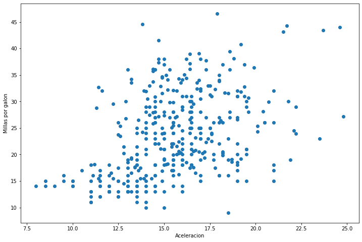
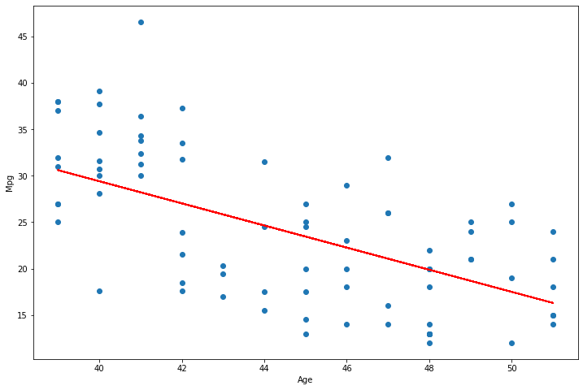
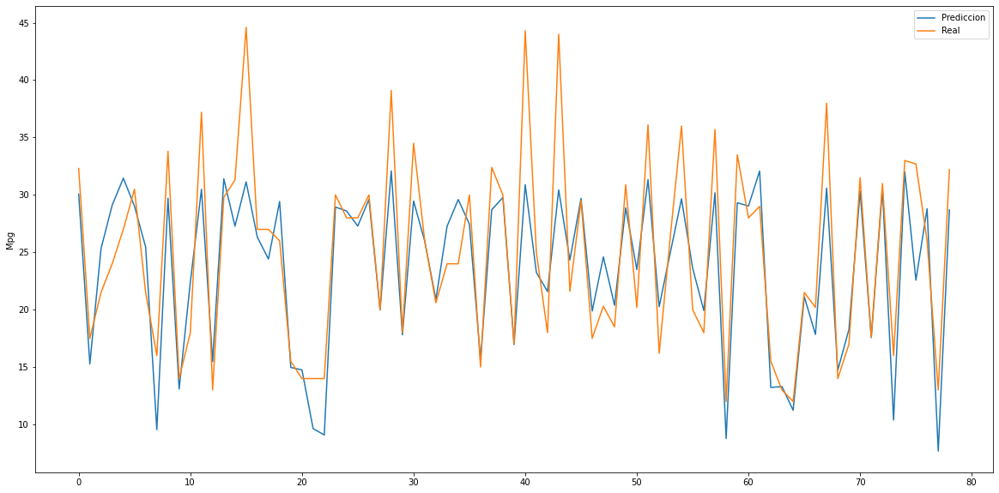

---
# Title, summary, and page position.
linktitle: 6. Regresion
summary: Ejemplo Regresion con Python
weight: 60
icon: book
icon_pack: fas

# Page metadata.
title: Regresion con Scikit Learn
date: "2021-04-17T00:00:00Z"
type: book  # Do not modify
---

Por [Jose R. Zapata](https://joserzapata.github.io/) 

<script type="text/javascript" src="https://cdnjs.buymeacoffee.com/1.0.0/button.prod.min.js" data-name="bmc-button" data-slug="joserzapata" data-color="#328cc1" data-emoji="" data-font="Cookie" data-text="Invítame a un Café" data-outline-color="#000000" data-font-color="#ffffff" data-coffee-color="#FFDD00" ></script><br>
```python
import pandas as pd
import numpy as np
import matplotlib.pyplot as plt
import seaborn as sns

import datetime
```

## Informacion de los datos


```python
automobile_df = pd.read_csv('auto-mpg.csv')

# Ver 5 registros aleatorios
automobile_df.sample(5)
```


<div>
<style scoped>
    .dataframe tbody tr th:only-of-type {
        vertical-align: middle;
    }

    .dataframe tbody tr th {
        vertical-align: top;
    }
    
    .dataframe thead th {
        text-align: right;
    }
</style>
<table border="1" class="dataframe">
  <thead>
    <tr style="text-align: right;">
      <th></th>
      <th>mpg</th>
      <th>cylinders</th>
      <th>displacement</th>
      <th>horsepower</th>
      <th>weight</th>
      <th>acceleration</th>
      <th>model year</th>
      <th>origin</th>
      <th>car name</th>
    </tr>
  </thead>
  <tbody>
    <tr>
      <th>136</th>
      <td>16.0</td>
      <td>8</td>
      <td>302.0</td>
      <td>140</td>
      <td>4141</td>
      <td>14.0</td>
      <td>74</td>
      <td>1</td>
      <td>ford gran torino</td>
    </tr>
    <tr>
      <th>155</th>
      <td>15.0</td>
      <td>6</td>
      <td>250.0</td>
      <td>72</td>
      <td>3158</td>
      <td>19.5</td>
      <td>75</td>
      <td>1</td>
      <td>ford maverick</td>
    </tr>
    <tr>
      <th>156</th>
      <td>16.0</td>
      <td>8</td>
      <td>400.0</td>
      <td>170</td>
      <td>4668</td>
      <td>11.5</td>
      <td>75</td>
      <td>1</td>
      <td>pontiac catalina</td>
    </tr>
    <tr>
      <th>189</th>
      <td>15.5</td>
      <td>8</td>
      <td>304.0</td>
      <td>120</td>
      <td>3962</td>
      <td>13.9</td>
      <td>76</td>
      <td>1</td>
      <td>amc matador</td>
    </tr>
    <tr>
      <th>331</th>
      <td>33.8</td>
      <td>4</td>
      <td>97.0</td>
      <td>67</td>
      <td>2145</td>
      <td>18.0</td>
      <td>80</td>
      <td>3</td>
      <td>subaru dl</td>
    </tr>
  </tbody>
</table>
</div>


```python
#Tamaño del dataset
automobile_df.shape 
```


    (398, 9)


```python
automobile_df.info()
```

    <class 'pandas.core.frame.DataFrame'>
    RangeIndex: 398 entries, 0 to 397
    Data columns (total 9 columns):
     #   Column        Non-Null Count  Dtype  
    ---  ------        --------------  -----  
     0   mpg           398 non-null    float64
     1   cylinders     398 non-null    int64  
     2   displacement  398 non-null    float64
     3   horsepower    398 non-null    object 
     4   weight        398 non-null    int64  
     5   acceleration  398 non-null    float64
     6   model year    398 non-null    int64  
     7   origin        398 non-null    int64  
     8   car name      398 non-null    object 
    dtypes: float64(3), int64(4), object(2)
    memory usage: 28.1+ KB


## Preparacion de Datos


```python
automobile_df = automobile_df.replace('?', np.nan)
```


```python
automobile_df = automobile_df.dropna()
```


```python
automobile_df.shape
```


    (392, 9)


### Eliminar Columnas no necesarias


```python
automobile_df.drop(['origin', 'car name'], axis=1, inplace=True)
```


```python
automobile_df.sample(5)
```


<div>
<style scoped>
    .dataframe tbody tr th:only-of-type {
        vertical-align: middle;
    }

    .dataframe tbody tr th {
        vertical-align: top;
    }
    
    .dataframe thead th {
        text-align: right;
    }
</style>
<table border="1" class="dataframe">
  <thead>
    <tr style="text-align: right;">
      <th></th>
      <th>mpg</th>
      <th>cylinders</th>
      <th>displacement</th>
      <th>horsepower</th>
      <th>weight</th>
      <th>acceleration</th>
      <th>model year</th>
    </tr>
  </thead>
  <tbody>
    <tr>
      <th>359</th>
      <td>28.1</td>
      <td>4</td>
      <td>141.0</td>
      <td>80</td>
      <td>3230</td>
      <td>20.4</td>
      <td>81</td>
    </tr>
    <tr>
      <th>131</th>
      <td>32.0</td>
      <td>4</td>
      <td>71.0</td>
      <td>65</td>
      <td>1836</td>
      <td>21.0</td>
      <td>74</td>
    </tr>
    <tr>
      <th>257</th>
      <td>19.4</td>
      <td>6</td>
      <td>232.0</td>
      <td>90</td>
      <td>3210</td>
      <td>17.2</td>
      <td>78</td>
    </tr>
    <tr>
      <th>174</th>
      <td>18.0</td>
      <td>6</td>
      <td>171.0</td>
      <td>97</td>
      <td>2984</td>
      <td>14.5</td>
      <td>75</td>
    </tr>
    <tr>
      <th>188</th>
      <td>16.0</td>
      <td>8</td>
      <td>318.0</td>
      <td>150</td>
      <td>4190</td>
      <td>13.0</td>
      <td>76</td>
    </tr>
  </tbody>
</table>
</div>


```python
automobile_df.info()
```

    <class 'pandas.core.frame.DataFrame'>
    Int64Index: 392 entries, 0 to 397
    Data columns (total 7 columns):
     #   Column        Non-Null Count  Dtype  
    ---  ------        --------------  -----  
     0   mpg           392 non-null    float64
     1   cylinders     392 non-null    int64  
     2   displacement  392 non-null    float64
     3   horsepower    392 non-null    object 
     4   weight        392 non-null    int64  
     5   acceleration  392 non-null    float64
     6   model year    392 non-null    int64  
    dtypes: float64(3), int64(3), object(1)
    memory usage: 24.5+ KB


### Convertir el formato de 'model year' a año completo


```python
automobile_df['model year'] = '19' + automobile_df['model year'].astype(str)
```


```python
automobile_df.sample(5)
```


<div>
<style scoped>
    .dataframe tbody tr th:only-of-type {
        vertical-align: middle;
    }

    .dataframe tbody tr th {
        vertical-align: top;
    }
    
    .dataframe thead th {
        text-align: right;
    }
</style>
<table border="1" class="dataframe">
  <thead>
    <tr style="text-align: right;">
      <th></th>
      <th>mpg</th>
      <th>cylinders</th>
      <th>displacement</th>
      <th>horsepower</th>
      <th>weight</th>
      <th>acceleration</th>
      <th>model year</th>
    </tr>
  </thead>
  <tbody>
    <tr>
      <th>144</th>
      <td>31.0</td>
      <td>4</td>
      <td>76.0</td>
      <td>52</td>
      <td>1649</td>
      <td>16.5</td>
      <td>1974</td>
    </tr>
    <tr>
      <th>231</th>
      <td>15.5</td>
      <td>8</td>
      <td>400.0</td>
      <td>190</td>
      <td>4325</td>
      <td>12.2</td>
      <td>1977</td>
    </tr>
    <tr>
      <th>154</th>
      <td>15.0</td>
      <td>6</td>
      <td>250.0</td>
      <td>72</td>
      <td>3432</td>
      <td>21.0</td>
      <td>1975</td>
    </tr>
    <tr>
      <th>169</th>
      <td>20.0</td>
      <td>6</td>
      <td>232.0</td>
      <td>100</td>
      <td>2914</td>
      <td>16.0</td>
      <td>1975</td>
    </tr>
    <tr>
      <th>116</th>
      <td>16.0</td>
      <td>8</td>
      <td>400.0</td>
      <td>230</td>
      <td>4278</td>
      <td>9.5</td>
      <td>1973</td>
    </tr>
  </tbody>
</table>
</div>


### Agregar columna de los años del automobil


```python
automobile_df['age'] = datetime.datetime.now().year - pd.to_numeric(automobile_df['model year'])
```


```python
automobile_df.drop(['model year'], axis=1, inplace=True)
```


```python
automobile_df.sample(5)
```


<div>
<style scoped>
    .dataframe tbody tr th:only-of-type {
        vertical-align: middle;
    }

    .dataframe tbody tr th {
        vertical-align: top;
    }
    
    .dataframe thead th {
        text-align: right;
    }
</style>
<table border="1" class="dataframe">
  <thead>
    <tr style="text-align: right;">
      <th></th>
      <th>mpg</th>
      <th>cylinders</th>
      <th>displacement</th>
      <th>horsepower</th>
      <th>weight</th>
      <th>acceleration</th>
      <th>age</th>
    </tr>
  </thead>
  <tbody>
    <tr>
      <th>18</th>
      <td>27.0</td>
      <td>4</td>
      <td>97.0</td>
      <td>88</td>
      <td>2130</td>
      <td>14.5</td>
      <td>51</td>
    </tr>
    <tr>
      <th>314</th>
      <td>26.4</td>
      <td>4</td>
      <td>140.0</td>
      <td>88</td>
      <td>2870</td>
      <td>18.1</td>
      <td>41</td>
    </tr>
    <tr>
      <th>380</th>
      <td>36.0</td>
      <td>4</td>
      <td>120.0</td>
      <td>88</td>
      <td>2160</td>
      <td>14.5</td>
      <td>39</td>
    </tr>
    <tr>
      <th>16</th>
      <td>18.0</td>
      <td>6</td>
      <td>199.0</td>
      <td>97</td>
      <td>2774</td>
      <td>15.5</td>
      <td>51</td>
    </tr>
    <tr>
      <th>276</th>
      <td>21.6</td>
      <td>4</td>
      <td>121.0</td>
      <td>115</td>
      <td>2795</td>
      <td>15.7</td>
      <td>43</td>
    </tr>
  </tbody>
</table>
</div>


```python
automobile_df.dtypes
```


    mpg             float64
    cylinders         int64
    displacement    float64
    horsepower       object
    weight            int64
    acceleration    float64
    age               int64
    dtype: object


```python
automobile_df['horsepower'] = pd.to_numeric(automobile_df['horsepower'], errors='coerce')
```


```python
automobile_df.describe()
```


<div>
<style scoped>
    .dataframe tbody tr th:only-of-type {
        vertical-align: middle;
    }

    .dataframe tbody tr th {
        vertical-align: top;
    }
    
    .dataframe thead th {
        text-align: right;
    }
</style>
<table border="1" class="dataframe">
  <thead>
    <tr style="text-align: right;">
      <th></th>
      <th>mpg</th>
      <th>cylinders</th>
      <th>displacement</th>
      <th>horsepower</th>
      <th>weight</th>
      <th>acceleration</th>
      <th>age</th>
    </tr>
  </thead>
  <tbody>
    <tr>
      <th>count</th>
      <td>392.000000</td>
      <td>392.000000</td>
      <td>392.000000</td>
      <td>392.000000</td>
      <td>392.000000</td>
      <td>392.000000</td>
      <td>392.000000</td>
    </tr>
    <tr>
      <th>mean</th>
      <td>23.445918</td>
      <td>5.471939</td>
      <td>194.411990</td>
      <td>104.469388</td>
      <td>2977.584184</td>
      <td>15.541327</td>
      <td>45.020408</td>
    </tr>
    <tr>
      <th>std</th>
      <td>7.805007</td>
      <td>1.705783</td>
      <td>104.644004</td>
      <td>38.491160</td>
      <td>849.402560</td>
      <td>2.758864</td>
      <td>3.683737</td>
    </tr>
    <tr>
      <th>min</th>
      <td>9.000000</td>
      <td>3.000000</td>
      <td>68.000000</td>
      <td>46.000000</td>
      <td>1613.000000</td>
      <td>8.000000</td>
      <td>39.000000</td>
    </tr>
    <tr>
      <th>25%</th>
      <td>17.000000</td>
      <td>4.000000</td>
      <td>105.000000</td>
      <td>75.000000</td>
      <td>2225.250000</td>
      <td>13.775000</td>
      <td>42.000000</td>
    </tr>
    <tr>
      <th>50%</th>
      <td>22.750000</td>
      <td>4.000000</td>
      <td>151.000000</td>
      <td>93.500000</td>
      <td>2803.500000</td>
      <td>15.500000</td>
      <td>45.000000</td>
    </tr>
    <tr>
      <th>75%</th>
      <td>29.000000</td>
      <td>8.000000</td>
      <td>275.750000</td>
      <td>126.000000</td>
      <td>3614.750000</td>
      <td>17.025000</td>
      <td>48.000000</td>
    </tr>
    <tr>
      <th>max</th>
      <td>46.600000</td>
      <td>8.000000</td>
      <td>455.000000</td>
      <td>230.000000</td>
      <td>5140.000000</td>
      <td>24.800000</td>
      <td>51.000000</td>
    </tr>
  </tbody>
</table>
</div>


## Analisis Univariable
Se debe hacer un analisis de cada una de las variables y describir sus caracteristicas.

## Analisis Bivariable

### Scatter Plots


```python
fig, ax = plt.subplots(figsize=(12, 8))

plt.scatter(automobile_df['age'], automobile_df['mpg'])

plt.xlabel('Años')
plt.ylabel('Millas por galon');
```


​    

​    


```python
fig, ax = plt.subplots(figsize=(12, 8))

plt.scatter(automobile_df['acceleration'], automobile_df['mpg'])

plt.xlabel('Aceleracion')
plt.ylabel('Millas por galon');
```


​    

​    


```python
fig, ax = plt.subplots(figsize=(12, 8))

plt.scatter(automobile_df['weight'], automobile_df['mpg'])

plt.xlabel('Peso')
plt.ylabel('Millas por galon');
```


​    

​    


```python
fig, ax = plt.subplots(figsize=(12, 8))

plt.scatter(automobile_df['displacement'], automobile_df['mpg'])

plt.xlabel('Desplazamiento')
plt.ylabel('Millas por galon');
```


​    

​    


```python
fig, ax = plt.subplots(figsize=(12, 8))

plt.scatter(automobile_df['horsepower'], automobile_df['mpg'])

plt.xlabel('Caballos de fuerza')
plt.ylabel('Millas por galon');
```


​    

​    


```python
fig, ax = plt.subplots(figsize=(12, 8))

plt.scatter(automobile_df['cylinders'], automobile_df['mpg'])

plt.xlabel('Cilindros')
plt.ylabel('Millas por galon');
```


​    

​    


### Correlacion


```python
automobile_corr = automobile_df.corr()

automobile_corr
```


<div>
<style scoped>
    .dataframe tbody tr th:only-of-type {
        vertical-align: middle;
    }

    .dataframe tbody tr th {
        vertical-align: top;
    }
    
    .dataframe thead th {
        text-align: right;
    }
</style>
<table border="1" class="dataframe">
  <thead>
    <tr style="text-align: right;">
      <th></th>
      <th>mpg</th>
      <th>cylinders</th>
      <th>displacement</th>
      <th>horsepower</th>
      <th>weight</th>
      <th>acceleration</th>
      <th>age</th>
    </tr>
  </thead>
  <tbody>
    <tr>
      <th>mpg</th>
      <td>1.000000</td>
      <td>-0.777618</td>
      <td>-0.805127</td>
      <td>-0.778427</td>
      <td>-0.832244</td>
      <td>0.423329</td>
      <td>-0.580541</td>
    </tr>
    <tr>
      <th>cylinders</th>
      <td>-0.777618</td>
      <td>1.000000</td>
      <td>0.950823</td>
      <td>0.842983</td>
      <td>0.897527</td>
      <td>-0.504683</td>
      <td>0.345647</td>
    </tr>
    <tr>
      <th>displacement</th>
      <td>-0.805127</td>
      <td>0.950823</td>
      <td>1.000000</td>
      <td>0.897257</td>
      <td>0.932994</td>
      <td>-0.543800</td>
      <td>0.369855</td>
    </tr>
    <tr>
      <th>horsepower</th>
      <td>-0.778427</td>
      <td>0.842983</td>
      <td>0.897257</td>
      <td>1.000000</td>
      <td>0.864538</td>
      <td>-0.689196</td>
      <td>0.416361</td>
    </tr>
    <tr>
      <th>weight</th>
      <td>-0.832244</td>
      <td>0.897527</td>
      <td>0.932994</td>
      <td>0.864538</td>
      <td>1.000000</td>
      <td>-0.416839</td>
      <td>0.309120</td>
    </tr>
    <tr>
      <th>acceleration</th>
      <td>0.423329</td>
      <td>-0.504683</td>
      <td>-0.543800</td>
      <td>-0.689196</td>
      <td>-0.416839</td>
      <td>1.000000</td>
      <td>-0.290316</td>
    </tr>
    <tr>
      <th>age</th>
      <td>-0.580541</td>
      <td>0.345647</td>
      <td>0.369855</td>
      <td>0.416361</td>
      <td>0.309120</td>
      <td>-0.290316</td>
      <td>1.000000</td>
    </tr>
  </tbody>
</table>
</div>


```python
fig, ax = plt.subplots(figsize=(12, 10))

sns.heatmap(automobile_corr, annot=True);
```


​    

​    


```python
automobile_df = automobile_df.sample(frac=1).reset_index(drop=True)

automobile_df.head()
```


<div>
<style scoped>
    .dataframe tbody tr th:only-of-type {
        vertical-align: middle;
    }

    .dataframe tbody tr th {
        vertical-align: top;
    }
    
    .dataframe thead th {
        text-align: right;
    }
</style>
<table border="1" class="dataframe">
  <thead>
    <tr style="text-align: right;">
      <th></th>
      <th>mpg</th>
      <th>cylinders</th>
      <th>displacement</th>
      <th>horsepower</th>
      <th>weight</th>
      <th>acceleration</th>
      <th>age</th>
    </tr>
  </thead>
  <tbody>
    <tr>
      <th>0</th>
      <td>16.5</td>
      <td>6</td>
      <td>168.0</td>
      <td>120</td>
      <td>3820</td>
      <td>16.7</td>
      <td>45</td>
    </tr>
    <tr>
      <th>1</th>
      <td>25.0</td>
      <td>4</td>
      <td>116.0</td>
      <td>81</td>
      <td>2220</td>
      <td>16.9</td>
      <td>45</td>
    </tr>
    <tr>
      <th>2</th>
      <td>16.0</td>
      <td>8</td>
      <td>318.0</td>
      <td>150</td>
      <td>4498</td>
      <td>14.5</td>
      <td>46</td>
    </tr>
    <tr>
      <th>3</th>
      <td>12.0</td>
      <td>8</td>
      <td>429.0</td>
      <td>198</td>
      <td>4952</td>
      <td>11.5</td>
      <td>48</td>
    </tr>
    <tr>
      <th>4</th>
      <td>31.3</td>
      <td>4</td>
      <td>120.0</td>
      <td>75</td>
      <td>2542</td>
      <td>17.5</td>
      <td>41</td>
    </tr>
  </tbody>
</table>
</div>


```python
automobile_df.to_csv('auto-mpg-processed.csv', index=False)
```

## Regresion Lineal

### Regresion lineal con una caracteristica (horsepower)


```python
from sklearn.model_selection import train_test_split

X = automobile_df[['horsepower']]
Y = automobile_df['mpg']

x_train, x_test, y_train, y_test = train_test_split(X, Y, test_size=0.2) #20%
```


```python
x_train.sample(5)
```


<div>
<style scoped>
    .dataframe tbody tr th:only-of-type {
        vertical-align: middle;
    }

    .dataframe tbody tr th {
        vertical-align: top;
    }
    
    .dataframe thead th {
        text-align: right;
    }
</style>
<table border="1" class="dataframe">
  <thead>
    <tr style="text-align: right;">
      <th></th>
      <th>horsepower</th>
    </tr>
  </thead>
  <tbody>
    <tr>
      <th>23</th>
      <td>70</td>
    </tr>
    <tr>
      <th>348</th>
      <td>153</td>
    </tr>
    <tr>
      <th>357</th>
      <td>72</td>
    </tr>
    <tr>
      <th>366</th>
      <td>100</td>
    </tr>
    <tr>
      <th>74</th>
      <td>97</td>
    </tr>
  </tbody>
</table>
</div>


```python
from sklearn.linear_model import LinearRegression

linear_model = LinearRegression(normalize=True).fit(x_train, y_train)
```


```python
print('Puntaje Entrenamiento: ', linear_model.score(x_train, y_train))
```

    Puntaje Entrenamiento:  0.6013261684165121


```python
y_pred = linear_model.predict(x_test)
```


```python
from sklearn.metrics import r2_score

print('Puntaje Testing: ', r2_score(y_test, y_pred))
```

    Puntaje Testing:  0.6173981579692112


```python
fig, ax = plt.subplots(figsize=(12, 8))

plt.scatter(x_test, y_test)
plt.plot(x_test, y_pred, color='r')

plt.xlabel('Caballos de Fuerza')
plt.ylabel('Mpg')
plt.show()
```


​    

​    


### Regresion lineal con una caracteristica - age


```python
X = automobile_df[['age']]
Y = automobile_df['mpg']

x_train, x_test, y_train, y_test = train_test_split(X, Y, test_size=0.2)

linear_model = LinearRegression(normalize=True).fit(x_train, y_train)

print('Puntaje de entrenamiento: ', linear_model.score(x_train, y_train))

y_pred = linear_model.predict(x_test)

print('Puntaje de Testing: ', r2_score(y_test, y_pred))
```

    Puntaje de entrenamiento:  0.3151398209833455
    Puntaje de Testing:  0.41035823800038795


```python
fig, ax = plt.subplots(figsize=(12, 8))

plt.scatter(x_test, y_test)
plt.plot(x_test, y_pred, color='r')

plt.xlabel('Age')
plt.ylabel('Mpg')
plt.show()
```


​    

​    


### Regresion lineal con varias caracteristicas


```python
# X = automobile_df[['displacement', 'horsepower', 'weight', 'acceleration', 'cylinders']]

X = automobile_df[['displacement', 'horsepower', 'weight']]
Y = automobile_df['mpg']

x_train, x_test, y_train, y_test = train_test_split(X, Y, test_size=0.2)
```


```python
linear_model = LinearRegression(normalize=True).fit(x_train, y_train)
```


```python
print('Training score: ', linear_model.score(x_train, y_train))
```

    Training score:  0.6935339515300342


```python
predictors = x_train.columns
coef = pd.Series(linear_model.coef_, predictors).sort_values()

print(coef)
```

    horsepower     -0.044184
    displacement   -0.010151
    weight         -0.004635
    dtype: float64


```python
y_pred = linear_model.predict(x_test)
```


```python
print('Puntaje Testing', r2_score(y_test, y_pred))
```

    Puntaje Testing 0.7335785739591847


```python
plt.figure(figsize = (20,10))

plt.plot(y_pred, label='Prediccion')
plt.plot(y_test.values, label='Real')

plt.ylabel('Mpg')

plt.legend()
plt.show()
```


​    

​    


## Regresión con Múltiples Modelos

Si se tienen **muchos modelos** realizar cross validation con todos es costoso computacionalmente y en tiempo, entonces se debe ir descartando los modelos con menos desempeño hasta llegar al modelo final
- Inicialmente se dividen los datos en una parte para realizar la seleccion del modelo (**Model selection dataset**) y otra para realizar la prueba de desempeño (**Performance dataset**, esta parte de los datos se debe usar solo en el final de todo el proceso)
- Primer paso es dividir el **Model selection dataset** en una parte de entrenamiento (train) y otra de prueba (test), normalmente en una proporcion de 80/20 o 70/30.
- Hacer una evaluacion de todos los modelos la division enterior y seleccionar los mejores (preferiblemente que tengan un principio de funcionamiento diferente entre ellos).
- Con lo mejores modelos (la cantidad depende de que tan parecido es su resultado) realizar un cross-validation (detectar si hay over-fitting) para obtener los que tengan mejor resultado.
- Se saca el mejor o los mejores modelos (Los que tengan mejor desempeño y poca varianza en sus resultados) y se realiza optimizacion de hiper parametros (Hyper parameter Tunning). Este proceso es costoso computacionalmente por eso se debe realizar con muy pocos modelos.
- Luego se selecciona el mejor modelo (Mejor desempeño y poca varianza) y se obtienen los hiper parametros que dieron el mejor resultado.
- Finalmente se entrena el modelo seleccionado con los hiper-parametros hallados sobre el **Model selection dataset** y se hace la prueba final con el **Performance dataset**


```python
import statsmodels.api as sm

from sklearn.model_selection import train_test_split
from sklearn.metrics import r2_score
from sklearn.preprocessing import StandardScaler

from sklearn.linear_model import LinearRegression
from sklearn.linear_model import Lasso
from sklearn.linear_model import Ridge
from sklearn.linear_model import ElasticNet
from sklearn.linear_model import Lars
from sklearn.linear_model import SGDRegressor
from sklearn.svm import SVR
from sklearn.neighbors import KNeighborsRegressor
from sklearn.tree import DecisionTreeRegressor

import warnings
warnings.filterwarnings("ignore")
```


```python
automobile_df = pd.read_csv('auto-mpg-processed.csv')

automobile_df.head()
```


<div>
<style scoped>
    .dataframe tbody tr th:only-of-type {
        vertical-align: middle;
    }

    .dataframe tbody tr th {
        vertical-align: top;
    }
    
    .dataframe thead th {
        text-align: right;
    }
</style>
<table border="1" class="dataframe">
  <thead>
    <tr style="text-align: right;">
      <th></th>
      <th>mpg</th>
      <th>cylinders</th>
      <th>displacement</th>
      <th>horsepower</th>
      <th>weight</th>
      <th>acceleration</th>
      <th>age</th>
    </tr>
  </thead>
  <tbody>
    <tr>
      <th>0</th>
      <td>16.5</td>
      <td>6</td>
      <td>168.0</td>
      <td>120</td>
      <td>3820</td>
      <td>16.7</td>
      <td>45</td>
    </tr>
    <tr>
      <th>1</th>
      <td>25.0</td>
      <td>4</td>
      <td>116.0</td>
      <td>81</td>
      <td>2220</td>
      <td>16.9</td>
      <td>45</td>
    </tr>
    <tr>
      <th>2</th>
      <td>16.0</td>
      <td>8</td>
      <td>318.0</td>
      <td>150</td>
      <td>4498</td>
      <td>14.5</td>
      <td>46</td>
    </tr>
    <tr>
      <th>3</th>
      <td>12.0</td>
      <td>8</td>
      <td>429.0</td>
      <td>198</td>
      <td>4952</td>
      <td>11.5</td>
      <td>48</td>
    </tr>
    <tr>
      <th>4</th>
      <td>31.3</td>
      <td>4</td>
      <td>120.0</td>
      <td>75</td>
      <td>2542</td>
      <td>17.5</td>
      <td>41</td>
    </tr>
  </tbody>
</table>
</div>


```python
result_dict = {}
```

### Funciones de ayuda


```python
def build_model(regression_fn,                
                name_of_y_col, 
                names_of_x_cols, 
                dataset, 
                test_frac=0.2,
                preprocess_fn=None):
    
    """build_model
    
    Funcion para entrenar y evaluar un modelo
        
    """
    
    X = dataset[names_of_x_cols]
    Y = dataset[name_of_y_col]

    if preprocess_fn is not None:
        X = preprocess_fn(X)

    x_train, x_test, y_train, y_test = train_test_split(X, Y, test_size=test_frac)
    
    model = regression_fn(x_train, y_train)
    
    y_pred = model.predict(x_test)
    
    print("Entrenamiento_score : " , model.score(x_train, y_train))
    print("Prueba_score : ", r2_score(y_test, y_pred))

    return {
            'Entrenamiento_score': model.score(x_train, y_train),
            'Prueba_score': r2_score(y_test, y_pred)
           }     
```


```python
def compare_results():
    for key in result_dict:
        print('Regresion: ', key)
        print('Entrenamiento score', result_dict[key]['Entrenamiento_score'])
        print('Prueba score', result_dict[key]['Prueba_score'])
        print()
```

### Regresion lineal


```python
def linear_reg(x_train, y_train):
    model = LinearRegression(normalize=True)
    model.fit(x_train, y_train)
    
    return model
```


```python
result_dict['mpg ~ single_linear'] = build_model(linear_reg,
                                                 'mpg',
                                                ['weight'],
                                                  automobile_df)
```

    Entrenamiento_score :  0.6696115274238652
    Prueba_score :  0.7704980985444312


```python
result_dict['mpg ~ kitchen_sink_linear'] = build_model(linear_reg,
                                                      'mpg',
                                                     ['cylinders',
                                                      'displacement',
                                                      'horsepower',
                                                      'weight',
                                                      'acceleration'],
                                                      automobile_df)
```

    Entrenamiento_score :  0.7074657620419418
    Prueba_score :  0.6989622365211952


```python
result_dict['mpg ~ parsimonius_linear'] = build_model(linear_reg,
                                                      'mpg',
                                                    ['horsepower',
                                                     'weight'],
                                                      automobile_df)
```

    Entrenamiento_score :  0.7013230352668707
    Prueba_score :  0.7232115758741458


```python
compare_results()
```

    Regresion:  mpg ~ single_linear
    Entrenamiento score 0.6696115274238652
    Prueba score 0.7704980985444312
    
    Regresion:  mpg ~ kitchen_sink_linear
    Entrenamiento score 0.7074657620419418
    Prueba score 0.6989622365211952
    
    Regresion:  mpg ~ parsimonius_linear
    Entrenamiento score 0.7013230352668707
    Prueba score 0.7232115758741458


### Lasso


```python
def lasso_reg(x_train, y_train, alpha=0.5):
    model = Lasso(alpha=alpha)
    model.fit(x_train, y_train)
    
    return model
```


```python
result_dict['mpg ~ kitchen_sink_lasso'] = build_model(lasso_reg,
                                                     'mpg',
                                                    ['cylinders',
                                                     'displacement',
                                                     'horsepower',
                                                     'weight',
                                                     'acceleration'],
                                                      automobile_df)
```

    Entrenamiento_score :  0.6943200981996365
    Prueba_score :  0.7366916237596017


```python
compare_results()
```

    Regresion:  mpg ~ single_linear
    Entrenamiento score 0.6696115274238652
    Prueba score 0.7704980985444312
    
    Regresion:  mpg ~ kitchen_sink_linear
    Entrenamiento score 0.7074657620419418
    Prueba score 0.6989622365211952
    
    Regresion:  mpg ~ parsimonius_linear
    Entrenamiento score 0.7013230352668707
    Prueba score 0.7232115758741458
    
    Regresion:  mpg ~ kitchen_sink_lasso
    Entrenamiento score 0.6943200981996365
    Prueba score 0.7366916237596017


### Ridge


```python
def ridge_reg(x_train, y_train, alpha=0.5, normalize=True):
    model = Ridge(alpha=alpha, normalize=normalize)
    model.fit(x_train, y_train)
    
    return model
```


```python
result_dict['mpg ~ kitchen_sink_ridge'] = build_model(ridge_reg,
                                                      'mpg',
                                                     ['cylinders',
                                                      'displacement',
                                                      'horsepower',
                                                      'weight',
                                                      'acceleration'],
                                                       automobile_df)
```

    Entrenamiento_score :  0.6890878092067418
    Prueba_score :  0.6560571888322049


```python
compare_results()
```

    Regresion:  mpg ~ single_linear
    Entrenamiento score 0.6696115274238652
    Prueba score 0.7704980985444312
    
    Regresion:  mpg ~ kitchen_sink_linear
    Entrenamiento score 0.7074657620419418
    Prueba score 0.6989622365211952
    
    Regresion:  mpg ~ parsimonius_linear
    Entrenamiento score 0.7013230352668707
    Prueba score 0.7232115758741458
    
    Regresion:  mpg ~ kitchen_sink_lasso
    Entrenamiento score 0.6943200981996365
    Prueba score 0.7366916237596017
    
    Regresion:  mpg ~ kitchen_sink_ridge
    Entrenamiento score 0.6890878092067418
    Prueba score 0.6560571888322049


### Elasticnet


```python
def elastic_net_reg(x_train, y_train, alpha=1, l1_ratio=0.5, 
                    normalize=False, max_iter=100000, warm_start=True, equivalent_to="Elastic Net"):

    print("Equivalent to:", equivalent_to)
    
    model = ElasticNet(alpha=alpha, l1_ratio=l1_ratio, 
                       normalize=normalize, max_iter=max_iter, warm_start=warm_start)
    model.fit(x_train, y_train)

    return model
```


```python
from functools import partial

## This generates a warning which says will not converge
result_dict['mpg ~ kitchen_sink_elastic_net_ols'] = build_model(partial(elastic_net_reg, 
                                                                        alpha=0, equivalent_to="OLS"),
                                                               'mpg',
                                                              ['cylinders',
                                                               'displacement',
                                                               'horsepower',
                                                               'weight',
                                                               'acceleration'],
                                                                automobile_df)
```

    Equivalent to: OLS
    Entrenamiento_score :  0.7286154402790895
    Prueba_score :  0.6261044691205849


```python
result_dict['mpg ~ kitchen_sink_elastic_net_lasso'] = build_model(partial(elastic_net_reg, alpha=1, 
                                                                    l1_ratio=0, equivalent_to="Lasso"),
                                                                  'mpg',
                                                                 ['cylinders',
                                                                  'displacement',
                                                                  'horsepower',
                                                                  'weight',
                                                                  'acceleration'],
                                                                   automobile_df)
```

    Equivalent to: Lasso
    Entrenamiento_score :  0.7065392087832174
    Prueba_score :  0.697481690838238


```python
result_dict['mpg ~ kitchen_sink_elastic_net_ridge'] = build_model(partial(elastic_net_reg, alpha=1, 
                                                                    l1_ratio=1, equivalent_to="Ridge"),
                                                                  'mpg',
                                                                 ['cylinders',
                                                                  'displacement',
                                                                  'horsepower',
                                                                  'weight',
                                                                  'acceleration'],
                                                                   automobile_df)
```

    Equivalent to: Ridge
    Entrenamiento_score :  0.7197200945905666
    Prueba_score :  0.6454151082422006


```python
result_dict['mpg ~ kitchen_sink_elastic_net'] = build_model(partial(elastic_net_reg, alpha=1, l1_ratio=0.5),
                                                            'mpg',
                                                          [ 'cylinders',
                                                            'displacement',
                                                            'horsepower',
                                                            'weight',
                                                            'acceleration'],
                                                            automobile_df)
```

    Equivalent to: Elastic Net
    Entrenamiento_score :  0.7137100772862914
    Prueba_score :  0.6575033081647761


```python
compare_results()
```

    Regresion:  mpg ~ single_linear
    Entrenamiento score 0.6696115274238652
    Prueba score 0.7704980985444312
    
    Regresion:  mpg ~ kitchen_sink_linear
    Entrenamiento score 0.7074657620419418
    Prueba score 0.6989622365211952
    
    Regresion:  mpg ~ parsimonius_linear
    Entrenamiento score 0.7013230352668707
    Prueba score 0.7232115758741458
    
    Regresion:  mpg ~ kitchen_sink_lasso
    Entrenamiento score 0.6943200981996365
    Prueba score 0.7366916237596017
    
    Regresion:  mpg ~ kitchen_sink_ridge
    Entrenamiento score 0.6890878092067418
    Prueba score 0.6560571888322049
    
    Regresion:  mpg ~ kitchen_sink_elastic_net_ols
    Entrenamiento score 0.7286154402790895
    Prueba score 0.6261044691205849
    
    Regresion:  mpg ~ kitchen_sink_elastic_net_lasso
    Entrenamiento score 0.7065392087832174
    Prueba score 0.697481690838238
    
    Regresion:  mpg ~ kitchen_sink_elastic_net_ridge
    Entrenamiento score 0.7197200945905666
    Prueba score 0.6454151082422006
    
    Regresion:  mpg ~ kitchen_sink_elastic_net
    Entrenamiento score 0.7137100772862914
    Prueba score 0.6575033081647761


### SVR

For SVR regression with larger datasets this alternate implementations is preferred

https://scikit-learn.org/stable/modules/generated/sklearn.svm.LinearSVR.html#sklearn.svm.LinearSVR

* Uses a different library for implementation
* More flexibility with choice of penalties
* Scales to larger datasets


```python
def svr_reg(x_train, y_train, kernel='linear', epsilon=0.05, C=0.3):
    model = SVR(kernel=kernel, epsilon=epsilon, C=C)
    model.fit(x_train,y_train)
    
    return model
```


```python
result_dict['mpg ~ kitchen_sink_svr'] = build_model(svr_reg,
                                                    'mpg',
                                                   ['cylinders',
                                                    'displacement',
                                                    'horsepower',
                                                    'weight',
                                                    'acceleration'],
                                                     automobile_df)
```

    Entrenamiento_score :  0.6948101242037901
    Prueba_score :  0.7240248634465822


```python
compare_results()
```

    Regresion:  mpg ~ single_linear
    Entrenamiento score 0.6696115274238652
    Prueba score 0.7704980985444312
    
    Regresion:  mpg ~ kitchen_sink_linear
    Entrenamiento score 0.7074657620419418
    Prueba score 0.6989622365211952
    
    Regresion:  mpg ~ parsimonius_linear
    Entrenamiento score 0.7013230352668707
    Prueba score 0.7232115758741458
    
    Regresion:  mpg ~ kitchen_sink_lasso
    Entrenamiento score 0.6943200981996365
    Prueba score 0.7366916237596017
    
    Regresion:  mpg ~ kitchen_sink_ridge
    Entrenamiento score 0.6890878092067418
    Prueba score 0.6560571888322049
    
    Regresion:  mpg ~ kitchen_sink_elastic_net_ols
    Entrenamiento score 0.7286154402790895
    Prueba score 0.6261044691205849
    
    Regresion:  mpg ~ kitchen_sink_elastic_net_lasso
    Entrenamiento score 0.7065392087832174
    Prueba score 0.697481690838238
    
    Regresion:  mpg ~ kitchen_sink_elastic_net_ridge
    Entrenamiento score 0.7197200945905666
    Prueba score 0.6454151082422006
    
    Regresion:  mpg ~ kitchen_sink_elastic_net
    Entrenamiento score 0.7137100772862914
    Prueba score 0.6575033081647761
    
    Regresion:  mpg ~ kitchen_sink_svr
    Entrenamiento score 0.6948101242037901
    Prueba score 0.7240248634465822


### KNR


```python
def kneighbors_reg(x_train, y_train, n_neighbors=10):
    model = KNeighborsRegressor(n_neighbors=n_neighbors)
    model.fit(x_train, y_train)
    
    return model
```


```python
result_dict['mpg ~ kitchen_sink_kneighbors'] = build_model(kneighbors_reg,
                                                           'mpg',
                                                          ['cylinders',
                                                           'displacement',
                                                           'horsepower',
                                                           'weight',
                                                           'acceleration'],
                                                           automobile_df)
```

    Entrenamiento_score :  0.7638870632761847
    Prueba_score :  0.6855412306938089


```python
compare_results()
```

    Regresion:  mpg ~ single_linear
    Entrenamiento score 0.6696115274238652
    Prueba score 0.7704980985444312
    
    Regresion:  mpg ~ kitchen_sink_linear
    Entrenamiento score 0.7074657620419418
    Prueba score 0.6989622365211952
    
    Regresion:  mpg ~ parsimonius_linear
    Entrenamiento score 0.7013230352668707
    Prueba score 0.7232115758741458
    
    Regresion:  mpg ~ kitchen_sink_lasso
    Entrenamiento score 0.6943200981996365
    Prueba score 0.7366916237596017
    
    Regresion:  mpg ~ kitchen_sink_ridge
    Entrenamiento score 0.6890878092067418
    Prueba score 0.6560571888322049
    
    Regresion:  mpg ~ kitchen_sink_elastic_net_ols
    Entrenamiento score 0.7286154402790895
    Prueba score 0.6261044691205849
    
    Regresion:  mpg ~ kitchen_sink_elastic_net_lasso
    Entrenamiento score 0.7065392087832174
    Prueba score 0.697481690838238
    
    Regresion:  mpg ~ kitchen_sink_elastic_net_ridge
    Entrenamiento score 0.7197200945905666
    Prueba score 0.6454151082422006
    
    Regresion:  mpg ~ kitchen_sink_elastic_net
    Entrenamiento score 0.7137100772862914
    Prueba score 0.6575033081647761
    
    Regresion:  mpg ~ kitchen_sink_svr
    Entrenamiento score 0.6948101242037901
    Prueba score 0.7240248634465822
    
    Regresion:  mpg ~ kitchen_sink_kneighbors
    Entrenamiento score 0.7638870632761847
    Prueba score 0.6855412306938089


### SGD


```python
def apply_standard_scaler(x):
    scaler = StandardScaler()
    scaler.fit(x)  

    return scaler.transform(x)
```


```python
def sgd_reg(x_train, y_train, max_iter=10000, tol=1e-3):
    model = SGDRegressor(max_iter=max_iter, tol=tol)
    model.fit(x_train, y_train)
    
    return model
```


```python
result_dict['mpg ~ kitchen_sink_sgd'] = build_model(sgd_reg,
                                                   'mpg',
                                                  ['cylinders',
                                                   'displacement',
                                                   'horsepower',
                                                   'weight',
                                                   'acceleration'],
                                                    automobile_df,
                                                    preprocess_fn=apply_standard_scaler)
```

    Entrenamiento_score :  0.7210212471051309
    Prueba_score :  0.6388005372824846


```python
compare_results()
```

    Regresion:  mpg ~ single_linear
    Entrenamiento score 0.6696115274238652
    Prueba score 0.7704980985444312
    
    Regresion:  mpg ~ kitchen_sink_linear
    Entrenamiento score 0.7074657620419418
    Prueba score 0.6989622365211952
    
    Regresion:  mpg ~ parsimonius_linear
    Entrenamiento score 0.7013230352668707
    Prueba score 0.7232115758741458
    
    Regresion:  mpg ~ kitchen_sink_lasso
    Entrenamiento score 0.6943200981996365
    Prueba score 0.7366916237596017
    
    Regresion:  mpg ~ kitchen_sink_ridge
    Entrenamiento score 0.6890878092067418
    Prueba score 0.6560571888322049
    
    Regresion:  mpg ~ kitchen_sink_elastic_net_ols
    Entrenamiento score 0.7286154402790895
    Prueba score 0.6261044691205849
    
    Regresion:  mpg ~ kitchen_sink_elastic_net_lasso
    Entrenamiento score 0.7065392087832174
    Prueba score 0.697481690838238
    
    Regresion:  mpg ~ kitchen_sink_elastic_net_ridge
    Entrenamiento score 0.7197200945905666
    Prueba score 0.6454151082422006
    
    Regresion:  mpg ~ kitchen_sink_elastic_net
    Entrenamiento score 0.7137100772862914
    Prueba score 0.6575033081647761
    
    Regresion:  mpg ~ kitchen_sink_svr
    Entrenamiento score 0.6948101242037901
    Prueba score 0.7240248634465822
    
    Regresion:  mpg ~ kitchen_sink_kneighbors
    Entrenamiento score 0.7638870632761847
    Prueba score 0.6855412306938089
    
    Regresion:  mpg ~ kitchen_sink_sgd
    Entrenamiento score 0.7210212471051309
    Prueba score 0.6388005372824846


### Decision Tree


```python
def decision_tree_reg(x_train, y_train, max_depth=2):
    model = DecisionTreeRegressor(max_depth=max_depth)
    model.fit(x_train, y_train)
    
    return model
```


```python
result_dict['mpg ~ kitchen_sink_decision_tree'] = build_model(decision_tree_reg,
                                                             'mpg',
                                                            ['cylinders',
                                                             'displacement',
                                                             'horsepower',
                                                             'weight',
                                                             'acceleration'],
                                                              automobile_df)
```

    Entrenamiento_score :  0.7302512814978837
    Prueba_score :  0.6695729153590095


```python
compare_results()
```

    Regresion:  mpg ~ single_linear
    Entrenamiento score 0.6696115274238652
    Prueba score 0.7704980985444312
    
    Regresion:  mpg ~ kitchen_sink_linear
    Entrenamiento score 0.7074657620419418
    Prueba score 0.6989622365211952
    
    Regresion:  mpg ~ parsimonius_linear
    Entrenamiento score 0.7013230352668707
    Prueba score 0.7232115758741458
    
    Regresion:  mpg ~ kitchen_sink_lasso
    Entrenamiento score 0.6943200981996365
    Prueba score 0.7366916237596017
    
    Regresion:  mpg ~ kitchen_sink_ridge
    Entrenamiento score 0.6890878092067418
    Prueba score 0.6560571888322049
    
    Regresion:  mpg ~ kitchen_sink_elastic_net_ols
    Entrenamiento score 0.7286154402790895
    Prueba score 0.6261044691205849
    
    Regresion:  mpg ~ kitchen_sink_elastic_net_lasso
    Entrenamiento score 0.7065392087832174
    Prueba score 0.697481690838238
    
    Regresion:  mpg ~ kitchen_sink_elastic_net_ridge
    Entrenamiento score 0.7197200945905666
    Prueba score 0.6454151082422006
    
    Regresion:  mpg ~ kitchen_sink_elastic_net
    Entrenamiento score 0.7137100772862914
    Prueba score 0.6575033081647761
    
    Regresion:  mpg ~ kitchen_sink_svr
    Entrenamiento score 0.6948101242037901
    Prueba score 0.7240248634465822
    
    Regresion:  mpg ~ kitchen_sink_kneighbors
    Entrenamiento score 0.7638870632761847
    Prueba score 0.6855412306938089
    
    Regresion:  mpg ~ kitchen_sink_sgd
    Entrenamiento score 0.7210212471051309
    Prueba score 0.6388005372824846
    
    Regresion:  mpg ~ kitchen_sink_decision_tree
    Entrenamiento score 0.7302512814978837
    Prueba score 0.6695729153590095


### Lars


```python
def lars_reg(x_train, y_train, n_nonzero_coefs=4):
    model = Lars(n_nonzero_coefs=n_nonzero_coefs)
    model.fit(x_train, y_train)
    
    return model
```


```python
result_dict['mpg ~ kitchen_sink_lars'] = build_model(lars_reg,
                                                    'mpg',
                                                   ['cylinders',
                                                    'displacement',
                                                    'horsepower',
                                                    'weight',
                                                    'acceleration'],
                                                     automobile_df)
```

    Entrenamiento_score :  0.7221519955627607
    Prueba_score :  0.6442421991887889


```python
compare_results()
```

    Regresion:  mpg ~ single_linear
    Entrenamiento score 0.6696115274238652
    Prueba score 0.7704980985444312
    
    Regresion:  mpg ~ kitchen_sink_linear
    Entrenamiento score 0.7074657620419418
    Prueba score 0.6989622365211952
    
    Regresion:  mpg ~ parsimonius_linear
    Entrenamiento score 0.7013230352668707
    Prueba score 0.7232115758741458
    
    Regresion:  mpg ~ kitchen_sink_lasso
    Entrenamiento score 0.6943200981996365
    Prueba score 0.7366916237596017
    
    Regresion:  mpg ~ kitchen_sink_ridge
    Entrenamiento score 0.6890878092067418
    Prueba score 0.6560571888322049
    
    Regresion:  mpg ~ kitchen_sink_elastic_net_ols
    Entrenamiento score 0.7286154402790895
    Prueba score 0.6261044691205849
    
    Regresion:  mpg ~ kitchen_sink_elastic_net_lasso
    Entrenamiento score 0.7065392087832174
    Prueba score 0.697481690838238
    
    Regresion:  mpg ~ kitchen_sink_elastic_net_ridge
    Entrenamiento score 0.7197200945905666
    Prueba score 0.6454151082422006
    
    Regresion:  mpg ~ kitchen_sink_elastic_net
    Entrenamiento score 0.7137100772862914
    Prueba score 0.6575033081647761
    
    Regresion:  mpg ~ kitchen_sink_svr
    Entrenamiento score 0.6948101242037901
    Prueba score 0.7240248634465822
    
    Regresion:  mpg ~ kitchen_sink_kneighbors
    Entrenamiento score 0.7638870632761847
    Prueba score 0.6855412306938089
    
    Regresion:  mpg ~ kitchen_sink_sgd
    Entrenamiento score 0.7210212471051309
    Prueba score 0.6388005372824846
    
    Regresion:  mpg ~ kitchen_sink_decision_tree
    Entrenamiento score 0.7302512814978837
    Prueba score 0.6695729153590095
    
    Regresion:  mpg ~ kitchen_sink_lars
    Entrenamiento score 0.7221519955627607
    Prueba score 0.6442421991887889


```python
# Crear un diccionario solo con los resultados de prueba de cada modelo
nombre_modelos = result_dict.keys()
resultados_prueba = {} # crear diccionario vacio
for nombre in nombre_modelos:
    resultados_prueba[nombre] = result_dict[nombre]['Prueba_score']
```


```python
plt.figure(figsize = (12,10)) # tamaño de la figura
plt.barh(range(len(resultados_prueba)), list(resultados_prueba.values()), 
        align='center', );
plt.title("Resultados en el dataset de pruebas de cada modelo")
plt.yticks(range(len(resultados_prueba)), list(resultados_prueba.keys()));
```


​    

​    


## Cross Validation - Seleccion de Modelos
Analizar la varianza de los resultados para obtener los que tengan mejor resultado.


```python
# lista para almacenar cada uno los modelos seleccionados para el cross validation
models = []

# Alamcenando los modelos como una tupla (nombre, modelo)
models.append(('kitchen_sink_linear',LinearRegression(normalize=True)))
models.append(('kitchen_sink_lasso',Lasso(alpha=0.5)))
models.append(('kitchen_sink_elastic_net',ElasticNet(alpha=1, l1_ratio=0.5,
                                                     normalize = False, 
                                                    max_iter= 100000, 
                                                    warm_start= True)))
models.append(('kitchen_sink_kneighbors',KNeighborsRegressor(n_neighbors=10)))
models.append(('kitchen_sink_decision_tree',DecisionTreeRegressor(max_depth=2)))
models.append(('kitchen_sink_svr',SVR(kernel='linear', epsilon=0.05, C=0.3)))
```


```python
# Grabar los resultados de cada modelo
from sklearn import model_selection

#Semilla para obtener los mismos resultados de pruebas
seed = 2
results = []
names = []
scoring = 'r2'
for name, model in models:
    # Kfold cross validation for model selection
    kfold = model_selection.KFold(n_splits=5, shuffle=True, random_state=seed)
    #X train , y train
    cv_results = model_selection.cross_val_score(model, x_train, y_train, cv=kfold, scoring=scoring)
    results.append(cv_results)
    names.append(name)
    msg = f"({name}, {cv_results.mean()}, {cv_results.std()}"
    print(msg)
```

    (kitchen_sink_linear, 0.6844234904934009, 0.03159374424744247
    (kitchen_sink_lasso, 0.6844633664989738, 0.03171821519792585
    (kitchen_sink_elastic_net, 0.6844703085848355, 0.03172143884528286
    (kitchen_sink_kneighbors, 0.6608036231338688, 0.040735571400253065
    (kitchen_sink_decision_tree, 0.6570680524867771, 0.03375219816362394
    (kitchen_sink_svr, 0.6702154382576372, 0.03214642285149907


```python
plt.figure(figsize = (15,8)) 
result_df = pd.DataFrame(results, index=names).T
result_df.boxplot()
plt.title("Resultados de Cross Validation");
```


​    

​    


## Hyper Parameter Tunning

Optimizacion de hiperparametros, Se seleccionan los mejores modelos que tengan diferente formas de funcionamiento.


```python
from sklearn.metrics import r2_score
from sklearn.preprocessing import StandardScaler

from sklearn.model_selection import GridSearchCV

import warnings
warnings.filterwarnings("ignore")
```


```python
automobile_df = pd.read_csv('auto-mpg-processed.csv')

automobile_df.head()
```


<div>
<style scoped>
    .dataframe tbody tr th:only-of-type {
        vertical-align: middle;
    }

    .dataframe tbody tr th {
        vertical-align: top;
    }
    
    .dataframe thead th {
        text-align: right;
    }
</style>
<table border="1" class="dataframe">
  <thead>
    <tr style="text-align: right;">
      <th></th>
      <th>mpg</th>
      <th>cylinders</th>
      <th>displacement</th>
      <th>horsepower</th>
      <th>weight</th>
      <th>acceleration</th>
      <th>age</th>
    </tr>
  </thead>
  <tbody>
    <tr>
      <th>0</th>
      <td>16.5</td>
      <td>6</td>
      <td>168.0</td>
      <td>120</td>
      <td>3820</td>
      <td>16.7</td>
      <td>45</td>
    </tr>
    <tr>
      <th>1</th>
      <td>25.0</td>
      <td>4</td>
      <td>116.0</td>
      <td>81</td>
      <td>2220</td>
      <td>16.9</td>
      <td>45</td>
    </tr>
    <tr>
      <th>2</th>
      <td>16.0</td>
      <td>8</td>
      <td>318.0</td>
      <td>150</td>
      <td>4498</td>
      <td>14.5</td>
      <td>46</td>
    </tr>
    <tr>
      <th>3</th>
      <td>12.0</td>
      <td>8</td>
      <td>429.0</td>
      <td>198</td>
      <td>4952</td>
      <td>11.5</td>
      <td>48</td>
    </tr>
    <tr>
      <th>4</th>
      <td>31.3</td>
      <td>4</td>
      <td>120.0</td>
      <td>75</td>
      <td>2542</td>
      <td>17.5</td>
      <td>41</td>
    </tr>
  </tbody>
</table>
</div>


```python
X = automobile_df.drop(['mpg', 'age'], axis=1)

Y = automobile_df['mpg']

x_train, x_test, y_train, y_test = train_test_split(X, Y, test_size=0.2)
```

### Lasso regression


```python
parameters = {'alpha': [0.2, 0.4, 0.6, 0.7, 0.8, 0.9, 1.0]}

grid_search = GridSearchCV(Lasso(), parameters, cv=3, return_train_score=True)
grid_search.fit(x_train, y_train)
```


    GridSearchCV(cv=3, estimator=Lasso(),
                 param_grid={'alpha': [0.2, 0.4, 0.6, 0.7, 0.8, 0.9, 1.0]},
                 return_train_score=True)


#### Resultados de la hiperparametrizacion


```python
print(f"Mejor resultado = {grid_search.best_score_}")
print(f"Mejor parametros = {grid_search.best_params_}")
```

    Mejor resultado = 0.7021717010510476
    Mejor parametros = {'alpha': 1.0}


```python
# Para ver todos los resultados del cross validation
# No es necesario, solo es informativo para ver como varia el modelo
for i in range(len(parameters['alpha'])):
    print('Parametros: ', grid_search.cv_results_['params'][i])

    print('Promedio Score Prueba: ', grid_search.cv_results_['mean_test_score'][i])
    
    print('Rank: ', grid_search.cv_results_['rank_test_score'][i])
```

    Parametros:  {'alpha': 0.2}
    Promedio Score Prueba:  0.6969019568609475
    Rank:  7
    Parametros:  {'alpha': 0.4}
    Promedio Score Prueba:  0.698541427433439
    Rank:  6
    Parametros:  {'alpha': 0.6}
    Promedio Score Prueba:  0.699965209997786
    Rank:  5
    Parametros:  {'alpha': 0.7}
    Promedio Score Prueba:  0.7005967051825271
    Rank:  4
    Parametros:  {'alpha': 0.8}
    Promedio Score Prueba:  0.7011748241730046
    Rank:  3
    Parametros:  {'alpha': 0.9}
    Promedio Score Prueba:  0.7016999274085981
    Rank:  2
    Parametros:  {'alpha': 1.0}
    Promedio Score Prueba:  0.7021717010510476
    Rank:  1


```python
lasso_model = Lasso(alpha=grid_search.best_params_['alpha']).fit(x_train, y_train)
```


```python
y_pred = lasso_model.predict(x_test)

print('Entrenamiento score: ', lasso_model.score(x_train, y_train))
print('Prueba score: ', r2_score(y_test, y_pred))
```

    Entrenamiento score:  0.7182879921908456
    Prueba score:  0.6653323457545108


### KNeighbors regression


```python
parameters = {'n_neighbors': [10, 12, 14, 18, 20, 25, 30, 35, 50]}

grid_search = GridSearchCV(KNeighborsRegressor(), parameters, cv=3, return_train_score=True)
grid_search.fit(x_train, y_train)
```


    GridSearchCV(cv=3, estimator=KNeighborsRegressor(),
                 param_grid={'n_neighbors': [10, 12, 14, 18, 20, 25, 30, 35, 50]},
                 return_train_score=True)


```python
print(f"Mejor resultado = {grid_search.best_score_}")
print(f"Mejor parametros = {grid_search.best_params_}")
```

    Mejor resultado = 0.7124428667389037
    Mejor parametros = {'n_neighbors': 25}


```python
kneighbors_model = KNeighborsRegressor(n_neighbors=grid_search.best_params_['n_neighbors']).fit(x_train, y_train)
```


```python
y_pred = kneighbors_model.predict(x_test)

print('Entrenamiento score: ', kneighbors_model.score(x_train, y_train))
print('Prueba score: ', r2_score(y_test, y_pred))
```

    Entrenamiento score:  0.7425582447137113
    Prueba score:  0.657177469793524


### Decision Tree


```python
parameters = {'max_depth':[1, 2, 3, 4, 5, 7, 8]}

grid_search = GridSearchCV(DecisionTreeRegressor(), parameters, cv=3, return_train_score=True)
grid_search.fit(x_train, y_train)

```


    GridSearchCV(cv=3, estimator=DecisionTreeRegressor(),
                 param_grid={'max_depth': [1, 2, 3, 4, 5, 7, 8]},
                 return_train_score=True)


```python
print(f"Mejor resultado = {grid_search.best_score_}")
print(f"Mejor parametros = {grid_search.best_params_}")
```

    Mejor resultado = 0.6827011911186145
    Mejor parametros = {'max_depth': 2}


```python
decision_tree_model = DecisionTreeRegressor(max_depth=grid_search.best_params_['max_depth']).fit(x_train, y_train)
```


```python
y_pred = decision_tree_model.predict(x_test)

print('Entrenamiento score: ', decision_tree_model.score(x_train, y_train))
print('Prueba score: ', r2_score(y_test, y_pred))
```

    Entrenamiento score:  0.7447696129290833
    Prueba score:  0.6806583570617913


### SVR


```python
parameters = {'epsilon': [0.05, 0.1, 0.2, 0.3],
              'C': [0.2, 0.3]}

grid_search = GridSearchCV(SVR(kernel='linear'), parameters, cv=3, return_train_score=True)
grid_search.fit(x_train, y_train)

```


    GridSearchCV(cv=3, estimator=SVR(kernel='linear'),
                 param_grid={'C': [0.2, 0.3], 'epsilon': [0.05, 0.1, 0.2, 0.3]},
                 return_train_score=True)


```python
print(f"Mejor resultado = {grid_search.best_score_}")
print(f"Mejor parametros = {grid_search.best_params_}")
```

    Mejor resultado = 0.6899470090629146
    Mejor parametros = {'C': 0.2, 'epsilon': 0.3}


Como ejercicio academico se estima el resultado con los datos de test


```python
svr_model = SVR(kernel='linear',
                epsilon=grid_search.best_params_['epsilon'], 
                C=grid_search.best_params_['C']).fit(x_train, y_train)
```


```python
y_pred = svr_model.predict(x_test)

print('Entrenamiento score: ', svr_model.score(x_train, y_train))
print('Prueba score: ', r2_score(y_test, y_pred))
```

    Entrenamiento score:  0.7106827209217679
    Prueba score:  0.6134432209981653


## Grabar el Modelo

Se Selecciona el modelo que obtuvo mejores resultados en la hiperparametrizacion y sus resultados eran buenos con el dataset de prueba (test)


```python
# Entrenar el modelo con todos los datos disponibles
kneighbors_model = KNeighborsRegressor(n_neighbors= 10 ).fit(X, Y)
```


```python
from joblib import dump# libreria de serializacion

# grabar el modelo en un archivo
dump(kneighbors_model, 'kneighbors_model-auto_mpg.joblib')
```


    ['kneighbors_model-auto_mpg.joblib']


## Usar el Modelo


```python
import pandas as pd
from joblib import load 
```


```python
modelo = load('kneighbors_model-auto_mpg.joblib')
```


```python
modelo
```


    KNeighborsRegressor(n_neighbors=10)


```python
datos = pd.read_csv('auto-mpg-processed.csv')
datos.head()
```


<div>
<style scoped>
    .dataframe tbody tr th:only-of-type {
        vertical-align: middle;
    }

    .dataframe tbody tr th {
        vertical-align: top;
    }
    
    .dataframe thead th {
        text-align: right;
    }
</style>
<table border="1" class="dataframe">
  <thead>
    <tr style="text-align: right;">
      <th></th>
      <th>mpg</th>
      <th>cylinders</th>
      <th>displacement</th>
      <th>horsepower</th>
      <th>weight</th>
      <th>acceleration</th>
      <th>age</th>
    </tr>
  </thead>
  <tbody>
    <tr>
      <th>0</th>
      <td>16.5</td>
      <td>6</td>
      <td>168.0</td>
      <td>120</td>
      <td>3820</td>
      <td>16.7</td>
      <td>45</td>
    </tr>
    <tr>
      <th>1</th>
      <td>25.0</td>
      <td>4</td>
      <td>116.0</td>
      <td>81</td>
      <td>2220</td>
      <td>16.9</td>
      <td>45</td>
    </tr>
    <tr>
      <th>2</th>
      <td>16.0</td>
      <td>8</td>
      <td>318.0</td>
      <td>150</td>
      <td>4498</td>
      <td>14.5</td>
      <td>46</td>
    </tr>
    <tr>
      <th>3</th>
      <td>12.0</td>
      <td>8</td>
      <td>429.0</td>
      <td>198</td>
      <td>4952</td>
      <td>11.5</td>
      <td>48</td>
    </tr>
    <tr>
      <th>4</th>
      <td>31.3</td>
      <td>4</td>
      <td>120.0</td>
      <td>75</td>
      <td>2542</td>
      <td>17.5</td>
      <td>41</td>
    </tr>
  </tbody>
</table>
</div>


```python
# tomar dos datos de entrada para realizar la prediccion
datos_prueba = datos.iloc[2:4,1:6]
datos_prueba
```


<div>
<style scoped>
    .dataframe tbody tr th:only-of-type {
        vertical-align: middle;
    }

    .dataframe tbody tr th {
        vertical-align: top;
    }
    
    .dataframe thead th {
        text-align: right;
    }
</style>
<table border="1" class="dataframe">
  <thead>
    <tr style="text-align: right;">
      <th></th>
      <th>cylinders</th>
      <th>displacement</th>
      <th>horsepower</th>
      <th>weight</th>
      <th>acceleration</th>
    </tr>
  </thead>
  <tbody>
    <tr>
      <th>2</th>
      <td>8</td>
      <td>318.0</td>
      <td>150</td>
      <td>4498</td>
      <td>14.5</td>
    </tr>
    <tr>
      <th>3</th>
      <td>8</td>
      <td>429.0</td>
      <td>198</td>
      <td>4952</td>
      <td>11.5</td>
    </tr>
  </tbody>
</table>
</div>


```python
# resultados de predicion con el modelo
modelo.predict(datos_prueba)
```


    array([13.85, 12.  ])


**Phd. Jose R. Zapata**
- [https://joserzapata.github.io/](https://joserzapata.github.io/)
- joser.zapata@upb.edu.co
