---
# Title, summary, and page position.
linktitle: 4 - Visualizacion
summary: Librerias de visualizacion (matplotlib, plotly, seaborn)
weight: 40
icon: book
icon_pack: fas

# Page metadata.
title: Visualización de Datos con PYTHON
date: "2020-09-09T00:00:00Z"
type: book  # Do not modify
---

Curso Programacion Analitica

Maestria TIC Linea Ciencia de Datos

Por [Jose R. Zapata](https://joserzapata.github.io/)

<script type="text/javascript" src="https://cdnjs.buymeacoffee.com/1.0.0/button.prod.min.js" data-name="bmc-button" data-slug="joserzapata" data-color="#328cc1" data-emoji="" data-font="Cookie" data-text="Invítame a un Café" data-outline-color="#000000" data-font-color="#ffffff" data-coffee-color="#FFDD00" ></script><br>

Python cuenta con varias librerias para visualizacion las principale son:
* [matplotlib](https://matplotlib.org/) para graficas sencillas: bars, pies, lines, scatter plots, etc.

* [Seaborn](https://seaborn.pydata.org/) para visualizacion estadistica: Para crear mapas de calor o de alguna manera resumiendo los datos y aún desea mostrar la distribución de los datos.

* [Plotly](https://plot.ly/) y [Bokeh](https://bokeh.pydata.org/en/latest/) para visualizacion interactiva: Si los datos son tan complejos (o no puede ver la informacion de sus datos), utilice plotly y Bokeh para crear 
visualizaciones interactivas que permitan a los usuarios explorar los datos mismos.


## Importancia de la visualizacion
El siguiente codigo demostrara [El cuarteto de Anscombe](https://es.wikipedia.org/wiki/Cuarteto_de_Anscombe) demostracion realizada por el estadístico F. J. Anscombe. 

Estos datos que estan conformados por 4 dataset demuestra la importancia de la visualizacion de los datos para su analisis.


```python
import pandas as pd # libreria manipulacion de datos
import seaborn as sns # Libreria graficas
import numpy as np

%matplotlib inline
```


```python
anscombe = pd.read_csv('https://github.com/mwaskom/seaborn-data/raw/master/anscombe.csv')
anscombe
```


<table border="1" class="dataframe">
  <thead>
    <tr style="text-align: right;">
      <th></th>
      <th>dataset</th>
      <th>x</th>
      <th>y</th>
    </tr>
  </thead>
  <tbody>
    <tr>
      <th>0</th>
      <td>I</td>
      <td>10.0</td>
      <td>8.04</td>
    </tr>
    <tr>
      <th>1</th>
      <td>I</td>
      <td>8.0</td>
      <td>6.95</td>
    </tr>
    <tr>
      <th>2</th>
      <td>I</td>
      <td>13.0</td>
      <td>7.58</td>
    </tr>
    <tr>
      <th>3</th>
      <td>I</td>
      <td>9.0</td>
      <td>8.81</td>
    </tr>
    <tr>
      <th>4</th>
      <td>I</td>
      <td>11.0</td>
      <td>8.33</td>
    </tr>
    <tr>
      <th>5</th>
      <td>I</td>
      <td>14.0</td>
      <td>9.96</td>
    </tr>
    <tr>
      <th>6</th>
      <td>I</td>
      <td>6.0</td>
      <td>7.24</td>
    </tr>
    <tr>
      <th>7</th>
      <td>I</td>
      <td>4.0</td>
      <td>4.26</td>
    </tr>
    <tr>
      <th>8</th>
      <td>I</td>
      <td>12.0</td>
      <td>10.84</td>
    </tr>
    <tr>
      <th>9</th>
      <td>I</td>
      <td>7.0</td>
      <td>4.82</td>
    </tr>
    <tr>
      <th>10</th>
      <td>I</td>
      <td>5.0</td>
      <td>5.68</td>
    </tr>
    <tr>
      <th>11</th>
      <td>II</td>
      <td>10.0</td>
      <td>9.14</td>
    </tr>
    <tr>
      <th>12</th>
      <td>II</td>
      <td>8.0</td>
      <td>8.14</td>
    </tr>
    <tr>
      <th>13</th>
      <td>II</td>
      <td>13.0</td>
      <td>8.74</td>
    </tr>
    <tr>
      <th>14</th>
      <td>II</td>
      <td>9.0</td>
      <td>8.77</td>
    </tr>
    <tr>
      <th>15</th>
      <td>II</td>
      <td>11.0</td>
      <td>9.26</td>
    </tr>
    <tr>
      <th>16</th>
      <td>II</td>
      <td>14.0</td>
      <td>8.10</td>
    </tr>
    <tr>
      <th>17</th>
      <td>II</td>
      <td>6.0</td>
      <td>6.13</td>
    </tr>
    <tr>
      <th>18</th>
      <td>II</td>
      <td>4.0</td>
      <td>3.10</td>
    </tr>
    <tr>
      <th>19</th>
      <td>II</td>
      <td>12.0</td>
      <td>9.13</td>
    </tr>
    <tr>
      <th>20</th>
      <td>II</td>
      <td>7.0</td>
      <td>7.26</td>
    </tr>
    <tr>
      <th>21</th>
      <td>II</td>
      <td>5.0</td>
      <td>4.74</td>
    </tr>
    <tr>
      <th>22</th>
      <td>III</td>
      <td>10.0</td>
      <td>7.46</td>
    </tr>
    <tr>
      <th>23</th>
      <td>III</td>
      <td>8.0</td>
      <td>6.77</td>
    </tr>
    <tr>
      <th>24</th>
      <td>III</td>
      <td>13.0</td>
      <td>12.74</td>
    </tr>
    <tr>
      <th>25</th>
      <td>III</td>
      <td>9.0</td>
      <td>7.11</td>
    </tr>
    <tr>
      <th>26</th>
      <td>III</td>
      <td>11.0</td>
      <td>7.81</td>
    </tr>
    <tr>
      <th>27</th>
      <td>III</td>
      <td>14.0</td>
      <td>8.84</td>
    </tr>
    <tr>
      <th>28</th>
      <td>III</td>
      <td>6.0</td>
      <td>6.08</td>
    </tr>
    <tr>
      <th>29</th>
      <td>III</td>
      <td>4.0</td>
      <td>5.39</td>
    </tr>
    <tr>
      <th>30</th>
      <td>III</td>
      <td>12.0</td>
      <td>8.15</td>
    </tr>
    <tr>
      <th>31</th>
      <td>III</td>
      <td>7.0</td>
      <td>6.42</td>
    </tr>
    <tr>
      <th>32</th>
      <td>III</td>
      <td>5.0</td>
      <td>5.73</td>
    </tr>
    <tr>
      <th>33</th>
      <td>IV</td>
      <td>8.0</td>
      <td>6.58</td>
    </tr>
    <tr>
      <th>34</th>
      <td>IV</td>
      <td>8.0</td>
      <td>5.76</td>
    </tr>
    <tr>
      <th>35</th>
      <td>IV</td>
      <td>8.0</td>
      <td>7.71</td>
    </tr>
    <tr>
      <th>36</th>
      <td>IV</td>
      <td>8.0</td>
      <td>8.84</td>
    </tr>
    <tr>
      <th>37</th>
      <td>IV</td>
      <td>8.0</td>
      <td>8.47</td>
    </tr>
    <tr>
      <th>38</th>
      <td>IV</td>
      <td>8.0</td>
      <td>7.04</td>
    </tr>
    <tr>
      <th>39</th>
      <td>IV</td>
      <td>8.0</td>
      <td>5.25</td>
    </tr>
    <tr>
      <th>40</th>
      <td>IV</td>
      <td>19.0</td>
      <td>12.50</td>
    </tr>
    <tr>
      <th>41</th>
      <td>IV</td>
      <td>8.0</td>
      <td>5.56</td>
    </tr>
    <tr>
      <th>42</th>
      <td>IV</td>
      <td>8.0</td>
      <td>7.91</td>
    </tr>
    <tr>
      <th>43</th>
      <td>IV</td>
      <td>8.0</td>
      <td>6.89</td>
    </tr>
  </tbody>
</table>


Calcular los valores de la **media** y la **varianza** de cada dataset


```python
agg = anscombe.groupby('dataset').agg([np.mean, np.var])
agg
```


<table border="1" class="dataframe">
  <thead>
    <tr>
      <th></th>
      <th colspan="2" halign="left">x</th>
      <th colspan="2" halign="left">y</th>
    </tr>
    <tr>
      <th></th>
      <th>mean</th>
      <th>var</th>
      <th>mean</th>
      <th>var</th>
    </tr>
    <tr>
      <th>dataset</th>
      <th></th>
      <th></th>
      <th></th>
      <th></th>
    </tr>
  </thead>
  <tbody>
    <tr>
      <th>I</th>
      <td>9.0</td>
      <td>11.0</td>
      <td>7.500909</td>
      <td>4.127269</td>
    </tr>
    <tr>
      <th>II</th>
      <td>9.0</td>
      <td>11.0</td>
      <td>7.500909</td>
      <td>4.127629</td>
    </tr>
    <tr>
      <th>III</th>
      <td>9.0</td>
      <td>11.0</td>
      <td>7.500000</td>
      <td>4.122620</td>
    </tr>
    <tr>
      <th>IV</th>
      <td>9.0</td>
      <td>11.0</td>
      <td>7.500909</td>
      <td>4.123249</td>
    </tr>
  </tbody>
</table>


Calcular la correlacion


```python
corr = [g.corr()['x'][1] for _, g in anscombe.groupby('dataset')]
corr
```


    [0.81642051634484, 0.8162365060002428, 0.8162867394895981, 0.8165214368885028]


Graficar los datasets, haciendo un scatterplot y una regression lineal


```python
# Grafica Usando seaborn
sns.set(style="ticks")
sns.lmplot(x="x", y="y", col="dataset", hue="dataset", data=anscombe,
               col_wrap=2, ci=None, palette="muted", height=4,
               scatter_kws={"s": 50, "alpha": 1});
```


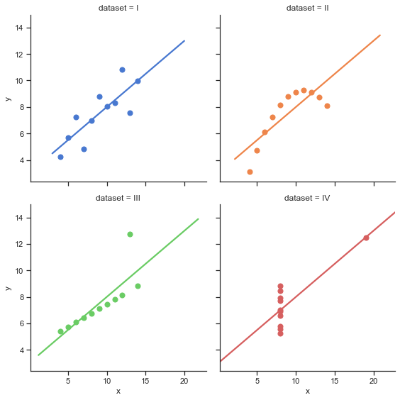


Calculo de los valores de la regresion lineal


```python
fits = [np.polyfit(g['x'], g['y'], 1) for _, g in anscombe.groupby('dataset')]
```


```python
# Almacenar los valores calculados de las regresiones lineales en un dataframe
val_reg = pd.DataFrame(fits,columns=['pendiente','intercepto'],index='I II II IV'.split())
val_reg.index.names = ['dataset']
val_reg
```


<table border="1" class="dataframe">
  <thead>
    <tr style="text-align: right;">
      <th></th>
      <th>pendiente</th>
      <th>intercepto</th>
    </tr>
    <tr>
      <th>dataset</th>
      <th></th>
      <th></th>
    </tr>
  </thead>
  <tbody>
    <tr>
      <th>I</th>
      <td>0.500091</td>
      <td>3.000091</td>
    </tr>
    <tr>
      <th>II</th>
      <td>0.500000</td>
      <td>3.000909</td>
    </tr>
    <tr>
      <th>II</th>
      <td>0.499727</td>
      <td>3.002455</td>
    </tr>
    <tr>
      <th>IV</th>
      <td>0.499909</td>
      <td>3.001727</td>
    </tr>
  </tbody>
</table>


## MATPLOTLIB

Matplotlib es el "abuelo" de las librerias de visualización de datos con Python. Fue creado por [John Hunter](https://numfocus.org/programs/john-hunter-technology-fellowship). Lo creó para tratar de replicar las capacidades de graficar de MatLab en Python.

Es una excelente biblioteca de gráficos 2D y 3D para generar figuras científicas.

Algunos de los principales Pros de Matplotlib son:

* Generalmente es fácil comenzar por graficas simples
* Soporte para etiquetas personalizadas y textos
* Gran control de cada elemento en una figura
* Salida de alta calidad en muchos formatos
* Muy personalizable en general

Matplotlib le permite crear figuras reproducibles mediante programación. la página web oficial de Matplotlib:
http://matplotlib.org/

### Instalacion

Se debe instalar Matplotlib, pero si instalo Anaconda ya viene instalado,
en caso de que no lo tenga se puede instalar asi: 

`pip install matplotlib` o `conda install matplotlib`

en Jupyter notebook `!pip install matplotlib`

usar preferiblemente Conda.
    
### Importar la libreria

Importar el modulo `matplotlib.pyplot` con el nombre de `plt` (esto es un estandar en la comunidad):


```python
import matplotlib.pyplot as plt
```

Para ver las graficas directamente en este notebook se debe hacer con este comando:


```python
%matplotlib inline
```

Esa línea es solo para Jupyter notebooks, si está usando otro editor, usará: `plt.show()` al final de todos sus comandos de graficos para que aparezca la figura en otra ventana.


```python
# La mayoria de los datos son inventados para evitar los warnings por divisiones por cero
# o valores igual a infinito, entonces apagare los warnings
import warnings; warnings.simplefilter('ignore')
```

### Comandos Basicos de Matplotlib

Veamos un ejemplo muy simple usando dos arreglos numpy. También se pueden usar listas, pero lo más probable es usar arreglos Numpy o columnas de pandas (que esencialmente también se comportan como arreglos).
**Los datos que queremos graficar:**


```python
import numpy as np
x = np.linspace(0,5, 11)
y = x ** 2
```


```python
x
```


    array([0. , 0.5, 1. , 1.5, 2. , 2.5, 3. , 3.5, 4. , 4.5, 5. ])


```python
y
```


    array([ 0.  ,  0.25,  1.  ,  2.25,  4.  ,  6.25,  9.  , 12.25, 16.  ,
           20.25, 25.  ])


Podemos crear un diagrama de líneas muy simple usando lo siguiente:


```python
# Metodo basico para graficar X vs Y
plt.plot(x, y) # se grafica una linea de color azul

plt.show() # Mostrar la grafica luego de que ya se definio todos los elementos
# plt.show() no es necesario en jupyter notebook
```


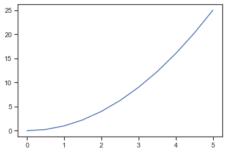


### Titulo


```python
plt.plot(x, y) # se grafica una linea de color azul
plt.title('Titulo de la grafica'); # definir el titulo de la grafica
```


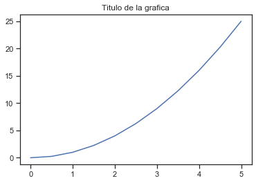


### Nombres de los ejes


```python
plt.plot(x, y) # se grafica una linea de color azul
plt.xlabel('Nombre del eje X') # definir el nombre del eje X
plt.ylabel('Nombre del eje Y') # definir el nombre del eje Y
plt.title('Titulo de la grafica'); # definir el titulo de la grafica
```


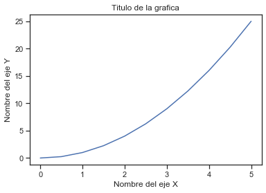


### Legend

Puede usar el argumento de palabra clave **label = "texto de etiqueta"** cuando se agreguen gráficas u otros objetos a la figura, y luego usar el método **legend** sin argumentos para agregar la leyenda a la figura:


```python
plt.plot(x, y, label="x vs y") # se grafica una linea de color azul
# se pone en el atributo 'label' el textto deseado

plt.xlabel('Nombre del eje X') # definir el nombre del eje X
plt.ylabel('Nombre del eje Y') # definir el nombre del eje Y
plt.title('Titulo de la grafica') # definir el titulo de la grafica
plt.legend(); # agregar el legend al plot
```


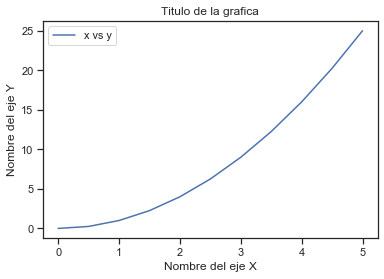


¡Observe cómo la leyenda se superpone con parte de la grafica!

EL Metodo **legend** toma un argumento opcional de palabra clave **loc** que puede usarse para especificar en qué parte de la figura debe dibujarse la leyenda. Los valores permitidos de **loc** son códigos numéricos para los diversos lugares donde se puede dibujar la leyenda. Consulte la [página de documentación](http://matplotlib.org/users/legend_guide.html#legend-location) para obtener detalles.

### Cuadricula (Grid )


```python
plt.plot(x, y, label="x vs y") # se grafica una linea de color azul
# se pone en el atributo 'label' el textto deseado

plt.xlabel('Nombre del eje X') # definir el nombre del eje X
plt.ylabel('Nombre del eje Y') # definir el nombre del eje Y
plt.title('Titulo de la grafica') # definir el titulo de la grafica
plt.legend() # agregar el legend al plot

plt.grid(True) # poner grid en la grafica
```


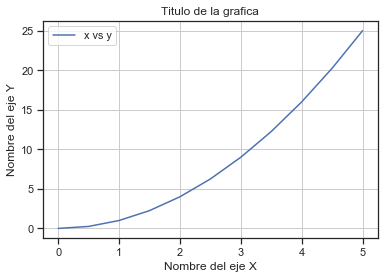


### Tamaño de la Figura y DPI

Matplotlib permite especificar la relación de aspecto, el DPI y el tamaño de la figura cuando se crea el objeto Figure. Puede usar los argumentos de las palabras clave `figsize` y` dpi`. No es necesario poner las dos.
* `figsize` es una tupla del ancho y alto de la figura en pulgadas
* `dpi` es el punto por pulgada (pixel por pulgada).


```python
# se cambia el tamaño de la figura y el numero de puntos por pulgada
plt.figure(figsize=(8,4), dpi=100)

plt.plot(x, y) # se grafica una linea de color azul

plt.xlabel('Nombre del eje X') # definir el nombre del eje X
plt.ylabel('Nombre del eje Y') # definir el nombre del eje Y
plt.title('Titulo de la grafica'); # definir el titulo de la grafica

# agrego ; al final del ultimo comando para solo mostrar la grafica
# plt.show() no es necesario en jupyter notebook
```


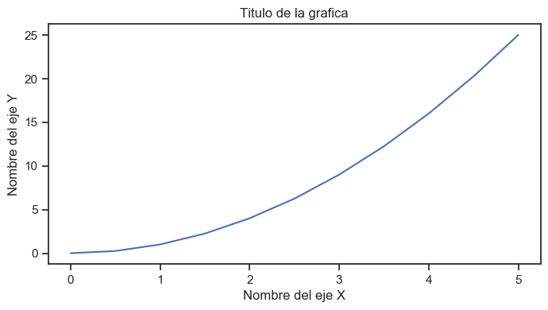


### Parametros de las lineas: colores, ancho y tipos

Matplotlib le brinda *muchas* opciones para personalizar colores, anchos de línea y tipos de línea.

Existe la sintaxis básica que se puede consultar en:

https://matplotlib.org/2.1.1/api/_as_gen/matplotlib.pyplot.plot.html

#### Colores Basicos

Con matplotlib, podemos definir los colores de las líneas y otros elementos gráficos de varias maneras. En primer lugar, podemos usar la sintaxis similar a MATLAB donde `'b'` significa azul,`'g'` significa verde, etc. También se admite la API MATLAB para seleccionar estilos de línea: donde, por ejemplo, 'b.-'significa una línea azul con puntos:


```python
# Estilo MATLAB de estilo y color de linea
plt.plot(x, x**2, 'b.-') # linea azul con puntos
plt.plot(x, x**3, 'g--'); # Linea verde discontinua
```


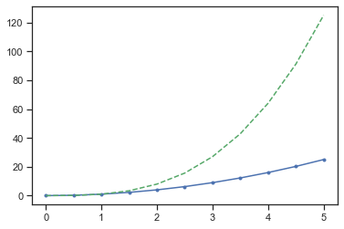


#### Colores usando el parametro  `color`

También podemos definir colores por sus nombres o códigos hexadecimales RGB y, opcionalmente, proporcionar un valor alpha utilizando los argumentos de palabras clave `color` y` alpha`. Alpha indica opacidad.


```python
plt.plot(x, x, color="red") # Medio transparente
plt.plot(x, x+1, color="red", alpha=0.5) # Medio transparente
plt.plot(x, x+2, color="#8B008B")        # RGB hex code
plt.plot(x, x+3, color="#F08C08");       # RGB hex code 
plt.grid(True) # poner grid en la grafica
```


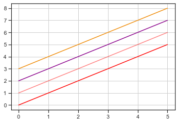


#### Estilos de Lineas y marcadores

Para cambiar el ancho de línea, podemos usar el argumento de la palabra clave `linewidth` o` lw`. El estilo de línea se puede seleccionar usando los argumentos de palabras clave `linestyle` o` ls`:


```python
plt.subplots(figsize=(12,6))

plt.plot(x, x+1, color="red", linewidth=0.25)
plt.plot(x, x+2, color="red", linewidth=0.50)
plt.plot(x, x+3, color="red", linewidth=1.00)
plt.plot(x, x+4, color="red", linewidth=2.00)

# posibles opciones linestype ‘-‘, ‘–’, ‘-.’, ‘:’, ‘steps’
plt.plot(x, x+5, color="green", lw=3, linestyle='-')
plt.plot(x, x+6, color="green", lw=3, ls='-.')
plt.plot(x, x+7, color="green", lw=3, ls=':')

# lineas parametrizadas
line, = plt.plot(x, x+8, color="black", lw=1.50)
line.set_dashes([5, 10, 15, 10]) # formato: longitud de linea, longitud de espacio, ...

# posibles simbolos del marcas: marker = '+', 'o', '*', 's', ',', '.',bb '1', '2', '3', '4', ...
plt.plot(x, x+ 9, color="blue", lw=3, ls='-', marker='+')
plt.plot(x, x+10, color="blue", lw=3, ls='--', marker='o')
plt.plot(x, x+11, color="blue", lw=3, ls='-', marker='s')
plt.plot(x, x+12, color="blue", lw=3, ls='--', marker='1')

# tamaño y color de la marca
plt.plot(x, x+13, color="purple", lw=1, ls='-', marker='o', markersize=2)
plt.plot(x, x+14, color="purple", lw=1, ls='-', marker='o', markersize=4)
plt.plot(x, x+15, color="purple", lw=1, ls='-', marker='o', markersize=8, markerfacecolor="red")
plt.plot(x, x+16, color="purple", lw=1, ls='-', marker='s', markersize=8, 
        markerfacecolor="yellow", markeredgewidth=3, markeredgecolor="green");
```


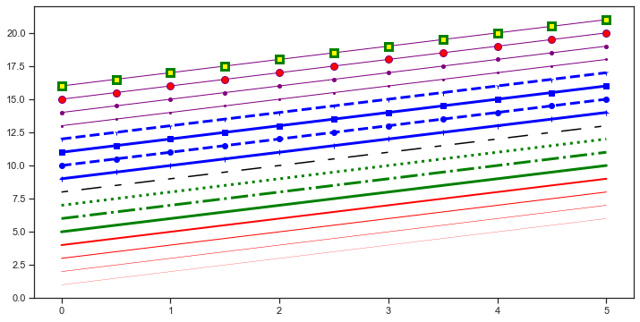


Para mas informacion:
https://matplotlib.org/2.1.1/api/_as_gen/matplotlib.pyplot.plot.html

### Subplots


```python
# la funcion es plt.subplot(nrows, ncols, plot_number)

plt.subplot(1,2,1) # subplot fila=1 Col=2, grafica=1
plt.plot(x, y, 'r--') # r-- color rojo y linea discontinua
plt.subplot(1,2,2) # subplot fila=1 Col=2, grafica=2
plt.plot(y, x, 'g*-'); # para no mostrar info de la funcion
plt.tight_layout() # para que no se superpongan las graficas
```


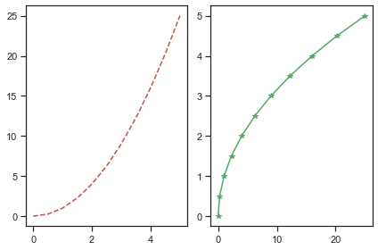


#### Multiples subplots

Crear subplot de diferentes tamaños se puede lograr con el metodo `.subplot2grid()`
Mas informacion en el link: https://matplotlib.org/api/_as_gen/matplotlib.pyplot.subplot2grid.html


```python
plt.subplot2grid((3,3), (0,0), colspan=3)
plt.subplot2grid((3,3), (1,0), colspan=2)
plt.subplot2grid((3,3), (1,2), rowspan=2)
plt.subplot2grid((3,3), (2,0))
plt.subplot2grid((3,3), (2,1))
plt.tight_layout() # para que no se superpongan las graficas
```


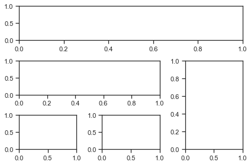


### Rango del Plot

Podemos configurar los rangos de los ejes usando los métodos `ylim` y` xlim` en el objeto del eje, o `axis('tight')` para obtener automáticamente rangos de ejes "tightly fitted":


```python
plt.figure(figsize=(12, 4))

plt.subplot(1,3,1)
plt.plot(x, x**2, x, x**3)
plt.title("Rango por defecto de los ejes")

plt.subplot(1,3,2)
plt.plot(x, x**2, x, x**3)
plt.axis('tight')
plt.title("Ejes apretados")

plt.subplot(1,3,3)
plt.plot(x, x**2, x, x**3)
plt.ylim([0, 60])
plt.xlim([2, 5])
plt.title("ejes de rango personalizados");

plt.tight_layout() # para que no se superpongan las graficas
```


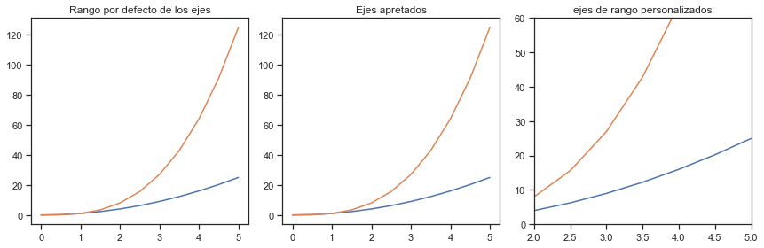


#### Escala Logaritmica


```python
plt.figure(figsize=(10,4))
      
plt.subplot(1,2,1)
plt.plot(x, x**2, x, np.exp(x))
plt.title("escala Normal")

plt.subplot(1,2,2)
plt.plot(x, x**2, x, np.exp(x))
plt.yscale("log")
plt.title("Escala Logaritmica(y)");

plt.tight_layout() # para que no se superpongan las graficas
```


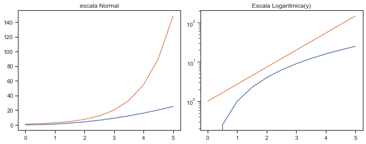


### Anotaciones de texto
Anotar texto en figuras matplotlib se puede hacer usando la función `text`. Es compatible con el formato LaTeX al igual que los textos y títulos de la etiqueta del eje:


```python
# Datos para graficar
xx = np.linspace(-0.75, 1., 100)

plt.plot(xx, xx**2, xx, xx**3)
plt.title("Plot con anotaciones")

# Anotacion 1
plt.text(0.15, 0.2, r"$y=x^2$", fontsize=20, color="blue")
#Anotacion 2
plt.text(0.65, 0.1, r"$y=x^3$", fontsize=20, color="green");
```


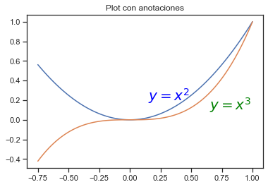


---
## Matplotlib Método orientado a objetos
Lo demostrado hasta el momento es la forma basica de usar `Matplotlib`,
pero la libreria se puede usar mediante la programacion orientada a objtetos con el Matplotlib's Object Oriented API. Esto significa que se creara una instancia del objeto de figura y luego llamaremos a métodos o atributos de ese objeto.
La idea principal al utilizar el método más formal orientado a objetos es crear objetos de figura y luego simplemente invocar métodos o atributos fuera de ese objeto. Este enfoque es más agradable cuando se trata de una figura que tiene múltiples graficos en él.
Mas informacion: https://matplotlib.org/api/api_overview.html#the-object-oriented-api

Un ejemplo de matplotlib orientado a objetos:


```python
# Se crea una figura y 2 subplots
# cada subplt se accede por medio de los objetos axes

fig, axes = plt.subplots(nrows=1, ncols=2)

for ax in axes:
    ax.plot(x, y, 'g')
    ax.set_xlabel('x')
    ax.set_ylabel('y')
    ax.set_title('title')
plt.tight_layout() # para que no se superpongan las graficas
```


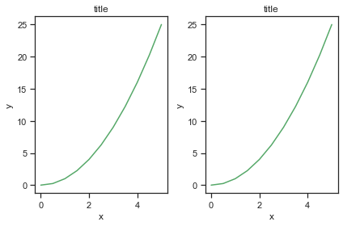


---
## Tipos Especiales de Plots

Hay muchas Graficas especializadas que podemos crear, como barras, histogramas, diagramas de dispersión y mucho más. La mayoría de este tipo de tramas lo crearemos usando seaborn, una biblioteca de gráficos estadísticos para Python. Pero aquí hay algunos ejemplos de este tipo de graficos

### Scatter Plot (Dispersion)


```python
#Grafica X vs Y
# crear datos aleatorios
N = 50
x = np.random.rand(N)
y = np.random.rand(N)

plt.scatter(x, y)
plt.title("Scatter plot Simple");
plt.show() # En jupyter notebook no es necesario este comando
```


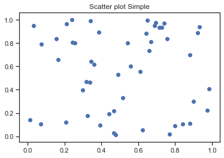


Con las graficas de scatter o dispersion se pueden representar mas de 2 variables en una misma grafica, en el siguiente ejemplo se realizara la comparacion de `x vs y` el color de los puntos se representara con otra variable y el tamaño de los puntos sera otra variable


```python
# se creara otra variable que se representara con colores
colors = np.random.rand(N) # usar colores aleatorios

# se creara otra variable que se representara con el area de los puntos
area = np.pi * (15 * np.random.rand(N))**2  # 0 to 15 point radio

plt.scatter(x, y, s=area, c=colors, alpha=0.5) # el atributo alpha es para la transparencia
plt.title("Scatter plot de representacion de 4 variables");
```


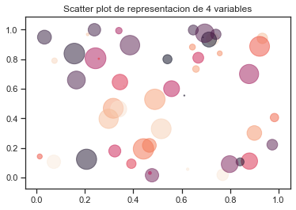


### Histograma
Un histograma es una representación gráfica de una variable en forma de barras, donde la superficie de cada barra es proporcional a la frecuencia de los valores representados. Sirven para obtener una "primera vista" general, o panorama, de la distribución de la población, o de la muestra, respecto a una característica, cuantitativa y continua 


```python
# crear datos aleatorios
from random import sample
data = sample(range(1, 1000), 100)

plt.hist(data,bins = 10) # bins el numero de divisiones del histograma
plt.title("Histograma");
```


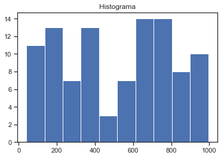


### Boxplot
Informacion sobre el boxplot ->  https://es.wikipedia.org/wiki/Diagrama_de_caja

* Primer cuartil (Q1) como la mediana de la primera mitad de valores
* Segundo cuartil (Q2) como la propia mediana de la serie
* Tercer cuartil (Q3) como la mediana de la segunda mitad de valores.

La diferencia entre el tercer cuartil y el primero se conoce como rango intercuartíl


```python
#crear datos aleatorios
data = [np.random.normal(0, std, 100) for std in range(1, 4)]

# boxplot rectangular 
plt.boxplot(data,vert=True,patch_artist=True);
plt.title("Boxplot");
```


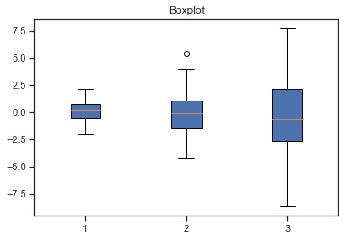


#### Diagramas de Violin

Permiten ver como es la distribucion de los datos


```python
all_data = [np.random.normal(0, std, 100) for std in range(6, 10)]

# grafico de violin, se puede activar la visualizacion de la media y de la mediana
plt.violinplot(all_data, showmeans=False, showmedians=True)
plt.title('violin plot');
```


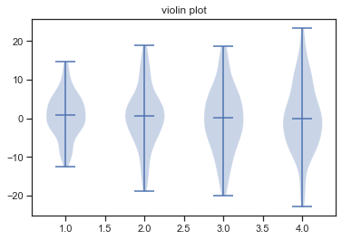


#### Diagramas de Violin vs Boxplot

Se grafiara usando programacino orientada a objetos con Matplolib la comparacion entre las graficas de violin y las de boxplot


```python
fig, axes = plt.subplots(nrows=1, ncols=2, figsize=(12, 4))

# generar datos aleatorios
all_data = [np.random.normal(0, std, 100) for std in range(6, 10)]

# plot de violin
axes[0].violinplot(all_data,
                   showmeans=False,
                   showmedians=True)
axes[0].set_title('violin plot')

# plot box plot
axes[1].boxplot(all_data)
axes[1].set_title('box plot')

# agregando lineas horizontales
for ax in axes:
    ax.yaxis.grid(True)
    ax.set_xticks([y+1 for y in range(len(all_data))])
    ax.set_xlabel('xlabel')
    ax.set_ylabel('ylabel')

# agragando los nombres a las divisiones del eje x (x-tick labels)
plt.setp(axes, xticks=[y+1 for y in range(len(all_data))],
         xticklabels=['x1', 'x2', 'x3', 'x4'])

fig.suptitle("Violin vs Boxplot",fontsize = 14) # titulo general de la grafica
plt.show()
```


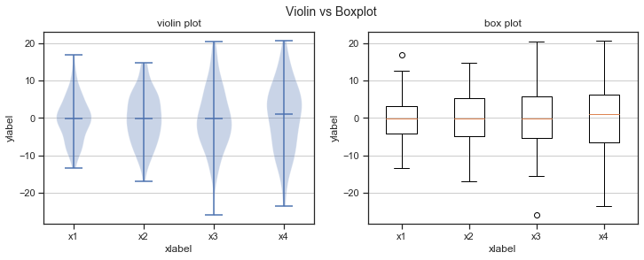


### Diagramas de torta
No usarlos, los humanos no somos buenos discriminando angulos


```python
labels = 'Caballos', 'Cerdos', 'Perros', 'Vacas'
sizes = [15, 30, 45, 10]
explode = (0, 0.1, 0, 0)  # solo "Saque" el 2do pedazo (ejem. 'cerdos')

plt.pie(sizes, explode=explode, labels=labels, autopct='%1.1f%%',
        shadow=True, startangle=90)

plt.axis('equal')  #La relación de aspecto igual garantiza que el círculo sea homogeneo
plt.show()
```


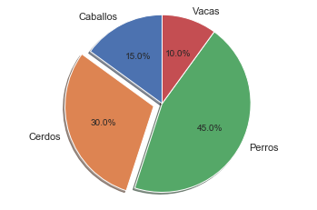


### Diagramas de error


```python
# generacion de datos aleatorios
x = np.arange(0.1, 4, 0.5)
y = np.exp(-x)

# Graficas de error
plt.errorbar(x, y, xerr=0.2, yerr=0.4)
plt.title("Diagrama de error")
plt.grid()
plt.show()
```


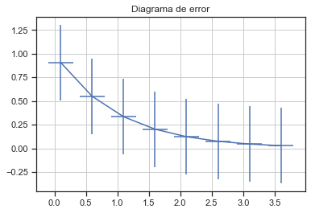


---
## Guardando  las figuras
Matplotlib puede generar resultados de alta calidad en varios formatos, incluidos PNG, JPG, EPS, SVG, PGF y PDF. 
Para guardar una figura en un archivo, podemos usar el método `savefig` de la clase` Figure`:

Lo primero es antes de crear una grafica definir la clase `Figure` al principio de todo la grafica, Ejemplo:

`fig = plt.figure(figsize=(10,4))
 plt.scatter(x, y)
 plt.title("Scatter plot Simple");`


```python
fig.savefig("figura.png")
```

Aquí también podemos especificar opcionalmente el DPI y elegir entre diferentes formatos de salida (PNG, JPG, EPS, SVG, PGF y PDF):


```python
fig.savefig("figura.pdf", dpi=200)
```

___
## VISUALIZACION CON PANDAS

Pandas tiene funciones incorporadas para la visualización de datos. Está construido sobre matplotlib, pero se usa el formato de pandas para un uso más fácil. Mas informacion en: https://pandas.pydata.org/pandas-docs/stable/visualization.html

Los parametros de las graficas se pueden modificar con matplotlib.

### Importar la libreria


```python
import pandas as pd
import numpy as np
%matplotlib inline
```

**Datos para graficar:**


```python
df1 = pd.read_csv('https://github.com/mwaskom/seaborn-data/raw/master/mpg.csv')
df1.head()
```


<table border="1" class="dataframe">
  <thead>
    <tr style="text-align: right;">
      <th></th>
      <th>mpg</th>
      <th>cylinders</th>
      <th>displacement</th>
      <th>horsepower</th>
      <th>weight</th>
      <th>acceleration</th>
      <th>model_year</th>
      <th>origin</th>
      <th>name</th>
    </tr>
  </thead>
  <tbody>
    <tr>
      <th>0</th>
      <td>18.0</td>
      <td>8</td>
      <td>307.0</td>
      <td>130.0</td>
      <td>3504</td>
      <td>12.0</td>
      <td>70</td>
      <td>usa</td>
      <td>chevrolet chevelle malibu</td>
    </tr>
    <tr>
      <th>1</th>
      <td>15.0</td>
      <td>8</td>
      <td>350.0</td>
      <td>165.0</td>
      <td>3693</td>
      <td>11.5</td>
      <td>70</td>
      <td>usa</td>
      <td>buick skylark 320</td>
    </tr>
    <tr>
      <th>2</th>
      <td>18.0</td>
      <td>8</td>
      <td>318.0</td>
      <td>150.0</td>
      <td>3436</td>
      <td>11.0</td>
      <td>70</td>
      <td>usa</td>
      <td>plymouth satellite</td>
    </tr>
    <tr>
      <th>3</th>
      <td>16.0</td>
      <td>8</td>
      <td>304.0</td>
      <td>150.0</td>
      <td>3433</td>
      <td>12.0</td>
      <td>70</td>
      <td>usa</td>
      <td>amc rebel sst</td>
    </tr>
    <tr>
      <th>4</th>
      <td>17.0</td>
      <td>8</td>
      <td>302.0</td>
      <td>140.0</td>
      <td>3449</td>
      <td>10.5</td>
      <td>70</td>
      <td>usa</td>
      <td>ford torino</td>
    </tr>
  </tbody>
</table>


```python
df2 = pd.read_csv('https://github.com/mwaskom/seaborn-data/raw/master/iris.csv')
df2.head()
```


<table border="1" class="dataframe">
  <thead>
    <tr style="text-align: right;">
      <th></th>
      <th>sepal_length</th>
      <th>sepal_width</th>
      <th>petal_length</th>
      <th>petal_width</th>
      <th>species</th>
    </tr>
  </thead>
  <tbody>
    <tr>
      <th>0</th>
      <td>5.1</td>
      <td>3.5</td>
      <td>1.4</td>
      <td>0.2</td>
      <td>setosa</td>
    </tr>
    <tr>
      <th>1</th>
      <td>4.9</td>
      <td>3.0</td>
      <td>1.4</td>
      <td>0.2</td>
      <td>setosa</td>
    </tr>
    <tr>
      <th>2</th>
      <td>4.7</td>
      <td>3.2</td>
      <td>1.3</td>
      <td>0.2</td>
      <td>setosa</td>
    </tr>
    <tr>
      <th>3</th>
      <td>4.6</td>
      <td>3.1</td>
      <td>1.5</td>
      <td>0.2</td>
      <td>setosa</td>
    </tr>
    <tr>
      <th>4</th>
      <td>5.0</td>
      <td>3.6</td>
      <td>1.4</td>
      <td>0.2</td>
      <td>setosa</td>
    </tr>
  </tbody>
</table>


### Hojas de estilo(Style Sheets)

Matplotlib tien [Hojas de estilo](http://matplotlib.org/gallery.html#style_sheets) se pueden usar para hacer que las graficas se vean un poco mejor. Estas hojas de estilo incluyen `plot_bmh`, `plot_fivethirtyeight`, `plot_ggplot` y más. Básicamente, crean un conjunto de reglas de estilo que siguen las gráficas. Es Recomendable usarlos, pues hacen que todas las graficas tengan el mismo aspecto y se sientan más profesionales.

**Antes de usasr `plt.style.use()` las graficas se ven así:**


```python
df1['acceleration'].hist();
```


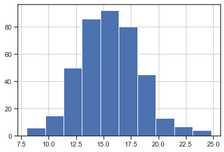


Usar el estilo ggplot


```python
import matplotlib.pyplot as plt
plt.style.use('ggplot')
```

Ahora las graficas se ven asi:


```python
df1['acceleration'].hist();
```


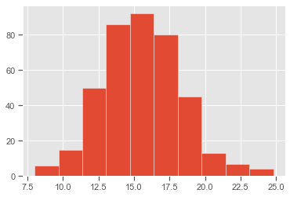


```python
plt.style.use('bmh')
df1['acceleration'].hist();
```


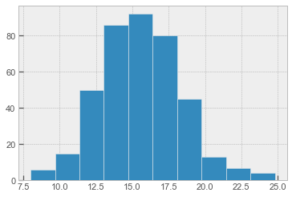


```python
plt.style.use('dark_background')
df1['acceleration'].hist();
```


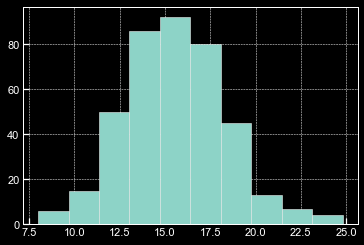


```python
plt.style.use('fivethirtyeight')
df1['acceleration'].hist();
```


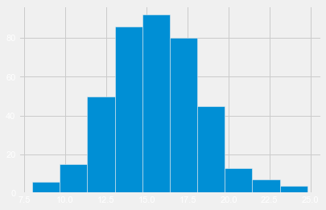


```python
# El estilo por defecto es
plt.style.use('classic')
df1['acceleration'].hist();
```


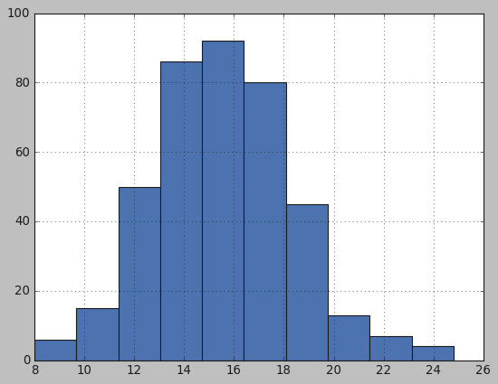


```python
# Seguire usando el estilo ggplot para ver los tipos de grafica de pandas
plt.style.use('ggplot')
```

## Tipos de graficas en Pandas

Hay varios tipos de plots integradas a pandas, la mayoría de estos plots sobn para estadística por naturaleza:

* df.plot.area     
* df.plot.barh     
* df.plot.density  
* df.plot.hist     
* df.plot.line     
* df.plot.scatter
* df.plot.bar      
* df.plot.box      
* df.plot.hexbin   
* df.plot.kde      
* df.plot.pie

También se puede llamar a `df.plot(kind = 'hist')` o reemplazar ese argumento kind con cualquiera de los términos clave que se muestran en la lista anterior (por ejemplo, 'box', 'barh', etc.)

### Area


```python
# Se puede hacer de las siguiente manera
#df2.plot(kind='area',alpha = 0.4)

df2.plot.area(alpha=0.4);
```


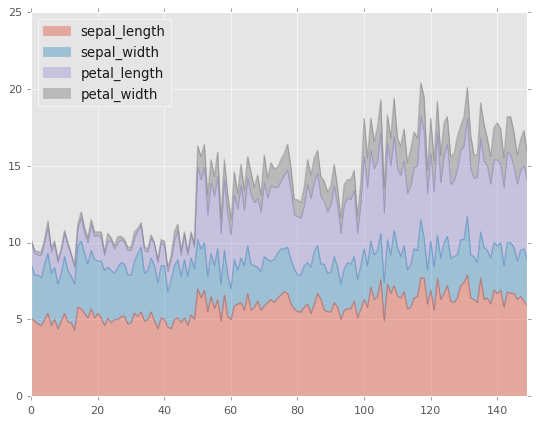


### Barplots


```python
# Visualizacion de datos
df2.head()
```


<table border="1" class="dataframe">
  <thead>
    <tr style="text-align: right;">
      <th></th>
      <th>sepal_length</th>
      <th>sepal_width</th>
      <th>petal_length</th>
      <th>petal_width</th>
      <th>species</th>
    </tr>
  </thead>
  <tbody>
    <tr>
      <th>0</th>
      <td>5.1</td>
      <td>3.5</td>
      <td>1.4</td>
      <td>0.2</td>
      <td>setosa</td>
    </tr>
    <tr>
      <th>1</th>
      <td>4.9</td>
      <td>3.0</td>
      <td>1.4</td>
      <td>0.2</td>
      <td>setosa</td>
    </tr>
    <tr>
      <th>2</th>
      <td>4.7</td>
      <td>3.2</td>
      <td>1.3</td>
      <td>0.2</td>
      <td>setosa</td>
    </tr>
    <tr>
      <th>3</th>
      <td>4.6</td>
      <td>3.1</td>
      <td>1.5</td>
      <td>0.2</td>
      <td>setosa</td>
    </tr>
    <tr>
      <th>4</th>
      <td>5.0</td>
      <td>3.6</td>
      <td>1.4</td>
      <td>0.2</td>
      <td>setosa</td>
    </tr>
  </tbody>
</table>


```python
# los nombres de cada columna equivalen a un color diferente
# Solo se graficaran algunos datos
df2.iloc[2:8].plot.bar();
```


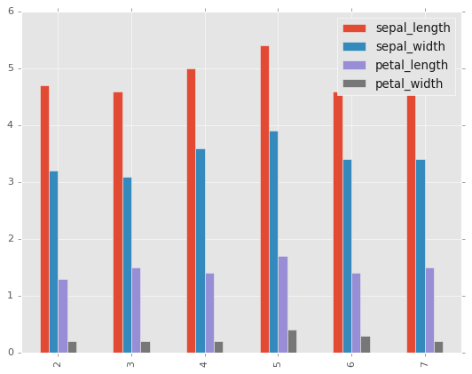


```python
df2.iloc[2:8].plot.bar(stacked=True);
```


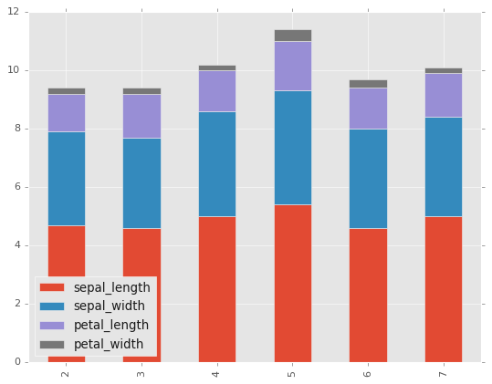


### Histogramas


```python
df1.head()
```


<table border="1" class="dataframe">
  <thead>
    <tr style="text-align: right;">
      <th></th>
      <th>mpg</th>
      <th>cylinders</th>
      <th>displacement</th>
      <th>horsepower</th>
      <th>weight</th>
      <th>acceleration</th>
      <th>model_year</th>
      <th>origin</th>
      <th>name</th>
    </tr>
  </thead>
  <tbody>
    <tr>
      <th>0</th>
      <td>18.0</td>
      <td>8</td>
      <td>307.0</td>
      <td>130.0</td>
      <td>3504</td>
      <td>12.0</td>
      <td>70</td>
      <td>usa</td>
      <td>chevrolet chevelle malibu</td>
    </tr>
    <tr>
      <th>1</th>
      <td>15.0</td>
      <td>8</td>
      <td>350.0</td>
      <td>165.0</td>
      <td>3693</td>
      <td>11.5</td>
      <td>70</td>
      <td>usa</td>
      <td>buick skylark 320</td>
    </tr>
    <tr>
      <th>2</th>
      <td>18.0</td>
      <td>8</td>
      <td>318.0</td>
      <td>150.0</td>
      <td>3436</td>
      <td>11.0</td>
      <td>70</td>
      <td>usa</td>
      <td>plymouth satellite</td>
    </tr>
    <tr>
      <th>3</th>
      <td>16.0</td>
      <td>8</td>
      <td>304.0</td>
      <td>150.0</td>
      <td>3433</td>
      <td>12.0</td>
      <td>70</td>
      <td>usa</td>
      <td>amc rebel sst</td>
    </tr>
    <tr>
      <th>4</th>
      <td>17.0</td>
      <td>8</td>
      <td>302.0</td>
      <td>140.0</td>
      <td>3449</td>
      <td>10.5</td>
      <td>70</td>
      <td>usa</td>
      <td>ford torino</td>
    </tr>
  </tbody>
</table>


```python
df1['acceleration'].plot.hist(bins=50);
```


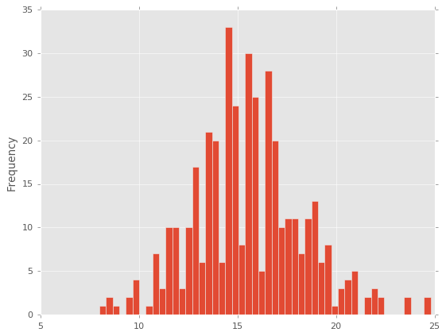


### Lineas


```python
# eje y = valores de la acceleracion
# eje x = valores del index
# atributo lw es el grosor de la linea
df1.plot.line(y='acceleration',figsize=(12,3),lw=1);
```


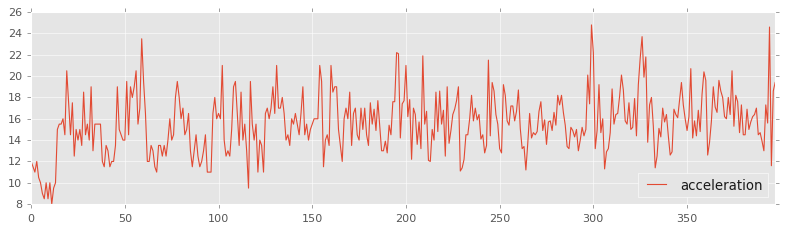


### Scatter Plots


```python
df1.plot.scatter(x='acceleration',y='mpg');
```


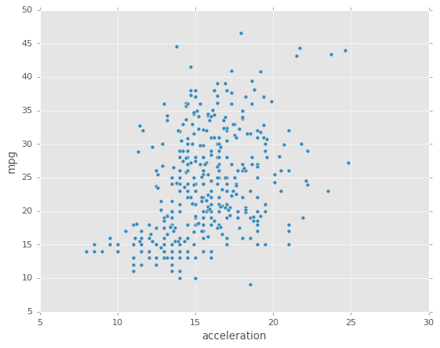


Se puede usar `c` para indicar el color de los valores de otra columna
Con cmap se indica el mapa de colores que se usaran. 
Para ver los colormaps existente: http://matplotlib.org/users/colormaps.html


```python
df1.plot.scatter(x='acceleration',y='mpg',c='model_year',cmap='coolwarm');
```


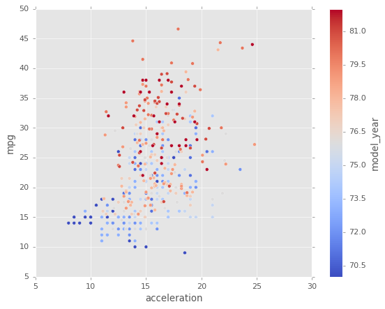


O se puede usar `s` para indicar el tamaño de los puntos. El parametro `s` debe ser un arreglo, no solo el nombre de una columna:


```python
df1.plot.scatter(x='acceleration',y='mpg',s=df1['horsepower']*2);
```


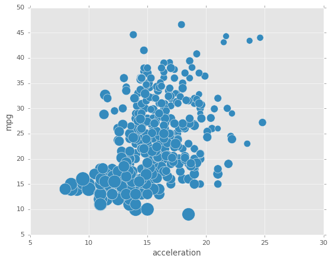


### BoxPlots


```python
df2.plot.box(); # Tambien se puede poner by= argumento para groupby
```


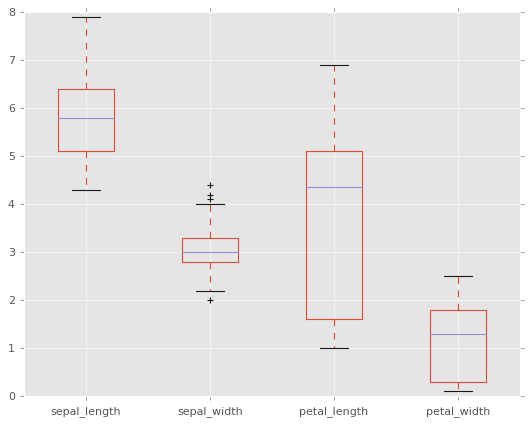


### Diagrama de Torta


```python
serie = pd.Series(3 * np.random.rand(4), index=['a', 'b', 'c', 'd'], name='series')
serie.plot.pie(figsize=(6, 6));
```


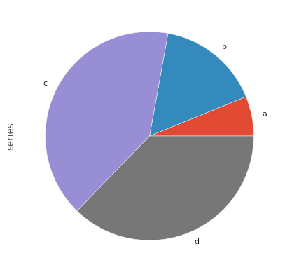


### Hexagonal

Util para datos de 2 variables, alternativa al scatterplot:


```python
df1.plot.hexbin(x='acceleration',y='mpg',gridsize=25,cmap='Oranges');
```


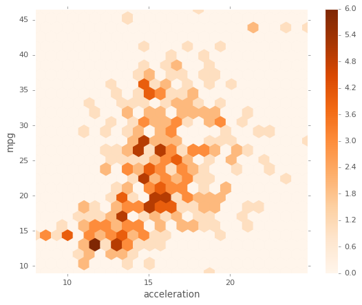


### Kernel Density Estimation Plot(KDE)


```python
df1['weight'].plot.kde();
```


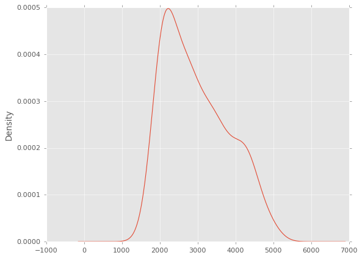


```python
df2.plot.density();
```


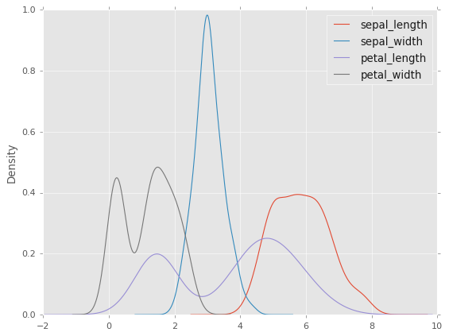


### Scatter Matrix


```python
pd.plotting.scatter_matrix(df2, figsize=(8, 8));
```


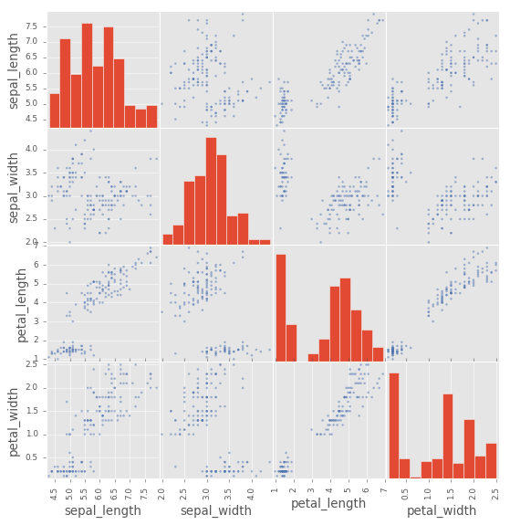


### Parametros de las graficas

Graficar con Pandas es un método de hacer graficas mucho más fácil de usar que matplotlib, equilibra la facilidad de uso con control sobre la figura. Muchas de las llamadas a gráficos también aceptan argumentos adicionales de matplotlib plt.


```python
df2.plot.density() # grafico de densidad con pandas

plt.title('Grafica de densidad de varias variables')
plt.grid(False)
plt.xticks([]);# Para eliminar los numeros del eje
```


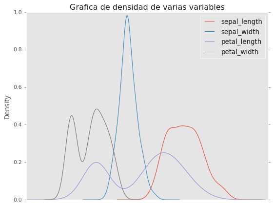


```python
# La misma grafica pero adicionando los parametros en los argumentos
df2.plot.density(title='Grafica de densidad de varias variables',
                 grid=False,
                xticks = []);
```


## PLOTLY: Libreria de Visualizacion Interactiva

Plotly es una libreria de graficos interactivos de código abierto que admite más de 40 tipos de gráficos únicos que cubren una amplia gama de casos de uso estadísticos, financieros, geográficos, científicos y tridimensionales.

Ademas de ser interactivo y obtener los valores en cada punto de la gráfica, **se pueden mezclar datos numéricos y categóricos.**


### Instalacion Plotly

´pip install plotly´

´conda install -c plotly plotly´

### Importar Plotly express

Plotly express es un modulo para usar de forma rapida y concisa de usar la visualización interactiva de plotly

**Nota: Los datos siempre deben estar en un dataframe**


```python
import plotly.express as px
```

### Datos integrados en Plotly
Plotly viene con algunos data sets clasicos integrados para hacer pruebas:
- carshare
- election
- gapminder
- iris
- tips
- wind


Tambien se pueden encontar otros datasets clasicos de demostracion en formato .csv
en: https://github.com/mwaskom/seaborn-data


```python
tips = px.data.tips() # Importar el dataset tips
type(tips)
```


    pandas.core.frame.DataFrame


```python
print(px.data.tips.__doc__)

```


        Each row represents a restaurant bill.
    
        https://vincentarelbundock.github.io/Rdatasets/doc/reshape2/tips.html
    
        Returns:
            A `pandas.DataFrame` with 244 rows and the following columns: `['total_bill', 'tip', 'sex', 'smoker', 'day', 'time', 'size']`.


```python
tips.head() # ver los primeros 5 registros
```


<table border="1" class="dataframe">
  <thead>
    <tr style="text-align: right;">
      <th></th>
      <th>total_bill</th>
      <th>tip</th>
      <th>sex</th>
      <th>smoker</th>
      <th>day</th>
      <th>time</th>
      <th>size</th>
    </tr>
  </thead>
  <tbody>
    <tr>
      <th>0</th>
      <td>16.99</td>
      <td>1.01</td>
      <td>Female</td>
      <td>No</td>
      <td>Sun</td>
      <td>Dinner</td>
      <td>2</td>
    </tr>
    <tr>
      <th>1</th>
      <td>10.34</td>
      <td>1.66</td>
      <td>Male</td>
      <td>No</td>
      <td>Sun</td>
      <td>Dinner</td>
      <td>3</td>
    </tr>
    <tr>
      <th>2</th>
      <td>21.01</td>
      <td>3.50</td>
      <td>Male</td>
      <td>No</td>
      <td>Sun</td>
      <td>Dinner</td>
      <td>3</td>
    </tr>
    <tr>
      <th>3</th>
      <td>23.68</td>
      <td>3.31</td>
      <td>Male</td>
      <td>No</td>
      <td>Sun</td>
      <td>Dinner</td>
      <td>2</td>
    </tr>
    <tr>
      <th>4</th>
      <td>24.59</td>
      <td>3.61</td>
      <td>Female</td>
      <td>No</td>
      <td>Sun</td>
      <td>Dinner</td>
      <td>4</td>
    </tr>
  </tbody>
</table>


```python
tips.dtypes #tipos de datos en el dataframe
```


    total_bill    float64
    tip           float64
    sex            object
    smoker         object
    day            object
    time           object
    size            int64
    dtype: object


```python
tips.describe() #Resumen estadistico de los datos del data frame por columna
```


<table border="1" class="dataframe">
  <thead>
    <tr style="text-align: right;">
      <th></th>
      <th>total_bill</th>
      <th>tip</th>
      <th>size</th>
    </tr>
  </thead>
  <tbody>
    <tr>
      <th>count</th>
      <td>244.000000</td>
      <td>244.000000</td>
      <td>244.000000</td>
    </tr>
    <tr>
      <th>mean</th>
      <td>19.785943</td>
      <td>2.998279</td>
      <td>2.569672</td>
    </tr>
    <tr>
      <th>std</th>
      <td>8.902412</td>
      <td>1.383638</td>
      <td>0.951100</td>
    </tr>
    <tr>
      <th>min</th>
      <td>3.070000</td>
      <td>1.000000</td>
      <td>1.000000</td>
    </tr>
    <tr>
      <th>25%</th>
      <td>13.347500</td>
      <td>2.000000</td>
      <td>2.000000</td>
    </tr>
    <tr>
      <th>50%</th>
      <td>17.795000</td>
      <td>2.900000</td>
      <td>2.000000</td>
    </tr>
    <tr>
      <th>75%</th>
      <td>24.127500</td>
      <td>3.562500</td>
      <td>3.000000</td>
    </tr>
    <tr>
      <th>max</th>
      <td>50.810000</td>
      <td>10.000000</td>
      <td>6.000000</td>
    </tr>
  </tbody>
</table>


## Tipos de Graficas con Plotly

### Lineas

```python
px.line(tips,y='total_bill',title='Valor Total de la Cuenta')
```




### Barras


```python
px.bar(tips, x="sex", y="total_bill")
```




```python
px.bar(tips, x="sex", y="total_bill", color='sex')
```




### Histograma


```python
px.histogram(tips,'total_bill',title='Histograma Valor Total de la Cuenta')
```




```python
px.histogram(tips,'sex',title='Histograma de Generos')
```




```python
px.histogram(tips,'day',
             category_orders= {'day': ["Thur","Fri","Sat", "Sun"]},
             title='Histograma de Dias')
```




### Boxplot


```python
px.box(tips,y='total_bill', title='Boxplot Valor Total de la Cuenta')
```




```python
px.box(tips,x = 'day',y='total_bill', color='day',
       title='Boxplots por dia del Valor Total de la Cuenta')
```




```python
px.box(tips,x = 'day',y='total_bill', title= 'Boxplot por dia con dias en orden',
       category_orders= {'day': ["Thur","Fri","Sat", "Sun"]})
```




```python
px.box(tips,x = 'day',y='total_bill', color='smoker', category_orders= {'day': ["Thur","Fri","Sat", "Sun"]})
```




```python
px.box(tips,x = 'day',y='total_bill', color='smoker', 
       boxmode='overlay',
       title = 'Boxplots de cuenta total por dia, fumador o no , sobrepuestos ',
       category_orders= {'day': ["Thur","Fri","Sat", "Sun"]})
```




### Violin Plot

```python
px.violin(tips,y='total_bill', title='Boxplot Valor Total de la Cuenta')
```




```python
px.violin(tips,x = 'day',y='total_bill', title='Violin por dia del Valor Total de la Cuenta')
```




```python
px.violin(tips,x = 'day',y='total_bill', color='day',
          title='Violin por dia del Valor Total de la Cuenta')
```




```python
px.violin(tips,x = 'day',y='total_bill', color='sex',
          title='Violin por dia del Valor Total de la Cuenta')
```




```python
px.violin(tips,x = 'day',y='total_bill', color='sex',violinmode='overlay',
          title='Violin por dia del Valor Total de la Cuenta, Hombres y Mujeres')
```




### StripPlot

```python
px.strip(tips, x="day", y="total_bill")
```




```python
px.strip(tips, x="total_bill", y="time",
         orientation="h", color="smoker")
```




```python
px.strip(tips, x="day", y="total_bill",
         color="sex", stripmode='overlay')
```



### Scatterplot


```python
gapminder = px.data.gapminder()
gapminder2007 = gapminder.query("year==2007")
```


```python
px.scatter(gapminder2007, x="gdpPercap", y="lifeExp")
```




```python
px.scatter(gapminder2007, x="gdpPercap", y="lifeExp", color="continent")
```




```python
px.scatter(gapminder2007, x="gdpPercap", y="lifeExp", size="pop", color="continent", size_max=60)
```




```python
px.scatter(gapminder2007, x="gdpPercap", y="lifeExp", size="pop", color="continent",
           hover_name="country", log_x=True, size_max=60)
```




### Regresion Lineal


```python
px.scatter(tips,x='total_bill',y='tip',trendline='ols')
```




### Matrix Plot


```python
px.scatter_matrix(tips)
```




```python
px.scatter_matrix(tips, dimensions=['total_bill','tip','size'])
```




```python
px.scatter_matrix(tips, dimensions=['total_bill','tip','size'], color='sex')
```




### HeatMap


```python
tips.head()
```

<table border="1" class="dataframe">
  <thead>
    <tr style="text-align: right;">
      <th></th>
      <th>total_bill</th>
      <th>tip</th>
      <th>sex</th>
      <th>smoker</th>
      <th>day</th>
      <th>time</th>
      <th>size</th>
    </tr>
  </thead>
  <tbody>
    <tr>
      <th>0</th>
      <td>16.99</td>
      <td>1.01</td>
      <td>Female</td>
      <td>No</td>
      <td>Sun</td>
      <td>Dinner</td>
      <td>2</td>
    </tr>
    <tr>
      <th>1</th>
      <td>10.34</td>
      <td>1.66</td>
      <td>Male</td>
      <td>No</td>
      <td>Sun</td>
      <td>Dinner</td>
      <td>3</td>
    </tr>
    <tr>
      <th>2</th>
      <td>21.01</td>
      <td>3.50</td>
      <td>Male</td>
      <td>No</td>
      <td>Sun</td>
      <td>Dinner</td>
      <td>3</td>
    </tr>
    <tr>
      <th>3</th>
      <td>23.68</td>
      <td>3.31</td>
      <td>Male</td>
      <td>No</td>
      <td>Sun</td>
      <td>Dinner</td>
      <td>2</td>
    </tr>
    <tr>
      <th>4</th>
      <td>24.59</td>
      <td>3.61</td>
      <td>Female</td>
      <td>No</td>
      <td>Sun</td>
      <td>Dinner</td>
      <td>4</td>
    </tr>
  </tbody>
</table>

```python
# Matriz de correlacion de los datos
tips.corr()
```

<table border="1" class="dataframe">
  <thead>
    <tr style="text-align: right;">
      <th></th>
      <th>total_bill</th>
      <th>tip</th>
      <th>size</th>
    </tr>
  </thead>
  <tbody>
    <tr>
      <th>total_bill</th>
      <td>1.000000</td>
      <td>0.675734</td>
      <td>0.598315</td>
    </tr>
    <tr>
      <th>tip</th>
      <td>0.675734</td>
      <td>1.000000</td>
      <td>0.489299</td>
    </tr>
    <tr>
      <th>size</th>
      <td>0.598315</td>
      <td>0.489299</td>
      <td>1.000000</td>
    </tr>
  </tbody>
</table>


```python
# Este grafico usa plotly de forma diferente
import plotly.figure_factory as ff

correlation = tips.corr().values # obtener los numeros de la correlacion
names = list(tips.corr().columns.values) # obtener los nombres de las columnas
transposed_corr = correlation[::-1] # es necesario transponer la matriz
```


```python
ff.create_annotated_heatmap(transposed_corr, x = names,y = names[::-1], colorscale='Viridis')
```




## Animaciones con  Plotly


```python
px.scatter(gapminder, x="gdpPercap", y="lifeExp",
           animation_frame="year", animation_group="country",
           size="pop", color="continent", hover_name="country",
           log_x=True, size_max=45, range_x=[100,100000], range_y=[25,90])
```




## Division de Columnas y filas por Categorias (Facet)


```python
px.scatter(gapminder2007, x="gdpPercap", y="lifeExp", size="pop",
           color="continent",
           hover_name="country",
           size_max=60, facet_col='continent',
           log_x=True)
```




```python
px.scatter(gapminder, x="gdpPercap", y="lifeExp",
           animation_frame="year", animation_group="country",
           size="pop", color="continent", hover_name="country", 
           facet_col="continent",
           log_x=True, size_max=45, range_x=[100, 100000], range_y=[25, 90])
```




```python
px.histogram(tips,'total_bill', facet_col="time", facet_row="smoker")
```




```python
px.scatter(tips, x="total_bill", y="tip", 
           facet_row="smoker", facet_col="time", color="sex")
```




```python
px.scatter(tips, x="total_bill", y="tip", facet_row="time", facet_col="day", color="smoker",
          category_orders={"day": ["Thur", "Fri", "Sat", "Sun"], "time": ["Lunch", "Dinner"]})
```




## Graficos en Margenes


```python
px.scatter(tips,x='total_bill',y='tip',
          marginal_x='histogram',
          marginal_y='histogram')
```




```python
px.scatter(tips,x='total_bill',y='tip',
          marginal_x='violin',
          marginal_y ='box')
```




```python
px.scatter(tips,x='total_bill',y='tip',
          marginal_x='violin',
          marginal_y ='box',
          color='sex')
```




## SEABORN: Libreria de visualización de datos estadísticos de Python

Seaborn complementa a Matplotlib y se dirige específicamente a la visualización de datos estadísticos, funciona muy bien con pandas.

### Instalacion Seaborn
Anaconda instala automaticamente Seaborn, en caso de no tenerlo instalarlo con el siguiente comando:

`conda install seaborn` o `pip install seaborn`.


### Importar seaborn
Se importa de forma estandar de la siguiente manera:


```python
import seaborn as sns
#para graficar dentro del jupyter notebook
%matplotlib inline 
```

### Datos integrados en seaborn
Seaborn viene con algunos data sets integrados, la lista competa se puede encontrar en: https://github.com/mwaskom/seaborn-data


```python
tips = sns.load_dataset('tips') # Importar el dataset tips
type(tips)
```


    pandas.core.frame.DataFrame


```python
tips.head() # ver los primeros 5 registros
```


<table border="1" class="dataframe">
  <thead>
    <tr style="text-align: right;">
      <th></th>
      <th>total_bill</th>
      <th>tip</th>
      <th>sex</th>
      <th>smoker</th>
      <th>day</th>
      <th>time</th>
      <th>size</th>
    </tr>
  </thead>
  <tbody>
    <tr>
      <th>0</th>
      <td>16.99</td>
      <td>1.01</td>
      <td>Female</td>
      <td>No</td>
      <td>Sun</td>
      <td>Dinner</td>
      <td>2</td>
    </tr>
    <tr>
      <th>1</th>
      <td>10.34</td>
      <td>1.66</td>
      <td>Male</td>
      <td>No</td>
      <td>Sun</td>
      <td>Dinner</td>
      <td>3</td>
    </tr>
    <tr>
      <th>2</th>
      <td>21.01</td>
      <td>3.50</td>
      <td>Male</td>
      <td>No</td>
      <td>Sun</td>
      <td>Dinner</td>
      <td>3</td>
    </tr>
    <tr>
      <th>3</th>
      <td>23.68</td>
      <td>3.31</td>
      <td>Male</td>
      <td>No</td>
      <td>Sun</td>
      <td>Dinner</td>
      <td>2</td>
    </tr>
    <tr>
      <th>4</th>
      <td>24.59</td>
      <td>3.61</td>
      <td>Female</td>
      <td>No</td>
      <td>Sun</td>
      <td>Dinner</td>
      <td>4</td>
    </tr>
  </tbody>
</table>


```python
tips.dtypes #tipos de datos en el dataframe
```


    total_bill     float64
    tip            float64
    sex           category
    smoker        category
    day           category
    time          category
    size             int64
    dtype: object


```python
tips.describe() #Resumen estadistico de los datos del data frame por columna
```


<table border="1" class="dataframe">
  <thead>
    <tr style="text-align: right;">
      <th></th>
      <th>total_bill</th>
      <th>tip</th>
      <th>size</th>
    </tr>
  </thead>
  <tbody>
    <tr>
      <th>count</th>
      <td>244.000000</td>
      <td>244.000000</td>
      <td>244.000000</td>
    </tr>
    <tr>
      <th>mean</th>
      <td>19.785943</td>
      <td>2.998279</td>
      <td>2.569672</td>
    </tr>
    <tr>
      <th>std</th>
      <td>8.902412</td>
      <td>1.383638</td>
      <td>0.951100</td>
    </tr>
    <tr>
      <th>min</th>
      <td>3.070000</td>
      <td>1.000000</td>
      <td>1.000000</td>
    </tr>
    <tr>
      <th>25%</th>
      <td>13.347500</td>
      <td>2.000000</td>
      <td>2.000000</td>
    </tr>
    <tr>
      <th>50%</th>
      <td>17.795000</td>
      <td>2.900000</td>
      <td>2.000000</td>
    </tr>
    <tr>
      <th>75%</th>
      <td>24.127500</td>
      <td>3.562500</td>
      <td>3.000000</td>
    </tr>
    <tr>
      <th>max</th>
      <td>50.810000</td>
      <td>10.000000</td>
      <td>6.000000</td>
    </tr>
  </tbody>
</table>


## Plots de Distribucion en Seaborn

### distplot

El distplot muestra la distribución de un conjunto univariante de observaciones.


```python
sns.distplot(tips['total_bill']);
```


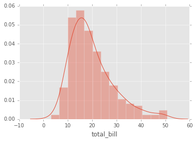


Si se quiere eliminar la grafica kde y solo tener el histograma entonces:


```python
sns.distplot(tips['total_bill'],kde=False,bins=30);
```


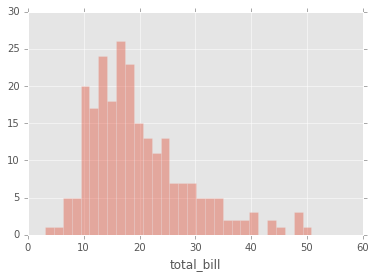


### jointplot
jointplot() le permite básicamente emparejar dos distplots para datos bivariados. Con su elección de  que parámetro **kind** va comparar:
* “scatter” 
* “reg” 
* “resid” 
* “kde” 
* “hex”


```python
# Histogramas y scatter plot
sns.jointplot(x='total_bill',y='tip',data=tips,kind='scatter');
```


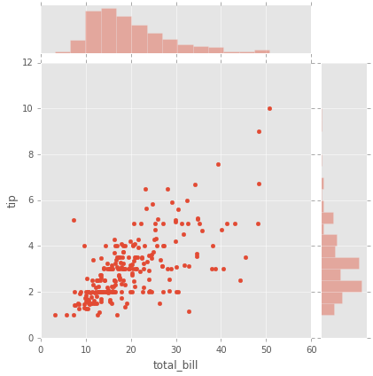


```python
# Histogramas  y hexagonal
sns.jointplot(x='total_bill',y='tip',data=tips,kind='hex');
```


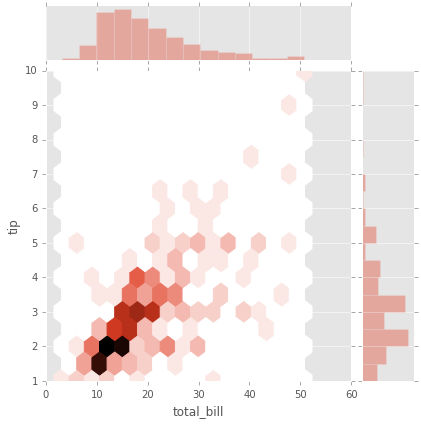


```python
#Hystogramas con kde y scatter plot
sns.jointplot(x='total_bill',y='tip',data=tips,kind='reg');
```


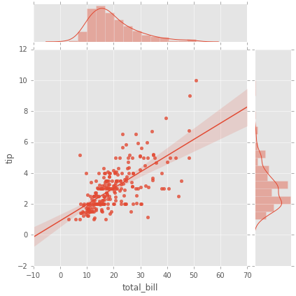


### pairplot

pairplot grafica relaciones por pares en un dataframe completo (para las columnas numéricas) y soporta un argumento de tono de color(Hue) (para columnas categóricas).


```python
#diagonal histogramas los demas son scatter plots
sns.pairplot(tips); # datos numericos
```


```python
# Datos categoricos

# Diagonal KDE y los otros plots son scatter
sns.pairplot(tips,hue='sex',palette='coolwarm'); # cambio de colormap
```


### kdeplot

kdeplots son [Gráficos de Estimación de Densidad del Núcleo](http://en.wikipedia.org/wiki/Kernel_density_estimation#Practical_estimation_of_the_bandwidth).


```python
# Variable 'total bill'
sns.kdeplot(tips['total_bill']) #plot kde
```


    <matplotlib.axes._subplots.AxesSubplot at 0x7f47c6f3c860>


```python
#Variable 'tip'
sns.kdeplot(tips['tip'])
```


    <matplotlib.axes._subplots.AxesSubplot at 0x7f47c6964908>


## Plots para datos categoricos
* boxplot
* violinplot
* stripplot
* swarmplot
* barplot
* countplot


```python
import seaborn as sns
%matplotlib inline
```

### barplot

Es un gráfico general que le permite agregar los datos categóricos basados en alguna función, el valor predeterminado es la media:


```python
sns.barplot(x='sex',y='total_bill',data=tips);
```


Puede cambiar el objeto estimador a su propia función, que convierte un vector a escalar:


```python
import numpy as np
sns.barplot(x='sex',y='total_bill',data=tips,estimator=np.std); # la desviacion estandar como estimador
```


### countplot

Esto es esencialmente lo mismo que Barplot, excepto que el estimador está contando explícitamente el número de ocurrencias. Por eso solo pasamos el valor de x:


```python
sns.countplot(x='sex',data=tips);
```


### boxplot
los boxplots (diagrama de caja) y violin plots se utilizan para mostrar la distribución de datos categóricos. Un diagrama de caja (boxplots o gráfico de caja y bigotes) muestra la distribución de datos cuantitativos de una manera que facilita las comparaciones entre variables o entre niveles de una variable categórica. El cuadro muestra los cuartiles del conjunto de datos, mientras que los bigotes se extienden para mostrar el resto de la distribución, a excepción de los puntos que se determinan como "valores atípicos" utilizando un método que es una función del rango intercuartílico.


```python
sns.boxplot(x="day", y="total_bill", data=tips,palette='rainbow');
```


```python
# se pueden graficar de forma horizontal
sns.boxplot(data=tips,palette='rainbow',orient='h');
```


```python
# cambiar el color y ver varias variables (hue)
sns.boxplot(x="day", y="total_bill", hue="smoker",data=tips, palette="coolwarm");
```


### violinplot
Un plot de violín juega un papel similar a un box and whisker plot (diagrama de cajas y bigotes). Muestra la distribución de datos cuantitativos a través de varios niveles de una (o más) variables categóricas de modo que esas distribuciones se puedan comparar. A diferencia de un diagrama de caja, en el que todos los componentes de la gráfica corresponden a los puntos de datos reales, la gráfica del violín presenta una estimación de la densidad del núcleo de la distribución subyacente.


```python
sns.violinplot(x="day", y="total_bill", data=tips,palette='rainbow');
```


```python
# Varias Variables
sns.violinplot(x="day", y="total_bill", data=tips,hue='sex',palette='Set1');
```


```python
# Varias variables
sns.violinplot(x="day", y="total_bill", data=tips,hue='sex',split=True,palette='Set1');
```


### stripplot
El stripplot dibujará un diagrama de dispersión donde una variable es categórica. Un stripplot se puede dibujar por sí mismo, pero también es un buen complemento de una casilla o trama de violín en los casos en que desea mostrar todas las observaciones junto con alguna representación de la distribución subyacente.


```python
sns.stripplot(x="day", y="total_bill", data=tips);
```


```python
sns.stripplot(x="day", y="total_bill", data=tips,jitter=True);
```


```python
# Varias variables
sns.stripplot(x="day", y="total_bill", data=tips,jitter=True,hue='sex',palette='Set1');
```


```python
# Varias Variables
sns.stripplot(x="day", y="total_bill", data=tips,jitter=True,hue='sex',palette='Set1',dodge=True);
```


### swarmplot
El swarmplot es similar a stripplot(), pero los puntos se ajustan (solo a lo largo del eje categórico) para que no se superpongan. Esto proporciona una mejor representación de la distribución de los valores, aunque no se ajusta a un gran número de observaciones (tanto en términos de la capacidad de mostrar todos los puntos como en términos del cálculo necesario para organizarlos).


```python
sns.swarmplot(x="day", y="total_bill", data=tips);
```


```python
sns.swarmplot(x="day", y="total_bill",hue='sex',data=tips, palette="Set1", dodge=True);
```


### Combininando Plots Categoricos


```python
sns.violinplot(x="tip", y="day", data=tips,palette='rainbow')
sns.swarmplot(x="tip", y="day", data=tips,color='black',size=3);
```


## Graficas de Matrices

Los Plot de matriz permiten graficar los datos como matrices codificadas por colores y también se pueden usar para indicar clústeres dentro de los datos, algunos de los mas usados son el heatmap y el clustermap de seaborn:


```python
flights = sns.load_dataset('flights') # carga de datos
```


```python
tips = sns.load_dataset('tips') # carga de datos
```


```python
tips.head() # ver los primeros 5 elementos de la tabla
```


<table border="1" class="dataframe">
  <thead>
    <tr style="text-align: right;">
      <th></th>
      <th>total_bill</th>
      <th>tip</th>
      <th>sex</th>
      <th>smoker</th>
      <th>day</th>
      <th>time</th>
      <th>size</th>
    </tr>
  </thead>
  <tbody>
    <tr>
      <th>0</th>
      <td>16.99</td>
      <td>1.01</td>
      <td>Female</td>
      <td>No</td>
      <td>Sun</td>
      <td>Dinner</td>
      <td>2</td>
    </tr>
    <tr>
      <th>1</th>
      <td>10.34</td>
      <td>1.66</td>
      <td>Male</td>
      <td>No</td>
      <td>Sun</td>
      <td>Dinner</td>
      <td>3</td>
    </tr>
    <tr>
      <th>2</th>
      <td>21.01</td>
      <td>3.50</td>
      <td>Male</td>
      <td>No</td>
      <td>Sun</td>
      <td>Dinner</td>
      <td>3</td>
    </tr>
    <tr>
      <th>3</th>
      <td>23.68</td>
      <td>3.31</td>
      <td>Male</td>
      <td>No</td>
      <td>Sun</td>
      <td>Dinner</td>
      <td>2</td>
    </tr>
    <tr>
      <th>4</th>
      <td>24.59</td>
      <td>3.61</td>
      <td>Female</td>
      <td>No</td>
      <td>Sun</td>
      <td>Dinner</td>
      <td>4</td>
    </tr>
  </tbody>
</table>


```python
flights.head() # ver los primeros 5 elementos de la tabla
```


<table border="1" class="dataframe">
  <thead>
    <tr style="text-align: right;">
      <th></th>
      <th>year</th>
      <th>month</th>
      <th>passengers</th>
    </tr>
  </thead>
  <tbody>
    <tr>
      <th>0</th>
      <td>1949</td>
      <td>January</td>
      <td>112</td>
    </tr>
    <tr>
      <th>1</th>
      <td>1949</td>
      <td>February</td>
      <td>118</td>
    </tr>
    <tr>
      <th>2</th>
      <td>1949</td>
      <td>March</td>
      <td>132</td>
    </tr>
    <tr>
      <th>3</th>
      <td>1949</td>
      <td>April</td>
      <td>129</td>
    </tr>
    <tr>
      <th>4</th>
      <td>1949</td>
      <td>May</td>
      <td>121</td>
    </tr>
  </tbody>
</table>


### Heatmap

Para que un mapa de calor funcione correctamente, los datos ya deben estar en forma de matriz, la función de sns.heatmap básicamente los colorea. Por ejemplo:


```python
tips.head()
```


<table border="1" class="dataframe">
  <thead>
    <tr style="text-align: right;">
      <th></th>
      <th>total_bill</th>
      <th>tip</th>
      <th>sex</th>
      <th>smoker</th>
      <th>day</th>
      <th>time</th>
      <th>size</th>
    </tr>
  </thead>
  <tbody>
    <tr>
      <th>0</th>
      <td>16.99</td>
      <td>1.01</td>
      <td>Female</td>
      <td>No</td>
      <td>Sun</td>
      <td>Dinner</td>
      <td>2</td>
    </tr>
    <tr>
      <th>1</th>
      <td>10.34</td>
      <td>1.66</td>
      <td>Male</td>
      <td>No</td>
      <td>Sun</td>
      <td>Dinner</td>
      <td>3</td>
    </tr>
    <tr>
      <th>2</th>
      <td>21.01</td>
      <td>3.50</td>
      <td>Male</td>
      <td>No</td>
      <td>Sun</td>
      <td>Dinner</td>
      <td>3</td>
    </tr>
    <tr>
      <th>3</th>
      <td>23.68</td>
      <td>3.31</td>
      <td>Male</td>
      <td>No</td>
      <td>Sun</td>
      <td>Dinner</td>
      <td>2</td>
    </tr>
    <tr>
      <th>4</th>
      <td>24.59</td>
      <td>3.61</td>
      <td>Female</td>
      <td>No</td>
      <td>Sun</td>
      <td>Dinner</td>
      <td>4</td>
    </tr>
  </tbody>
</table>


```python
# Matriz de correlacion de los datos
tips.corr()
```

<table border="1" class="dataframe">
  <thead>
    <tr style="text-align: right;">
      <th></th>
      <th>total_bill</th>
      <th>tip</th>
      <th>size</th>
    </tr>
  </thead>
  <tbody>
    <tr>
      <th>total_bill</th>
      <td>1.000000</td>
      <td>0.675734</td>
      <td>0.598315</td>
    </tr>
    <tr>
      <th>tip</th>
      <td>0.675734</td>
      <td>1.000000</td>
      <td>0.489299</td>
    </tr>
    <tr>
      <th>size</th>
      <td>0.598315</td>
      <td>0.489299</td>
      <td>1.000000</td>
    </tr>
  </tbody>
</table>


```python
# Heatmap de la matriz de correlacion
sns.heatmap(tips.corr());
```


```python
# Cambiando el mapa de colres y agregando las anotaciones a la grafica
sns.heatmap(tips.corr(),cmap='coolwarm',annot=True);
```


O para los datos de vuelos:


```python
# Definir una pivot table
flights.pivot_table(values='passengers',index='month',columns='year')
```


<table border="1" class="dataframe">
  <thead>
    <tr style="text-align: right;">
      <th>year</th>
      <th>1949</th>
      <th>1950</th>
      <th>1951</th>
      <th>1952</th>
      <th>1953</th>
      <th>1954</th>
      <th>1955</th>
      <th>1956</th>
      <th>1957</th>
      <th>1958</th>
      <th>1959</th>
      <th>1960</th>
    </tr>
    <tr>
      <th>month</th>
      <th></th>
      <th></th>
      <th></th>
      <th></th>
      <th></th>
      <th></th>
      <th></th>
      <th></th>
      <th></th>
      <th></th>
      <th></th>
      <th></th>
    </tr>
  </thead>
  <tbody>
    <tr>
      <th>January</th>
      <td>112</td>
      <td>115</td>
      <td>145</td>
      <td>171</td>
      <td>196</td>
      <td>204</td>
      <td>242</td>
      <td>284</td>
      <td>315</td>
      <td>340</td>
      <td>360</td>
      <td>417</td>
    </tr>
    <tr>
      <th>February</th>
      <td>118</td>
      <td>126</td>
      <td>150</td>
      <td>180</td>
      <td>196</td>
      <td>188</td>
      <td>233</td>
      <td>277</td>
      <td>301</td>
      <td>318</td>
      <td>342</td>
      <td>391</td>
    </tr>
    <tr>
      <th>March</th>
      <td>132</td>
      <td>141</td>
      <td>178</td>
      <td>193</td>
      <td>236</td>
      <td>235</td>
      <td>267</td>
      <td>317</td>
      <td>356</td>
      <td>362</td>
      <td>406</td>
      <td>419</td>
    </tr>
    <tr>
      <th>April</th>
      <td>129</td>
      <td>135</td>
      <td>163</td>
      <td>181</td>
      <td>235</td>
      <td>227</td>
      <td>269</td>
      <td>313</td>
      <td>348</td>
      <td>348</td>
      <td>396</td>
      <td>461</td>
    </tr>
    <tr>
      <th>May</th>
      <td>121</td>
      <td>125</td>
      <td>172</td>
      <td>183</td>
      <td>229</td>
      <td>234</td>
      <td>270</td>
      <td>318</td>
      <td>355</td>
      <td>363</td>
      <td>420</td>
      <td>472</td>
    </tr>
    <tr>
      <th>June</th>
      <td>135</td>
      <td>149</td>
      <td>178</td>
      <td>218</td>
      <td>243</td>
      <td>264</td>
      <td>315</td>
      <td>374</td>
      <td>422</td>
      <td>435</td>
      <td>472</td>
      <td>535</td>
    </tr>
    <tr>
      <th>July</th>
      <td>148</td>
      <td>170</td>
      <td>199</td>
      <td>230</td>
      <td>264</td>
      <td>302</td>
      <td>364</td>
      <td>413</td>
      <td>465</td>
      <td>491</td>
      <td>548</td>
      <td>622</td>
    </tr>
    <tr>
      <th>August</th>
      <td>148</td>
      <td>170</td>
      <td>199</td>
      <td>242</td>
      <td>272</td>
      <td>293</td>
      <td>347</td>
      <td>405</td>
      <td>467</td>
      <td>505</td>
      <td>559</td>
      <td>606</td>
    </tr>
    <tr>
      <th>September</th>
      <td>136</td>
      <td>158</td>
      <td>184</td>
      <td>209</td>
      <td>237</td>
      <td>259</td>
      <td>312</td>
      <td>355</td>
      <td>404</td>
      <td>404</td>
      <td>463</td>
      <td>508</td>
    </tr>
    <tr>
      <th>October</th>
      <td>119</td>
      <td>133</td>
      <td>162</td>
      <td>191</td>
      <td>211</td>
      <td>229</td>
      <td>274</td>
      <td>306</td>
      <td>347</td>
      <td>359</td>
      <td>407</td>
      <td>461</td>
    </tr>
    <tr>
      <th>November</th>
      <td>104</td>
      <td>114</td>
      <td>146</td>
      <td>172</td>
      <td>180</td>
      <td>203</td>
      <td>237</td>
      <td>271</td>
      <td>305</td>
      <td>310</td>
      <td>362</td>
      <td>390</td>
    </tr>
    <tr>
      <th>December</th>
      <td>118</td>
      <td>140</td>
      <td>166</td>
      <td>194</td>
      <td>201</td>
      <td>229</td>
      <td>278</td>
      <td>306</td>
      <td>336</td>
      <td>337</td>
      <td>405</td>
      <td>432</td>
    </tr>
  </tbody>
</table>


```python
# Graficar la pivot table como un heatmap
pvflights = flights.pivot_table(values='passengers',index='month',columns='year')
sns.heatmap(pvflights);
```


```python
# Cambiando los parametros del colormap y el ancho y color de las lineas d division
sns.heatmap(pvflights,cmap='magma',linecolor='white',linewidths=1);
```


### clustermap

El mapa de clúster utiliza la agrupación jerárquica para producir una versión agrupada del mapa de calor. Por ejemplo:


```python
# Grafica Clustermap de la tabla pivot de los vuelos
sns.clustermap(pvflights);
```


Observe ahora cómo los años y meses ya no están en orden, en su lugar se agrupan por similitud en el valor (recuento de pasajeros). Eso significa que podemos comenzar a inferir cosas de esta trama, como agosto y julio siendo similares (tiene sentido, ya que ambos son meses de viaje de verano)


```python
# Más opciones para obtener la información un poco más clara como la normalización
# Cambiar el colormap
sns.clustermap(pvflights,cmap='coolwarm',standard_scale=1);
```


## Grids
Las grids son tipos generales de plots que le permiten mapear tipos de plots en filas y columnas de una cuadrícula, esto le ayuda a crear plots similares separadas por características.


```python
# Importar librerias
import seaborn as sns
import matplotlib.pyplot as plt
%matplotlib inline
```


```python
iris = sns.load_dataset('iris') #Importar el dataset
```


```python
iris.head() #Ver los primeros 5 elementos de la tabla
```


<table border="1" class="dataframe">
  <thead>
    <tr style="text-align: right;">
      <th></th>
      <th>sepal_length</th>
      <th>sepal_width</th>
      <th>petal_length</th>
      <th>petal_width</th>
      <th>species</th>
    </tr>
  </thead>
  <tbody>
    <tr>
      <th>0</th>
      <td>5.1</td>
      <td>3.5</td>
      <td>1.4</td>
      <td>0.2</td>
      <td>setosa</td>
    </tr>
    <tr>
      <th>1</th>
      <td>4.9</td>
      <td>3.0</td>
      <td>1.4</td>
      <td>0.2</td>
      <td>setosa</td>
    </tr>
    <tr>
      <th>2</th>
      <td>4.7</td>
      <td>3.2</td>
      <td>1.3</td>
      <td>0.2</td>
      <td>setosa</td>
    </tr>
    <tr>
      <th>3</th>
      <td>4.6</td>
      <td>3.1</td>
      <td>1.5</td>
      <td>0.2</td>
      <td>setosa</td>
    </tr>
    <tr>
      <th>4</th>
      <td>5.0</td>
      <td>3.6</td>
      <td>1.4</td>
      <td>0.2</td>
      <td>setosa</td>
    </tr>
  </tbody>
</table>


### PairGrid

Pairgrid es un subplot grid para graficar relaciones por pares en un conjunto de datos.


```python
# solo el Grid
sns.PairGrid(iris);
```


```python
# Ahora se mapea el grid
g = sns.PairGrid(iris)
g.map(plt.scatter);
```


```python
# Mapear a arriba, abajo y diagonal
g = sns.PairGrid(iris) # crear una cuadricula
g.map_diag(plt.hist) #Histogramas en la diagonal
g.map_upper(plt.scatter) # Scatter plots en la parte superior
g.map_lower(sns.kdeplot); # Plots de densidad kde en la parte inferior
```


### pairplot

pairplot es una versión más simple de PairGrid (se usa con bastante frecuencia)


```python
# La diagonal es un histograma
# las otras graficas son scatter plots
sns.pairplot(iris);
```


```python
# la diagonal son kde de los datos categoricos
# las otars graficas son scatter plots
sns.pairplot(iris,hue='species',palette='rainbow');
```


### Facet Grid

FacetGrid es la forma general de crear grids de plots basados en dos caracteristica:


```python
tips = sns.load_dataset('tips')
```


```python
tips.head()
```


<table border="1" class="dataframe">
  <thead>
    <tr style="text-align: right;">
      <th></th>
      <th>total_bill</th>
      <th>tip</th>
      <th>sex</th>
      <th>smoker</th>
      <th>day</th>
      <th>time</th>
      <th>size</th>
    </tr>
  </thead>
  <tbody>
    <tr>
      <th>0</th>
      <td>16.99</td>
      <td>1.01</td>
      <td>Female</td>
      <td>No</td>
      <td>Sun</td>
      <td>Dinner</td>
      <td>2</td>
    </tr>
    <tr>
      <th>1</th>
      <td>10.34</td>
      <td>1.66</td>
      <td>Male</td>
      <td>No</td>
      <td>Sun</td>
      <td>Dinner</td>
      <td>3</td>
    </tr>
    <tr>
      <th>2</th>
      <td>21.01</td>
      <td>3.50</td>
      <td>Male</td>
      <td>No</td>
      <td>Sun</td>
      <td>Dinner</td>
      <td>3</td>
    </tr>
    <tr>
      <th>3</th>
      <td>23.68</td>
      <td>3.31</td>
      <td>Male</td>
      <td>No</td>
      <td>Sun</td>
      <td>Dinner</td>
      <td>2</td>
    </tr>
    <tr>
      <th>4</th>
      <td>24.59</td>
      <td>3.61</td>
      <td>Female</td>
      <td>No</td>
      <td>Sun</td>
      <td>Dinner</td>
      <td>4</td>
    </tr>
  </tbody>
</table>


```python
# Solo el Grid
g = sns.FacetGrid(tips, col="time", row="smoker");
```


```python
# histogramas entre las dos variables
g = sns.FacetGrid(tips, col="time",  row="smoker")
g = g.map(plt.hist, "total_bill")
```


```python
# Scatterplots
g = sns.FacetGrid(tips, col="time",  row="smoker",hue='sex')
# Observe como los argumentos vienen despues de llamar a plt.scatter
g = g.map(plt.scatter, "total_bill", "tip").add_legend()
```


### JointGrid

JointGrid es la version general de jointplot()


```python
# Solo el grid
g = sns.JointGrid(x="total_bill", y="tip", data=tips)
```


```python
# Grafica de regresion y histograma con kde
g = sns.JointGrid(x="total_bill", y="tip", data=tips)
g = g.plot(sns.regplot, sns.distplot)
```


## Plots de Regresion

Seaborn tiene muchas capacidades integradas para trazados de regresión, **lmplot** le permite visualizar modelos lineales, pero también le permite dividir los gráficos en función de las características, así como también colorear el tono (hue) en función de las características.


```python
#Importar librerias
import seaborn as sns
%matplotlib inline
```


```python
tips = sns.load_dataset('tips') # importar el dataset
```


```python
tips.head() # ver los primeros datos del dataset
```


<table border="1" class="dataframe">
  <thead>
    <tr style="text-align: right;">
      <th></th>
      <th>total_bill</th>
      <th>tip</th>
      <th>sex</th>
      <th>smoker</th>
      <th>day</th>
      <th>time</th>
      <th>size</th>
    </tr>
  </thead>
  <tbody>
    <tr>
      <th>0</th>
      <td>16.99</td>
      <td>1.01</td>
      <td>Female</td>
      <td>No</td>
      <td>Sun</td>
      <td>Dinner</td>
      <td>2</td>
    </tr>
    <tr>
      <th>1</th>
      <td>10.34</td>
      <td>1.66</td>
      <td>Male</td>
      <td>No</td>
      <td>Sun</td>
      <td>Dinner</td>
      <td>3</td>
    </tr>
    <tr>
      <th>2</th>
      <td>21.01</td>
      <td>3.50</td>
      <td>Male</td>
      <td>No</td>
      <td>Sun</td>
      <td>Dinner</td>
      <td>3</td>
    </tr>
    <tr>
      <th>3</th>
      <td>23.68</td>
      <td>3.31</td>
      <td>Male</td>
      <td>No</td>
      <td>Sun</td>
      <td>Dinner</td>
      <td>2</td>
    </tr>
    <tr>
      <th>4</th>
      <td>24.59</td>
      <td>3.61</td>
      <td>Female</td>
      <td>No</td>
      <td>Sun</td>
      <td>Dinner</td>
      <td>4</td>
    </tr>
  </tbody>
</table>


### lmplot()


```python
#scatter plot mas la regresion lineal
sns.lmplot(x='total_bill',y='tip',data=tips);
```


```python
#scatter plot mas la regresion lineal basado en el genero
sns.lmplot(x='total_bill',y='tip',data=tips,hue='sex');
```


```python
# Cambio de paleta de colores
sns.lmplot(x='total_bill',y='tip',data=tips,hue='sex',palette='coolwarm');
```


### Usando Marcadores

Los argumentos kwargs lmplot  pasan a **regplto** que es una forma más general de lmplot(). regplot tiene un parámetro scatter_kws que se pasa a plt.scatter y puede modificar los parametros.

Mire siempre la documentacion http://matplotlib.org/api/markers_api.html


```python
# http://matplotlib.org/api/markers_api.html
sns.lmplot(x='total_bill',y='tip',data=tips,hue='sex',palette='coolwarm',
           markers=['o','v'],scatter_kws={'s':100});
```


### Usando un Grid

Podemos agregar una separación más variable a través de columnas y filas con el uso de un grid. Simplemente indícandolo en los argumentos col o row:


```python
sns.lmplot(x='total_bill',y='tip',data=tips,col='sex'); #hace una division por el genero
```


```python
# division por el genero y por tiempo de almuerzo o cena
sns.lmplot(x="total_bill", y="tip", row="sex", col="time",data=tips);
```


```python
# informacion del genero en HUE
sns.lmplot(x='total_bill',y='tip',data=tips,col='day',hue='sex',palette='coolwarm');
```


### Aspecto y Tamaño

Las figuras de Seaborn se les puede ajustar su tamaño y relación de aspecto con los parámetros **height** y **aspect**:


```python
sns.lmplot(x='total_bill',y='tip',data=tips,col='day',hue='sex',palette='coolwarm',
          aspect=0.6,height=8);
```


## Referencias

* http://www.matplotlib.org
* http://matplotlib.org/gallery.html - Una gran galería que muestra varios tipos de graficos matplotlib. ¡Muy recomendable!
* [Matplotlib cheat sheet](https://s3.amazonaws.com/assets.datacamp.com/blog_assets/Python_Matplotlib_Cheat_Sheet.pdf)
* http://www.loria.fr/~rougier/teaching/matplotlib - Un Buen tutorial de matplotlib.
* http://scipy-lectures.github.io/matplotlib/matplotlib.html - Otra buena referencia para matplotlib reference.
* https://medium.com/plotly/introducing-plotly-express-808df010143d
* https://plot.ly/python/plotly-express/
* http://seaborn.pydata.org/ - Documentacion Seaborn otra libreria de graficas estadisticas
* http://matplotlib.org/api/markers_api.html - documentacion de marcadores
* Lista de colormaps http://www.scipy.org/Cookbook/Matplotlib/Show_colormaps


**Phd. Jose R. Zapata**
- [https://joserzapata.github.io/](https://joserzapata.github.io/)
- https://twitter.com/joserzapata
